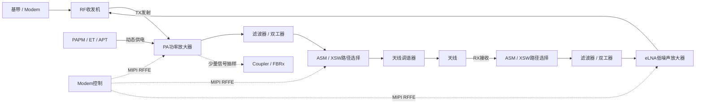

# RF基础概念

## 一句话

RF 问题本质上围绕五件事：信号能否正确产生、发射功率是否合适、接收灵敏度是否足够、射频路径是否选对、天线是否把能量有效地发到或收自空中。

## 阅读入口

本文面向刚接触移动通信射频的研发和问题分析人员，解释 RF 信号链、常见前端器件、dB/dBm、链路预算、天线匹配、RSRP/RSRQ/SINR、TRP/TIS 以及配置和自检的边界。

实际无服务或搜网失败按 [无线信号与搜网失败排查](../30_Troubleshooting/无线信号与搜网失败排查.md) 执行；吞吐量问题看 [Data业务流程](../20_Service-Flows/Data/Data业务流程.md#吞吐量分析流程)；蓝牙 OTA 和远距离问题看 [BLE远距离链路与OTA指标](../20_Service-Flows/BT/BLE远距离链路与OTA指标.md)。

## RF在通信系统中的位置

RF 是 Radio Frequency，即射频。手机中的数字数据需要经过基带处理、数模转换、变频、放大、滤波和天线辐射，才能变成空中的电磁波；接收时则按相反方向恢复为数字数据。



这里有两条完全不同的路径：

- **RF 信号路径**传输的是 MHz/GHz 级模拟射频信号，真正决定信号从哪个端口到哪个天线。
- **控制路径**通过 MIPI RFFE、GPIO、供电控制等方式写寄存器，决定 PA 增益、开关位置、LNA 状态和调谐码。

MIPI RFFE 上传输的是控制命令，不是需要发射到空中的射频信号。

## 频率、波长与带宽

| 概念              | 含义                        | 工程上关注什么                      |
| --------------- | ------------------------- | ---------------------------- |
| 频率              | 信号每秒振荡次数，单位为 Hz           | 决定所处频段、传播特性、器件和天线尺寸          |
| 波长              | 一个周期在空间中传播的距离，`λ = c / f` | 频率越高，波长越短；天线尺寸和布局通常与波长相关     |
| Band            | 标准定义的一段上下行频率范围            | 手机是否支持该 Band，前端器件和天线是否覆盖     |
| Channel / ARFCN | 对具体载频的编号                  | 用于把协议编号映射到真实中心频率             |
| 带宽              | 信号占用的频率范围                 | 带宽越大通常可承载更多数据，但不等于信号更强       |
| 上行 UL           | UE 向基站发送                  | 重点关注 PA、PAPM、TX path、功控和发射质量 |
| 下行 DL           | 基站向 UE 发送                 | 重点关注天线、RX path、eLNA、灵敏度和干扰   |
| FDD             | 上下行使用不同频率同时工作             | 依赖双工器隔离上下行，常见于成对频谱           |
| TDD             | 上下行使用同一频率、不同时间工作          | 依赖时隙切换和收发开关，常见于非成对频谱         |

在理想自由空间中，距离增加一倍，路径损耗约增加 `6 dB`；频率增加一倍，路径损耗也约增加 `6 dB`。真实环境还会受到墙体、人体、地面反射、天线方向和干扰影响。

## dB、dBm与常用单位

| 单位 | 表示什么 | 示例 |
|---|---|---|
| dB | 两个功率或幅度的相对比值 | 增益、插损、路径损耗、隔离度 |
| dBm | 相对于 `1 mW` 的绝对功率 | PA 输出功率、接收功率、仪表读数 |
| dBi | 天线相对于理想全向天线的方向性增益 | 天线在不同方向上的辐射能力 |
| dBc | 相对于载波功率的差值 | 杂散、邻道泄漏、谐波等相对指标 |

功率换算公式：

```text
P(dBm) = 10 × log10(P(mW))
```

常用换算：

| dBm | 功率 |
|---|---|
| `0 dBm` | `1 mW` |
| `10 dBm` | `10 mW` |
| `20 dBm` | `100 mW` |
| `23 dBm` | 约 `200 mW` |
| `30 dBm` | `1 W` |

需要记住：

- 功率增加 `3 dB`，约等于功率变为 2 倍。
- 功率增加 `10 dB`，等于功率变为 10 倍。
- 对接收功率而言，`-80 dBm` 比 `-100 dBm` 强 `20 dB`。
- `dB` 是差值，`dBm` 是绝对功率，二者不能混用。

## 链路预算

链路预算用于估算发射端到接收端还剩多少信号余量。简化表达如下：

```text
接收功率 = 发射功率 + 发射天线增益 + 接收天线增益
         - 空间路径损耗 - 线缆/连接器损耗 - 人体/结构损耗 - 其他损耗
```

当接收功率低于接收机能够可靠解调的最低门限时，链路会出现误码、重传、降阶调制，最终掉线。接收功率距离最低门限的差值可理解为链路余量。

链路预算不只由 PA 决定。PA 功率更大可能改善上行，但如果天线效率差、开关插损大、接收灵敏度差或干扰严重，整机覆盖仍然可能不好。

## 射频前端器件

| 器件                    | 所在链路      | 主要作用                                  | 异常时常见表现                          |
| --------------------- | --------- | ------------------------------------- | -------------------------------- |
| RF Transceiver / RFIC | TX 和 RX   | 完成 IQ/模拟信号与射频之间的变频、增益和收发控制            | 多频段异常、频率或增益异常、Modem RF 初始化失败     |
| PA                    | TX        | 放大发射信号，使 UE 有足够功率到达基站                 | 上行接入失败、RACH 打满、发射功率低、EVM/ACLR 变差 |
| PAPM                  | TX 供电     | 管理 PA 电压，支持 APT、ET、Boost 等效率模式        | 功率不稳、耗流高、发热、PA 压缩、调制质量差          |
| Filter                | TX 或 RX   | 只允许目标频段通过，抑制带外信号和干扰                   | 单个频段插损大、灵敏度差、杂散或阻塞问题             |
| Duplexer              | FDD TX/RX | 让上下行不同频率共用天线，同时保持隔离                   | 自干扰、接收降敏、单 Band 收发异常             |
| ASM                   | TX 和 RX   | Antenna Switch Module，在频段、收发路径和天线之间切换 | 某些 Band 不通、收发走错口、CA 组合失败         |
| XSW                   | TX 和 RX   | Cross-Switch，对多个 RF 输入和输出进行交叉连接       | 主集/分集走错、MIMO/CA/ENDC 特定组合异常      |
| Antenna Tuner         | 天线前端      | 调整匹配网络，补偿频段、握持和结构带来的阻抗变化              | TRP/TIS 变差、某些姿态或频段性能明显下降         |
| eLNA                  | RX        | 在尽量少增加噪声的情况下放大微弱接收信号                  | 接收灵敏度差、弱场掉网、单个 RX path 掉底        |
| Coupler               | TX 反馈     | 抽取少量发射信号送给功率检测或 FBRx                  | 功控、校准、闭环发射功率或失配检测异常              |
| Therm                 | 辅助        | 读取器件温度，用于温补、降功率和过热保护                  | 温补错误、异常降功率、过热保护过早或不生效            |
| Antenna               | TX 和 RX   | 在电路中的射频能量与空间电磁波之间转换                   | Conducted 测试正常但 OTA 差、方向性或握持问题明显 |

FEM 是 Front-End Module，即射频前端模组。一颗集成 FEM 可能同时包含 PA、LNA、开关、滤波器和 Coupler。软件通常按逻辑功能拆分组件，因此一个物理料号可能同时出现在 `pa`、`asm`、`elna`、`xsw`、`coupler` 等逻辑分类中。

文件或驱动中存在某个料号，只说明软件支持它，不能直接证明当前主板实际装配了它。

## 主集、分集与MIMO

| 概念                 | 含义                       | 定位价值                           |
| ------------------ | ------------------------ | ------------------------------ |
| PRX / Main RX      | 主接收通路                    | 通常承担主要接收和解调任务                  |
| DRX / Diversity RX | 分集接收通路                   | 利用空间或天线差异改善覆盖和抗衰落能力            |
| MIMO               | 多天线同时传输或接收不同数据流          | 提高吞吐或链路可靠性，需要多条 RF/RX chain 正常 |
| CA                 | Carrier Aggregation，载波聚合 | 同时使用多个 LTE/NR 载波，前端路径和频段组合更复杂  |
| EN-DC              | LTE 与 NR 双连接             | LTE 锚点和 NR 载波同时工作，需要检查跨制式并发路径  |

主辅通路并不是简单的“备用天线”。在 MIMO、CA 和弱场场景中，任意一条接收链路损坏都可能造成吞吐下降、灵敏度差或特定组合失败。

## 天线、阻抗与匹配

手机射频电路通常按 `50 Ω` 系统设计。当天线或器件阻抗不匹配时，部分能量会被反射回来，造成有效辐射功率下降、PA 负载异常和接收效率变差。

| 指标 | 含义 | 判断方向 |
|---|---|---|
| Return Loss | 反射损耗，描述反射回来的能量 | 在相同定义下，正值越大通常表示匹配越好 |
| VSWR | 驻波比，描述传输线上的驻波程度 | 越接近 `1:1`，通常表示匹配越好 |
| S11 | 输入端反射系数 | 常用于网络分析仪评估天线和端口匹配 |
| Isolation | 两条路径之间的隔离度 | 隔离不足会导致 TX 泄漏到 RX、互扰或接收降敏 |
| Insertion Loss | 器件插入后增加的损耗 | 插损越大，实际到达天线或接收机的功率越少 |

人体握持、金属结构、屏幕、壳体、弹片、天线扣线和主板地都会改变天线匹配。因此芯片 conducted 指标通过，不代表整机 OTA 一定通过。

## 接收信号指标

| 指标             | 主要含义                     | 使用边界                      |
| -------------- | ------------------------ | ------------------------- |
| RSSI           | 接收带宽内的总功率，可能包含有用信号、干扰和噪声 | 不同制式定义不同，不能只凭 RSSI 判断链路质量 |
| RSRP           | LTE/NR 参考信号接收功率          | 更偏覆盖强弱，不直接代表干扰水平和吞吐能力     |
| RSRQ           | 参考信号接收质量                 | 同时受 RSRP、RSSI、负载和干扰影响     |
| SINR           | 有用信号与干扰加噪声的比值            | 越高通常越有利于高阶调制和高吞吐          |
| SNR            | 有用信号与噪声的比值               | 不包含或弱化干扰项时使用，需确认平台定义      |
| RSCP           | WCDMA 接收码功率              | 用于判断 3G 覆盖强弱              |
| Ec/No          | WCDMA 每码片能量与噪声密度之比       | 用于判断 3G 信号质量和干扰情况         |
| RxLev / RxQual | GSM 接收电平和接收质量            | 分别关注覆盖和误码质量               |
| CQI            | UE 对可用信道质量的量化反馈          | 影响网络选择的调制编码，但不是直接功率值      |
| BLER           | 传输块错误率                   | 高 BLER 会触发重传、降 MCS 和吞吐下降  |

不要套用一组固定阈值判断所有制式、频段和平台。分析时至少同时看信号强度、信号质量、当前频点、带宽、调制编码和 BLER。

## 发射与OTA指标

| 指标                     | 含义                                 | 判断方向                     |
| ---------------------- | ---------------------------------- | ------------------------ |
| TX Power               | 发射输出功率                             | 过低影响覆盖，过高可能引起非线性、耗流和法规问题 |
| EVM                    | Error Vector Magnitude，误差矢量幅度      | 越小通常表示调制信号越准确            |
| ACLR / ACPR            | 邻道泄漏比                              | 反映发射能量泄漏到相邻信道的程度         |
| Spectrum Emission Mask | 频谱发射模板                             | 判断带外发射是否满足标准限制           |
| TRP                    | Total Radiated Power，总辐射功率         | 表示整机真正辐射到空中的总发射能力，通常越大越好 |
| TIS                    | Total Isotropic Sensitivity，总全向灵敏度 | 表示整机综合接收灵敏度，通常越负越好       |

Conducted 测试通过主要证明射频端口上的能力；TRP/TIS 还包含天线、结构、匹配、线损和整机方向性的影响。

## 调制、MCS与吞吐

| 项目             | 特点                                       |
| -------------- | ---------------------------------------- |
| QPSK           | 鲁棒性较高，每个符号承载的数据较少，适合较差信道                 |
| 16QAM          | 吞吐高于 QPSK，对信号质量要求更高                      |
| 64QAM / 256QAM | 可提供更高频谱效率，但需要更好的 SINR、EVM 和链路稳定性         |
| Coding Rate    | 有效数据与纠错冗余的比例，码率越高冗余越少                    |
| MCS            | Modulation and Coding Scheme，调制方式与编码率的组合 |

RSRP 很强但 SINR 较差时，网络仍可能使用较低 MCS。吞吐量还受带宽、调度 RB、MIMO 层数、CA/EN-DC、网络负载、BLER 和协议栈影响，因此“信号格满”不等于网速一定快。

## RF配置的层次

| 层次        | 主要内容                                  | 配错后的典型后果                 |
| --------- | ------------------------------------- | ------------------------ |
| 板级拓扑      | 物理料号、供电、总线地址、端口、天线和器件连接关系             | 器件找不到、路径断开、端口对应错误        |
| 器件控制      | RFFE/GPIO 寄存器、增益、偏置、开关状态、Sleep/Wakeup | 器件可识别但工作状态错误             |
| Band与场景路由 | RAT、Band、TX/RX、CA、MIMO、SRS 等路径选择      | 单 Band 或特定并发组合失败         |
| 校准与NV     | TX 功率、RX 增益、线损、频偏、IQ、FBRx、温补          | 功率偏差、灵敏度差、EVM/ACLR 或温漂异常 |
| 运行时控制     | L1 调度、闭环功控、调谐、热管理和并发资源控制              | 动态场景异常，静态测试可能正常          |

> [!note] 高通代码中的常见映射
> RF Card / RFC 更偏板级拓扑和场景路由；FEM 数据更偏具体器件寄存器脚本；校准 NV 保存实际硬件的增益、损耗和补偿结果。三者需要匹配，不能只看其中一层。

## 自检、编译与测试的边界

| 验证层级               | 能证明什么                         | 不能证明什么                          |
| ------------------ | ----------------------------- | ------------------------------- |
| 配置静态检查             | XML、端口、ID、引用和生成规则基本一致         | 实物焊接、天线、校准和真实 RF 性能             |
| RFPD / RFC AG PASS | Qualcomm RF Card 能完成静态检查和代码生成 | RF Card 所有数值都适配实物，更不代表整机 OTA 通过 |
| FEM 编译通过           | 器件数据和驱动可以编译、链接                | 寄存器值、端口选择和时序一定正确                |
| RFFE ID读取成功        | 控制总线可访问器件，器件 ID 基本匹配          | RF 信号路径、增益、滤波器和天线一定正常           |
| Conducted测试        | 射频端口的功率、灵敏度、线性等满足条件           | 天线效率、结构遮挡和整机方向性                 |
| OTA测试              | 整机天线和射频综合性能满足测试条件             | 所有现场网络、动态并发和温度场景都一定正常           |
| 现场网络测试             | 当前网络、地点和场景下可以工作               | 所有 Band、运营商和极限条件都已覆盖            |

任何单项 PASS 都只覆盖一个验证层级。RF 配置没有问题的结论需要结合板级配置、器件控制、校准、conducted、OTA 和真实网络场景共同判断。

## 第一坏点速查

| 现象                    | 优先检查方向                                      |
| --------------------- | ------------------------------------------- |
| 所有 RAT 都搜不到网，主辅接收掉底   | 天线连接、公共供电、RFIC、RFFE 在位、公共 RX path、校准数据      |
| 只有一个或少数 Band 异常       | Band 专用 PA/LNA、滤波器、ASM 端口、RF path 和 Band 校准 |
| 接收正常但发射接入失败           | PA、PAPM、TX switch、功控、Coupler/FBRx 和 TX 校准   |
| 发射正常但接收灵敏度差           | eLNA、RX switch、主辅天线、滤波器、RX 增益和校准            |
| RSRP 较强但 SINR 很差      | 同频/邻频干扰、TX-RX 隔离、互调、PIM、网络负载                |
| 特定 CA/MIMO/EN-DC 组合失败 | 并发 RF path、端口资源冲突、XSW/ASM 状态和前端组合能力         |
| 高功率时耗流大或机身发热          | PA bias、PAPM 模式、天线失配、功控和热管理                 |
| Conducted正常但OTA差      | 天线效率、调谐、结构、弹片、扣线、主板地和人体遮挡                   |
| 自检通过但现场仍然失败           | 检查自检覆盖边界，继续验证实物、校准、动态时序和 OTA                |

## 常见误区

- 信号格是系统 UI 的映射结果，不等于某一个原始 RF 指标。
- RSRP 强只说明参考信号功率较强，不保证 SINR、BLER 和吞吐良好。
- 增大发射功率并非总是更好，还要满足线性、频谱、耗流、温升和法规限制。
- RFFE 器件能读到 ID，不代表器件的 RF 输入输出路径正常。
- 源码里存在某个器件文件，不代表当前硬件版本实际使用该器件。
- 配置自检、编译、校准、conducted、OTA 和现场测试是不同验证层级，不能相互替代。

## 关联文档

- [[50_Platform-Code/Qualcomm/Qualcomm-Modem-RF配置与编译链路]]
- [无线信号与搜网失败排查](../30_Troubleshooting/无线信号与搜网失败排查.md)
- [Data业务流程](../20_Service-Flows/Data/Data业务流程.md)
- [BLE远距离链路与OTA指标](../20_Service-Flows/BT/BLE远距离链路与OTA指标.md)
- [Modem稳定性与Assert](../20_Service-Flows/Stability/Modem稳定性与Assert.md)
- [信号强度查看SOP](../70_Tools-Debug/Debug-Tips/信号强度查看SOP.md)
