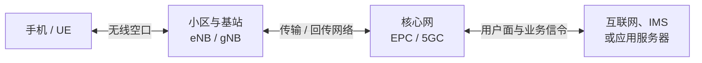

# 手机连接基站与数据传输基础

## 使用边界

- 本文用于建立手机、无线接入网、传输网和核心网之间的整体认识，不替代具体制式的协议流程。
- 正文以 LTE/NR 为主要例子。2G/3G 也有“找网驻留、接入注册、承载业务”的抽象过程，但同步信号、信道和消息名称不同。
- 来源文章是通俗科普材料。本文保留其“三步走”和“快递”类比作为理解入口，同时校正容易形成误解的技术表述。

## 阅读入口

- 选网、找网、驻留和注册的详细证据链看 [[../20_Service-Flows/Network-Registration/LTE注册流程|LTE注册流程]]、[[../20_Service-Flows/Network-Registration/NR注册流程|NR注册流程]] 和 [[PLMN基础与术语]]。
- 射频链路、信号指标和“满格不等于高速”看 [[RF基础概念]]。
- 数据连接、APN、默认承载和吞吐量看 [[../20_Service-Flows/Data/Data业务流程|Data业务流程]]。
- Android、RIL 和 Modem 的系统边界看 [[../50_Platform-Code/Cross-Platform/Telephony系统架构|Telephony系统架构]]。

## 先分清四个对象

| 对象 | 主要作用 | 容易混淆的边界 |
|---|---|---|
| 手机 / UE | 搜索并选择网络、建立无线连接、完成注册、收发业务数据 | 信号格是系统映射结果，不等于始终处于 RRC 连接态 |
| 小区 / Cell | 一组可被 UE 识别和驻留的无线覆盖与配置 | UE 逻辑上驻留或连接的是小区，不是笼统地“连上一座铁塔” |
| 基站 / eNB / gNB | 提供空口接入、无线资源调度、移动性控制，并把信令和用户面接入核心网 | 一个物理站点或基站可承载多个扇区、频段和逻辑小区 |
| 核心网 / EPC / 5GC | 完成移动性管理、用户鉴权、会话和用户面转发，并连接 IMS 或外部数据网络 | SIM/USIM 签约鉴权主要由核心网处理，基站负责接入和信令承载 |

## 总体链路



传输或回传网络可能使用光纤、微波、以太网或其他承载方式，并不等同于“地下光纤”。互联网应用通常先访问应用服务器；对端手机通过自己的数据连接访问同一服务，而不是由核心网把每条消息直接送到“对方当前基站”。

## 先用原文的方式理解

我们每天用手机打电话、刷视频、发消息，看起来像是手机在独自工作，其实它背后一直有一个看不见的搭档——基站。手机和基站不用声音交流，而是通过无线电波交换控制信息和业务数据。

原文把这套复杂系统讲成了三件很日常的事：

> [!abstract] 原文的“三步走”
> 1. 手机先“找组织、报家门”，确认附近有没有可以使用的网络。
> 2. 聊天、图片和视频被拆成“数字快递”，经过基站和核心网送往业务目的地。
> 3. 周围很多人同时使用手机时，网络通过“分房间、定规矩”来共享有限的无线资源。

这个理解框架是成立的。下面不把它推翻，而是继续沿用这些比喻，同时补上每个比喻在真实网络中的技术边界。

## 把“三步走”翻译成技术流程

### 第一步：手机先“找组织”——实际是先听后说

刚开机的手机确实不会“闲着”，第一件事就是找网络。可以把周围小区理解成一直在广播门牌、运营商身份和接入规则的“物业”：手机先听这些广播，判断哪个小区属于可选网络、信号是否满足要求、当前是否允许驻留，然后才发起接入。

手机开机或 Radio 重新打开后，通常先接收网络的下行信号，而不是立即向周围基站发送“低频暗号”。以 LTE/NR 为例，可以把过程概括为：

```text
按历史信息或支持的 Band 搜索频点
-> 检测下行同步信号
-> 读取 MIB / SIB 等系统信息
-> 判断 PLMN、信号条件和小区限制
-> 选择 suitable cell 并驻留
-> 有注册或业务需要时发起随机接入 RACH
-> 建立 RRC 连接
-> 承载 NAS Attach / Registration
-> 完成 Attach / Registration、鉴权与安全激活
-> 有分组数据需求时建立或恢复 EPS Bearer / PDU Session
```

> [!note] 驻留不等于完成注册
> UE 可以先找到并驻留小区，再通过 RRC 把 NAS 注册信令送往核心网。GUTI/5G-GUTI 等临时标识主要用于识别已有上下文；需要鉴权时，核心网基于 IMSI/SUPI 对应的签约数据与 USIM 密钥派生认证向量。手机号 MSISDN 不是空口鉴权的直接凭据。

原文把信号格理解成手机和基站“联系得好不好”，这个方向便于入门。更准确地说，信号格是手机把部分无线指标换算成的简化分数：它通常能反映覆盖强弱，但不能单独证明注册、数据会话、网络负载、回传或应用服务器都正常。

### 第二步：“数字快递”——数据如何经过基站和核心网

发一句消息、打一通视频电话或刷一段短视频时，内容不会作为一个完整的大块直接穿过空中，而会被分层封装成许多协议数据单元。原文的“数字快递”类比可以继续保留：手机天线像投递口，基站像附近的接入站，传输网像连接各地的干线，核心网像负责身份、会话和转发的调度枢纽，互联网、IMS 或应用服务器才是业务真正要到达的地方。

工程上不能把所有内容都统称为一个带手机号的“数据帧”。一条常见的数据路径是：

```text
应用数据
-> TCP / UDP + IP
-> PDCP / RLC / MAC（NR 用户面还可包含 SDAP）
-> PHY / RF
-> eNB / gNB
-> 传输网
-> SGW / PGW 或 UPF
-> 互联网、IMS 或应用服务器
```

不同协议层有不同的地址、序号、承载和临时标识。普通 IP 用户面数据通常依靠 IP 地址、端口、无线承载和隧道信息转发，不会在每个空口数据单元里写入主叫手机号、对方手机号或 IMEI。

这套“快递系统”也不是永远不会丢件或延误。无线链路会出现误码、丢包、乱序和重复，PHY 纠错、HARQ、RLC 和 TCP 等机制会在不同层级检测或重传；UDP 本身则不保证可靠和有序。VoLTE/VoNR 等业务还要结合 [[../20_Service-Flows/IMS/IMS业务流程|IMS业务流程]] 理解，传统 2G/3G 电路域语音也不完全适用上述 IP 用户面路径。

### 第三步：“分房间、定规矩”——多人如何共享基站

原文用 KTV 包间解释“不同频道”，用超市排队解释“按顺序发送”，这两个比喻分别抓住了频率隔离和时间调度的直觉。真实的 LTE/NR 更像一个会实时重新布置的智能大厅：网络会同时从时间、频率和空间多个维度切分资源，并由基站调度器不断决定谁在什么时候、用多少资源、采用什么速率传输。

因此，LTE/NR 不是给每个人永久分配一个独立频率，也不是让所有手机按固定序号每隔 `0.1 秒` 轮流发送。常见的资源维度包括：

| 维度 | 典型机制 | 影响因素 |
|---|---|---|
| 频域 | 载波、子载波、资源块 | 带宽、频谱配置、干扰 |
| 时域 | 帧、时隙、符号级调度 | 上下行配置、业务时延、调度周期 |
| 空域 | MIMO、空间层、波束 | 天线能力、信道质量、UE 能力 |
| 链路自适应 | MCS、功控、HARQ | SINR、BLER、移动速度 |
| 业务策略 | QoS、优先级、公平性 | 业务类型、网络负载、运营商策略 |

“分房间、定规矩”能减少冲突并提高频谱利用率，但不能让道路无限扩容。热点区域的无线资源、基带处理、回传和核心网容量都有上限；用户增加后，仍然可能出现吞吐下降、时延上升或接入变慢。

## 移动时是小区重选还是切换

| UE 状态 | 主要过程 | 控制特点 |
|---|---|---|
| 空闲态 / 非活动态 | 小区重选 Cell Reselection | UE 根据测量、优先级和小区参数选择新的驻留小区 |
| 连接态 | 切换 Handover | 网络结合 UE 测量报告、邻区和负载决定目标小区及切换时机 |
| 无线链路异常 | RLF、重建或重新驻留 | 可能出现短时中断、掉话、掉线或重新注册 |

原文把移动过程比作快递从一个片区的站点转到下一个片区，这个直觉也可以保留。但“后台无缝换基站”只是理想化结果：实际过程可能发生在同一站点的不同小区之间，也可能跨站；是否无感取决于覆盖、邻区、测量、切换准备、无线质量和业务容错。

## 原文比喻的适用边界

下面的表格不是要否定原文，而是说明这些生活化类比应该停在哪里，避免把帮助理解的故事直接当成协议事实。

| 原文里的通俗说法 | 帮助理解什么 | 需要补充的技术边界 |
|---|---|---|
| 手机开机先向基站“举手” | 手机需要主动寻找并加入网络 | UE 通常先搜索并同步下行信号、读取系统信息，之后才通过 RACH 发起上行接入 |
| 基站核验手机卡号和运营商 | 网络会确认用户能否接入 | 基站承载接入信令，核心网依据 USIM 凭据、用户标识和签约数据完成鉴权与注册判断 |
| 信号格越多，后续“聊天”越顺畅 | 无线覆盖会影响通信体验 | 信号格只是 UI 映射；体验还受 RSRQ/SINR、BLER、调度、负载、回传、QoS 和服务器影响 |
| 内容拆成带标签的“小包裹” | 数据需要分段、编号和转发 | 应用、IP、无线承载和隧道分别使用各自标识，手机号和 IMEI 不是普通用户面包的逐包地址 |
| 基站经“高速公路”把包裹送到总调度中心 | RAN 后面还有传输网和核心网 | 回传不一定是地下光纤；OTT 消息一般先到应用服务器，对端再通过自己的连接收取 |
| 每个用户进入不同“包间”并按顺序发送 | 多个用户需要复用有限频谱 | LTE/NR 动态调度时频资源，并可利用 MIMO、波束和空间复用并行服务用户 |
| 定好规则后就不会“堵车” | 调度能够降低冲突 | 调度只能管理有限资源；高负载时仍会拥塞、降速和增大时延 |
| 5G 就是更快、基站更密 | 代际演进通常会提升容量和体验 | 实际结果取决于频段、带宽、MIMO、覆盖、负载、UE 能力、回传和部署策略，不能作无条件保证 |

> [!summary] 如果只记住一句话
> 原文的记忆口诀“找基站 → 拆数据 → 传数据 → 拼数据”仍然很好用。翻成工程语言就是：手机先找到并驻留合适的小区，再完成接入和注册；业务数据像经过多层包装的“数字快递”，由无线接入网、传输网和核心网共同转发；多人同时使用时，基站通过动态调度共享有限的时频空资源。

## 从用户现象映射到技术阶段

| 用户现象 | 优先确认的阶段 | 继续阅读 |
|---|---|---|
| 无信号、搜不到网 | RF、Band、扫频、同步、系统信息和小区适合性 | [RF基础概念](RF基础概念.md)、[无线信号与搜网失败排查](../30_Troubleshooting/无线信号与搜网失败排查.md) |
| 有信号格但未注册 | PLMN 选择、RACH、RRC、NAS 鉴权和注册 | [PLMN基础与术语](PLMN基础与术语.md)、[LTE注册流程](../20_Service-Flows/Network-Registration/LTE注册流程.md) |
| 已注册但不能上网 | APN、默认承载 / PDU Session、IP、DNS 和连通性检测 | [Data业务流程](../20_Service-Flows/Data/Data业务流程.md) |
| 移动中掉话或断流 | 邻区、测量、重选、切换、RLF 和业务恢复 | 对应 Call / Data 流程与现场 Modem log |
| 满格但网速慢 | SINR、BLER、MCS、调度资源、网络负载、回传和服务器 | [RF基础概念](RF基础概念.md)、[吞吐量分析流程](../20_Service-Flows/Data/Data业务流程.md#吞吐量分析流程) |

## 关联文档

- [[PLMN基础与术语]]
- [[RF基础概念]]
- [[3GPP协议阅读方法]]
- [[../20_Service-Flows/Network-Registration/LTE注册流程|LTE注册流程]]
- [[../20_Service-Flows/Network-Registration/NR注册流程|NR注册流程]]
- [[../20_Service-Flows/Data/Data业务流程|Data业务流程]]
- [[../20_Service-Flows/IMS/IMS业务流程|IMS业务流程]]
- [[../50_Platform-Code/Cross-Platform/Telephony系统架构|Telephony系统架构]]

## 来源记录

- [手机连接基站原理](https://mp.weixin.qq.com/s/UsbWB84Xz_y2A3-jXahWyA)，微信公众号「我想我思」，发布于 2026-07-28 08:20，访问于 2026-07-28。
- 本文为摘要式重组，没有复制原图；原文中的比喻和定量结论不作为协议或测试规范依据。
- 技术核对入口：3GPP TS 36.300、36.331、24.301、23.401，以及 TS 38.300、38.331、24.501、23.501/23.502；具体消息和字段以项目所用协议版本为准。
