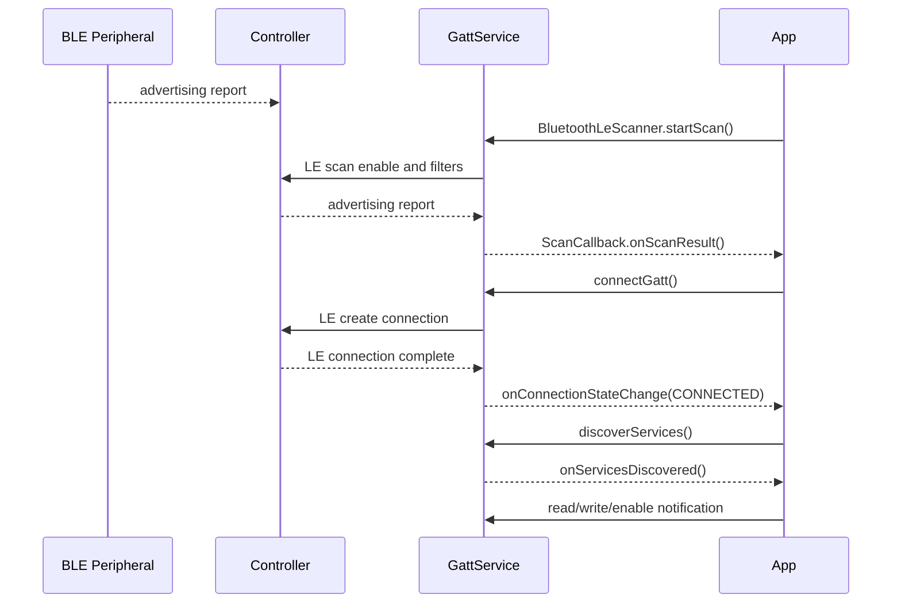

# BLE广播扫描连接GATT流程

## 一句话

BLE 问题按 `广播 -> 扫描 -> 连接 -> 服务发现 -> GATT 读写/通知` 拆开定位，先确认失败发生在空口发现、连接建立还是 ATT/GATT 业务层。

## 前置条件

- 明确本机角色：Central/Scanner/Client 还是 Peripheral/Advertiser/Server。
- 记录外设广播模式：legacy/extended、connectable、PHY、广播间隔、是否定向广播。
- 远距离场景要额外记录 OTA TRP/TIS、目标 PHY、connection interval、latency、supervision timeout、MTU 和业务包大小。
- Android 侧要确认扫描权限、定位开关/策略、前后台限制和 scan filter。

## 正常路径

## AP侧观察点

| 阶段 | 关键字 |
|---|---|
| 扫描注册 | `registerScanner`、`onScannerRegistered` |
| 扫描启动 | `startScan`、`ScanManager`、`GattService` |
| 扫描结果 | `onScanResult`、`onBatchScanResults`、`ScanRecord` |
| 扫描失败 | `onScanFailed`、`scan failed` |
| 连接 | `connectGatt`、`clientConnect`、`onConnectionStateChange` |
| 服务发现 | `discoverServices`、`onServicesDiscovered` |
| 数据交互 | `readCharacteristic`、`writeCharacteristic`、`onCharacteristicChanged` |

## HCI侧观察点

| 阶段 | 需要确认 |
|---|---|
| 广播 | controller 是否收到 advertising report |
| 扫描 | LE scan 是否 enable，filter 是否下发 |
| 连接 | LE create connection 是否发出，connection complete 是否成功 |
| PHY | 是否发生 `LE PHY Update Complete`，Tx/Rx PHY 是否符合预期 |
| 参数更新 | connection interval、latency、timeout 是否异常 |
| GATT | ATT read/write/notification 是否有空口交互，L2CAP CID 是否为 ATT `0x0004` |
| 包大小 | MTU、ATT value length、L2CAP length、HCI ACL length 是否符合业务预期 |
| 断开 | disconnect reason 是否来自本机、对端或链路超时 |

## 常见异常分叉

| 阶段 | 异常 | 可能方向 | 需要证据 |
|---|---|---|---|
| 广播 | 对比机能扫到，本机扫不到 | filter、PHY、controller、权限、扫描节流 | HCI advertising report、scan settings |
| 扫描回调 | HCI 有 report 但 App 无回调 | Framework 过滤、App 权限、进程状态 | `GattService`、`ScanManager`、App log |
| 连接 | `connectGatt` 后超时 | 外设不可连接、地址类型、白名单、链路质量 | HCI LE create connection、外设 log |
| 服务发现 | connected 但无 service | GATT discovery 失败、加密要求、外设异常 | `discoverServices`、ATT error |
| 读写通知 | service 有但数据失败 | CCCD 未打开、MTU、权限、加密、外设协议 | ATT read/write/notify、App 业务 log |
| 远距离吞吐差 | 连接保持但消息慢、语音断续 | Coded PHY 未生效、包过大、pacing 太快、缺少 ACK/重试、编码码率高 | PHY、连接参数、ATT value、业务 log |
| 断连 | 连接后很快断开 | 参数更新、supervision timeout、对端主动断开、链路质量不足 | HCI disconnect reason |

## 远距离GATT专项

- 先确认业务实际走的是 GATT/ATT 还是 L2CAP CoC。HCI ACL 中 L2CAP `CID 0x0004` 表示 ATT/GATT，不是 CoC。
- `MTU=517` 只说明协商能力，不代表弱链路下应该使用大 ATT value。远距离传输通常要结合分片、ACK、重试和 pacing 控制。
- `0x08 Connection Timeout` 一般是链路 supervision timeout 内未收到有效包，优先看 PHY、TRP/TIS、遮挡、连接参数和空口质量，而不是直接判定 App 主动断开。
- `LE_CODED`、connection interval、latency、supervision timeout 必须从 HCI 事件确认，不能只凭 App 配置或厂商默认表推断。
- 文字、语音、图片、定位等 App 数据要分别看原始 payload、协议头、GATT 分片和业务 ACK；不同业务的可用距离可能不同。

## 关联case

- 后续将“BLE 设备偶现扫不到”“connectGatt 超时”“服务发现为空”“通知不回调”等问题沉淀到 `40_Case-Library/BT`。

## 关联文档

- [[BLE远距离链路与OTA指标]]
