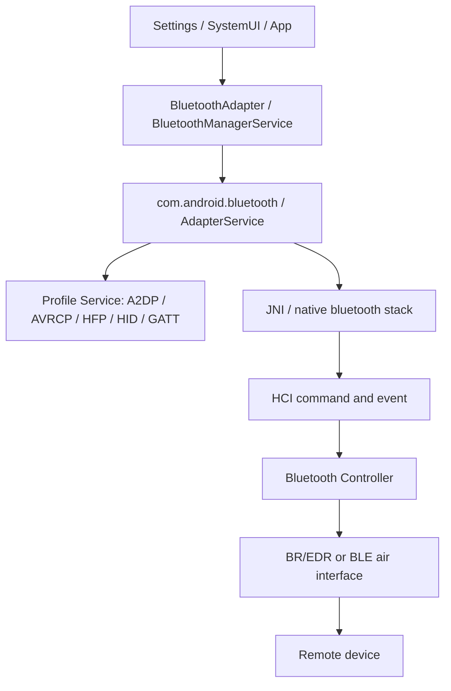

# BT基础概念与分层

## 一句话

蓝牙问题定位先分清“上层状态机、蓝牙协议栈、HCI/controller、对端设备、具体 Profile”五层，否则很容易把扫描、配对、连接和音频问题混在一起。

## 分层视图

## 核心术语

| 术语 | 含义 | 常见定位价值 |
|---|---|---|
| BR/EDR | 经典蓝牙，适合持续连接、音频、键鼠、车机等场景 | 关注 discovery、ACL、SDP、Profile |
| BLE / LE | 低功耗蓝牙，适合广播、低功耗小数据、GATT 外设 | 关注 advertising、scan、connectGatt、GATT |
| Dual mode | 同时支持经典蓝牙和 BLE 的设备 | 配对/连接时要确认 transport，不要只看设备名称 |
| GAP | 发现、广播、连接角色等通用访问流程 | 扫描不到、可见性、连接角色问题 |
| GATT | BLE 属性服务模型 | BLE service discovery、read/write/notify 问题 |
| ATT | GATT 底层属性传输协议 | MTU、属性读写和 notification 失败 |
| SMP | 安全管理协议，BLE 配对和密钥协商相关 | 配对失败、加密失败、bond 信息异常 |
| SSP | 经典蓝牙 Secure Simple Pairing | 配对码、确认弹窗、Just Works 等场景 |
| L2CAP | 逻辑链路控制与适配协议 | 上承 ATT、RFCOMM、AVDTP 等 |
| SDP | 经典蓝牙服务发现协议 | 配对后不知道对端支持哪些 Profile |
| RFCOMM | 串口仿真通道 | SPP、部分车机或传统设备连接 |
| A2DP | 蓝牙音乐音频传输 | 耳机无音乐声、编码和 audio path |
| AVRCP | 媒体控制和元数据 | 耳机按键、播放暂停、曲目信息 |
| HFP | 免提通话 Profile | 蓝牙通话音频、SCO、拨号和接听控制 |
| HID | 键盘、鼠标、遥控器等输入设备 | 输入设备连接和按键事件 |
| PAN | 蓝牙个人局域网 | 蓝牙网络共享类问题 |
| HCI | Host Controller Interface | Host 与 Controller 之间的命令、事件和数据包 |
| CoD | Class of Device，经典蓝牙设备类别 | 经典发现结果里的设备类型判断 |
| UUID | 服务或 Profile 标识 | Profile 选择、GATT 服务发现 |
| RSSI | 接收信号强度 | 只辅助判断距离/信号，不能单独作为根因 |

## 经典蓝牙与 BLE 对比

| 项目 | 经典蓝牙 BR/EDR | BLE |
|---|---|---|
| 常见设备 | 耳机、音箱、车机、键鼠、部分 PAN/SPP 设备 | 手环、手表、传感器、门锁、信标、App 外设 |
| 发现方式 | `startDiscovery()`，通过广播感知发现结果 | `BluetoothLeScanner.startScan()`，通过 `ScanCallback` 返回 |
| 连接重点 | ACL、SDP、Profile 连接 | LE connection、GATT service discovery |
| 配对重点 | SSP、PIN/passkey、BOND 状态 | SMP、加密、bond key |
| 常见证据 | `ACTION_FOUND`、`BOND_STATE_CHANGED`、ACL、Profile log | `onScanResult`、`registerScanner`、GATT callback、HCI LE event |

## 状态对象不要混用

| 状态 | 说明 | 常见误区 |
|---|---|---|
| Adapter state | `OFF / TURNING_ON / ON / TURNING_OFF` 等完整蓝牙状态 | `ON` 只说明适配器可用，不说明目标设备已连接 |
| BLE state | `BLE_TURNING_ON / BLE_ON / BLE_TURNING_OFF` 等低功耗状态 | 关闭经典蓝牙时可能短暂停在 `BLE_ON` |
| Bond state | `BOND_NONE / BOND_BONDING / BOND_BONDED` | bonded 不等于 connected |
| ACL state | 底层链路是否连上 | ACL 连上不等于 A2DP/HFP/GATT 可用 |
| Profile state | A2DP、HFP、HID、GATT 等各自状态 | 一个 Profile 成功不代表所有 Profile 成功 |

## 第一坏点原则

| 问题类型 | 先问什么 |
|---|---|
| 开关问题 | AdapterService 是否拉起，native stack 是否 init/shutdown 完成 |
| 扫描问题 | 是经典 discovery 还是 BLE scan，Controller 是否上报发现事件 |
| 配对问题 | createBond 是否发起，PAIRING_REQUEST 是否到 UI，SMP/SSP 是否失败 |
| 连接问题 | ACL 是否建立，SDP/UUID 是否完成，目标 Profile 是否连接 |
| 音频问题 | A2DP/AVRCP/HFP 哪个 Profile 异常，audio route/HAL 是否匹配 |

## 关联文档

- [[BT开关流程]]
- [[BT扫描与发现流程]]
- [[BT配对与绑定流程]]
- [[BT连接与Profile流程]]
- [[BLE广播扫描连接GATT流程]]
- [[BT音频流程-A2DP-AVRCP-HFP]]
- [[BT第一坏点速查]]
