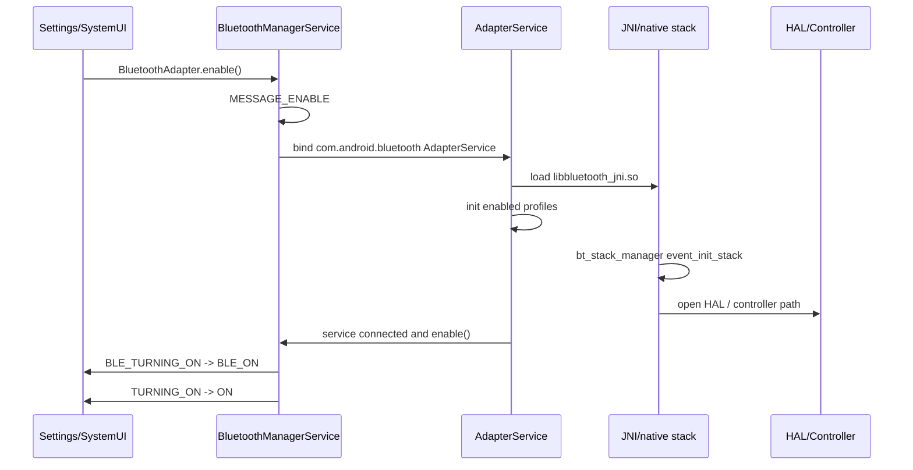
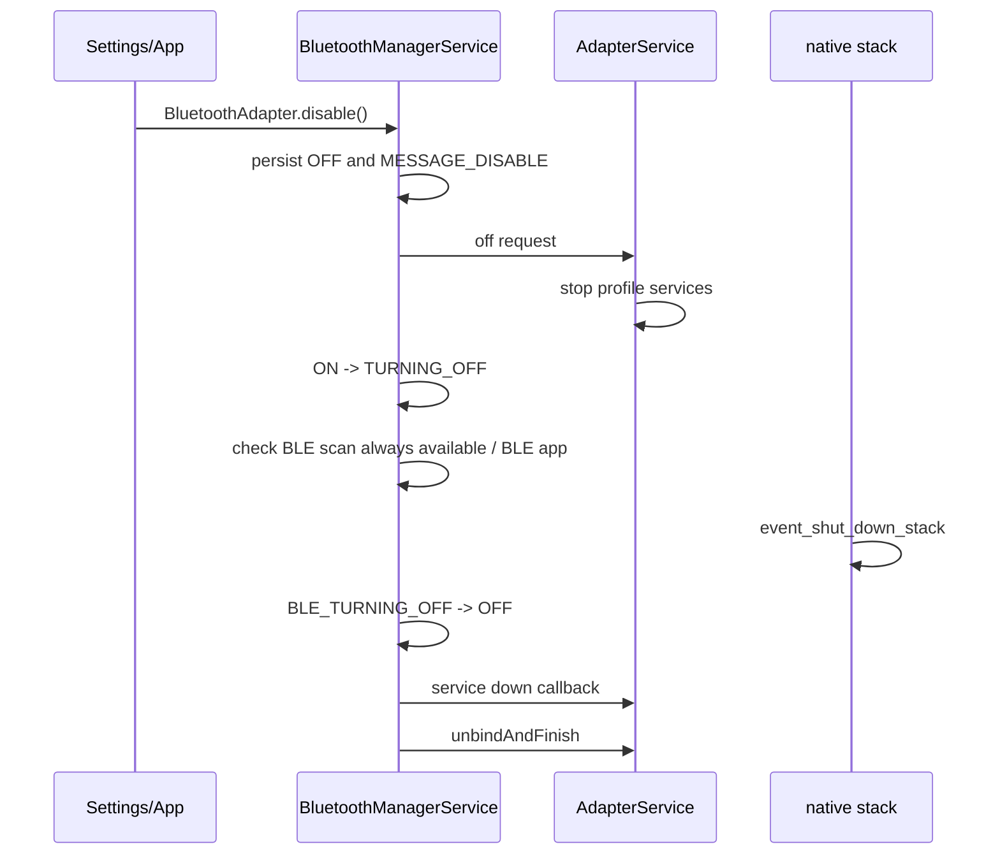

# BT开关流程

## 一句话

蓝牙开关问题按 `Settings/SystemUI -> BluetoothManagerService -> AdapterService -> JNI/native stack -> HAL/controller -> 状态广播` 顺序定位，先确认卡在哪个状态迁移点。

## 前置条件

- 复现时记录用户入口：快捷开关、Settings、第三方 App、开机自动恢复或策略触发。
- 同时抓 `main/system/crash` logcat，必要时补 `dumpsys bluetooth_manager`。
- 如果涉及蓝牙进程重启、native crash 或 controller 无响应，需要补 bugreport 和 HCI snoop。

## 开启正常路径



关键状态顺序：

```text
OFF -> BLE_TURNING_ON -> BLE_ON -> TURNING_ON -> ON
```

## 关闭正常路径



关闭时要注意经典蓝牙和 BLE 可能分阶段关闭。若 BLE scan always available 或 BLE app 存在，状态停留和资源释放顺序可能不同。

## AP侧观察点

| 观察点 | 关键字 |
|---|---|
| 请求来源 | `enable(`、`disable(`、`APPLICATION_REQUEST`、包名 |
| 状态机消息 | `MESSAGE_ENABLE`、`MESSAGE_DISABLE`、`MESSAGE_HANDLE_DISABLE_DELAYED` |
| 服务绑定 | `binding Bluetooth service`、`ServiceConnection.onServiceConnected` |
| 状态广播 | `BLE_STATE_CHANGED`、`STATE_CHANGED` |
| 服务上下线 | `sendBluetoothServiceUpCallback`、`sendBluetoothServiceDownCallback`、`onBluetoothServiceDown` |
| BLE 保留策略 | `isBleScanAlwaysAvailable`、`isBleAppPresent` |

## Stack/HCI/Controller侧观察点

| 观察点 | 关键字 |
|---|---|
| JNI 加载 | `Loading JNI Library`、`libbluetooth_jni.so`、`JNI_OnLoad` |
| Profile 初始化 | `AdapterServiceConfig: init: profile=`、`initProfileServices` |
| native stack 启动 | `bt_stack_manager`、`event_init_stack`、`finished` |
| 配置加载 | `bt_stack.conf` |
| 音频 HAL | `BluetoothAudioHal`、`BTAudioClientAIDL`、`openProvider` |
| native stack 关闭 | `event_shut_down_stack`、`is bringing down the stack`、`finished` |

## 常见异常分叉

| 阶段 | 异常 | 可能方向 | 需要证据 |
|---|---|---|---|
| enable 请求 | UI 点击无状态变化 | 上层开关未真正调用、策略拦截、权限/用户限制 | Settings/SystemUI log、`BluetoothManagerService enable(` |
| bind 服务 | 一直 `mAdapter=null` | 蓝牙进程未拉起、AdapterService 绑定失败、进程 crash | ActivityManager、crash log、`dumpsys activity service` |
| JNI/native init | 加载 so 或 stack init 失败 | APEX/库加载、native crash、配置缺失 | `libbluetooth_jni.so`、tombstone、`bt_stack_manager` |
| BLE_ON 后不上 ON | BR/EDR 启动失败 | controller、native stack、持久化状态或策略 | `continueFromBleOnState`、HCI log |
| disable 卡住 | 一直 TURNING_OFF | profile 未停、native shutdown 卡住、BLE 保留策略 | `MESSAGE_HANDLE_DISABLE_DELAYED`、profile stop、HCI |
| 关闭后自动又开 | 持久化状态或上层重新请求 | 快捷开关、开机恢复、第三方 App | 请求包名、`setBluetoothPersistedState` |

## 关联case

- 后续将真实开关卡住、蓝牙进程 crash、controller 无响应等问题沉淀到 `40_Case-Library/BT` 后再反链。
