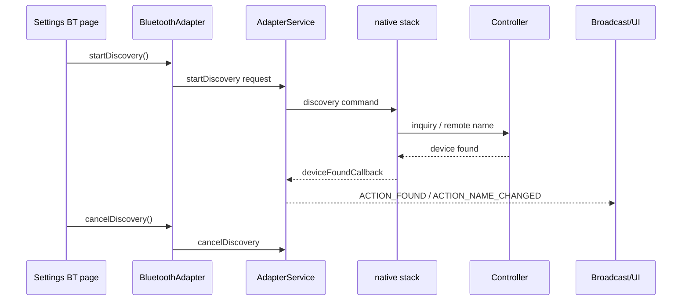
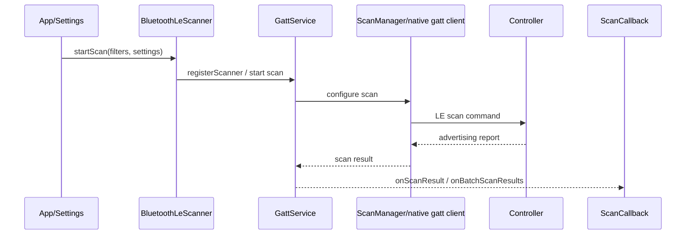

# BT扫描与发现流程

## 一句话

扫描问题先区分经典蓝牙 `startDiscovery()` 和 BLE `startScan()`：两者入口、回调、权限、底层事件和第一坏点都不同。

## 前置条件

- 明确目标设备类型：耳机/音箱/车机通常先看经典蓝牙，手环/传感器/门锁通常先看 BLE。
- 记录目标设备是否处于可发现、可连接或广播状态。
- Android 12 及以后版本还要关注蓝牙扫描相关权限和 App 前后台策略。

## 经典蓝牙发现路径

常见广播：

| 广播 | 用途 |
|---|---|
| `BluetoothAdapter.ACTION_DISCOVERY_STARTED` | discovery 开始 |
| `BluetoothDevice.ACTION_FOUND` | 发现经典蓝牙设备 |
| `BluetoothDevice.ACTION_NAME_CHANGED` | 设备名更新或补齐 |
| `BluetoothDevice.ACTION_CLASS_CHANGED` | 设备类别更新 |
| `BluetoothDevice.ACTION_UUID` | 服务 UUID 信息 |
| `BluetoothAdapter.ACTION_DISCOVERY_FINISHED` | discovery 结束 |

## BLE扫描路径

BLE 回调：

| 回调 | 用途 |
|---|---|
| `onScanResult()` | 单个扫描结果 |
| `onBatchScanResults()` | 批量扫描结果 |
| `onScanFailed()` | 扫描启动或执行失败 |

## AP侧观察点

| 类型 | 关键字 |
|---|---|
| 经典扫描 | `startDiscovery`、`cancelDiscovery`、`deviceFoundCallback`、`ACTION_FOUND`、`DISCOVERY_FINISHED` |
| BLE 扫描 | `BluetoothLeScanner`、`GattService`、`ScanManager`、`registerScanner`、`onScannerRegistered`、`onScanResult`、`onScanFailed` |
| UI 列表 | `BluetoothEventManager`、`AvailablePairDeviceGroupController`、`name change` |
| 广播链路 | `dumpsys activity broadcasts`、`android.bluetooth.device.action.FOUND` |

## Controller/HCI侧观察点

- 经典蓝牙看 inquiry、remote name request、device found、discovery cancel。
- BLE 看 LE scan enable、advertising report、scan filter、scan timeout。
- 如果 AP log 显示已经发起扫描但没有任何设备结果，HCI snoop 是判断 controller 是否收到空口事件的关键证据。

## 常见异常分叉

| 阶段 | 异常 | 可能方向 | 需要证据 |
|---|---|---|---|
| 发起扫描 | 没有 `startDiscovery/startScan` | UI 未触发、权限、开关未 ON、策略限制 | App/Settings log、权限状态、adapter state |
| 注册 BLE scanner | `onScannerRegistered` 失败 | scanner 资源、权限、蓝牙服务异常 | `GattService`、`ScanManager`、错误码 |
| 底层扫描 | AP 已发起但无结果 | controller 未扫描、过滤条件过严、对端未广播/不可发现 | HCI snoop、对端抓包或对比机 |
| 发现结果 | HCI 有结果但 UI 没显示 | 过滤策略、设备类型过滤、名称未补齐、UI 缓存 | `deviceFoundCallback`、`BluetoothEventManager` |
| 停止扫描 | 配对前未停止 discovery | discovery 干扰配对或连接 | `cancelDiscovery`、配对时间线 |

## 关联case

- 后续将“特定 BLE 设备搜不到”“车机不出现在列表”“HCI 有 advertising report 但 UI 无结果”等问题沉淀到 `40_Case-Library/BT`。
