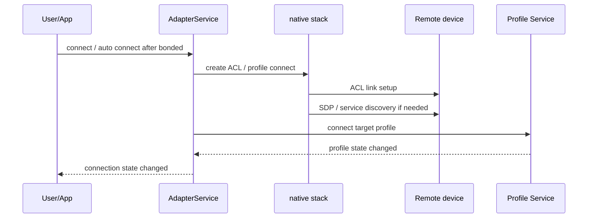

# BT连接与Profile流程

## 一句话

蓝牙“已配对”只是建立信任关系，业务可用还要看 ACL 链路、服务发现和目标 Profile 是否成功连接。

## 前置条件

- 明确目标业务：音乐、通话、媒体按键、键鼠输入、网络共享、BLE 数据读写。
- 记录设备当前 bond state、connection state、支持的 UUID/Profile。
- 同一设备可能多个 Profile 部分成功、部分失败，不能只看一个“connected”文案。

## 正常路径

## 常见Profile

| Profile | 业务 | 第一观察点 |
|---|---|---|
| A2DP | 蓝牙音乐播放 | A2DP state、codec、audio route、Audio HAL |
| AVRCP | 播放/暂停/上一曲/下一曲/元数据 | AVRCP controller/target 状态和按键事件 |
| HFP | 蓝牙通话、SCO 音频、免提控制 | HFP connection、SCO、call audio route |
| HID | 键盘、鼠标、遥控器 | HID profile 连接和 input event |
| PAN | 蓝牙网络共享 | PAN profile 状态和网络接口 |
| GATT | BLE 服务读写通知 | GATT connection、service discovery、ATT operation |

## AP侧观察点

| 观察点 | 关键字 |
|---|---|
| 自动连接 | `connectAllEnabledProfiles`、`connectAllSupportedProfiles` |
| 连接状态 | `onConnectionStateChanged`、`CONNECTING`、`CONNECTED`、`DISCONNECTED` |
| 服务发现 | `ACTION_UUID`、UUID list、SDP |
| Profile 初始化 | `AdapterServiceConfig: init: profile=` |
| Profile 状态 | `A2dpService`、`Avrcp`、`HeadsetService`、`HidHostService`、`PanService`、`GattService` |

## HCI/Controller侧观察点

- ACL 是否建立、是否被对端断开。
- 断开 reason 是认证、超时、远端用户终止、连接参数问题还是链路层问题。
- 对于经典蓝牙 Profile，关注 SDP/UUID 和对应 profile channel。
- 对于 BLE/GATT，转到 [[BLE广播扫描连接GATT流程]]。

## 常见异常分叉

| 阶段 | 异常 | 可能方向 | 需要证据 |
|---|---|---|---|
| 自动连接 | bonded 后没有连接动作 | 自动连接策略、quiet enable、目标 Profile 未启用 | `connectAllEnabledProfiles`、profile config |
| ACL | ACL 建不起来 | 对端不可连接、距离/干扰、controller reject、认证问题 | HCI snoop、disconnect reason |
| SDP/UUID | 无目标服务 | 对端能力、SDP 失败、缓存 UUID 异常 | `ACTION_UUID`、SDP log、对比机 |
| Profile | ACL connected 但 Profile disconnected | Profile service 未启用、策略限制、codec/role 不匹配 | Profile service log |
| 状态显示 | 底层已断但 UI 仍显示连接 | 状态同步丢失、缓存未刷新、广播未处理 | `onConnectionStateChanged`、UI log |

## 关联文档

- [[BT音频流程-A2DP-AVRCP-HFP]]
- [[BLE广播扫描连接GATT流程]]
- [[BT第一坏点速查]]
