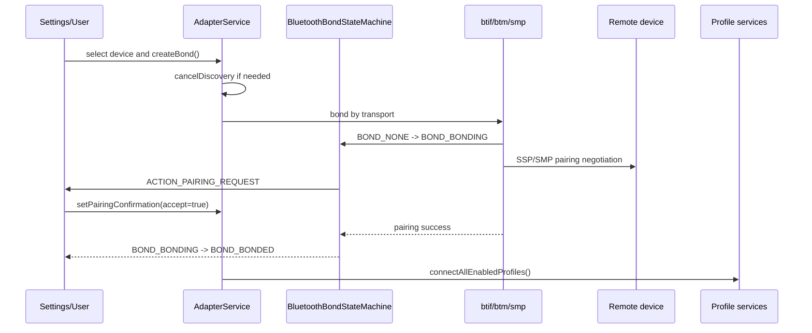

# BT配对与绑定流程

## 一句话

配对问题按 `createBond -> BondStateMachine -> SSP/SMP -> 配对 UI -> bond state -> profile auto connect` 顺序定位，先判断是没有发起、用户确认问题、密钥协商失败，还是配对后连接失败。

## 前置条件

- 先确认目标设备是经典蓝牙、BLE 还是 Dual mode。
- 配对前应记录是否执行了 `cancelDiscovery()`。
- 复现时同时保留 AP log 和 HCI snoop；HCI reason 对配对失败很关键。

## 正常路径

## 关键状态

| 状态 | 数值常见含义 | 说明 |
|---|---|---|
| `BOND_NONE` | 10 | 未绑定 |
| `BOND_BONDING` | 11 | 正在配对 |
| `BOND_BONDED` | 12 | 已绑定 |

底层日志里也可能用 `0:none, 1:bonding, 2:bonded` 表示 native bond 状态，需要和 Framework 常量区分。

## AP侧观察点

| 观察点 | 关键字 |
|---|---|
| 发起配对 | `createBond`、`device=`、`transport=` |
| 取消扫描 | `cancelDiscovery`、`DISCOVERY_FINISHED` |
| 状态机 | `BluetoothBondStateMachine`、`PendingCommandState` |
| 配对请求 | `sspRequestCallback`、`sendDisplayPinIntent`、`PAIRING_REQUEST` |
| UI 弹窗 | `BluetoothPairingRequest`、`BluetoothPairingDialog` |
| 用户确认 | `setPairingConfirmation`、`accept=true/false` |
| 绑定成功 | `BOND_BONDING => BOND_BONDED`、`bond_state_changed` |
| 配对后连接 | `connectAllEnabledProfiles`、`connectAllSupportedProfiles` |

## Native/HCI侧观察点

| 观察点 | 关键字 |
|---|---|
| transport 选择 | `btm_sec_bond_by_transport`、`Transport used` |
| 远端名称 | `remote_name_request` |
| SSP | `sspRequestCallback`、passkey、pairing variant |
| SMP | `smp_l2c`、pairing、encryption |
| 失败原因 | HCI reason、authentication failure、timeout、repeated attempts |

## 常见异常分叉

| 阶段 | 异常 | 可能方向 | 需要证据 |
|---|---|---|---|
| 发起配对 | UI 点击后无 `createBond` | UI 过滤、设备状态不允许、权限/策略 | Settings log、adapter/device state |
| transport | transport 非预期 | Dual mode 设备选错链路、缓存类型错误 | `transport=`、HCI、对端能力 |
| 配对请求 | 无弹窗 | SSP/SMP 请求未到 AP、广播未发出、UI 被限制 | `PAIRING_REQUEST`、ActivityTaskManager |
| 用户确认 | 用户同意后失败 | passkey/confirm 不一致、对端拒绝、超时 | `setPairingConfirmation`、HCI reason |
| bond state | 卡在 BOND_BONDING | 底层协商未返回、状态机丢事件、对端断开 | BondStateMachine、HCI disconnect |
| bonded 后异常 | 已配对但不可用 | Profile 未连接、UUID/SDP 未完成、设备能力不匹配 | `connectAllEnabledProfiles`、Profile log |

## 关联case

- 后续将“配对弹窗不出”“配对码不一致”“BOND_BONDED 后立即断开”等问题沉淀到 `40_Case-Library/BT`。
