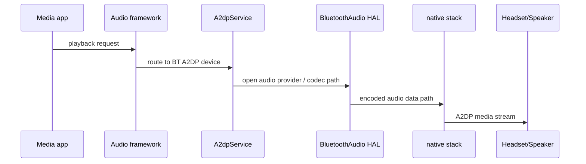
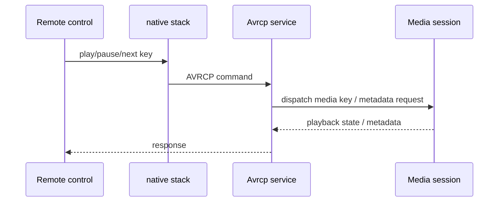
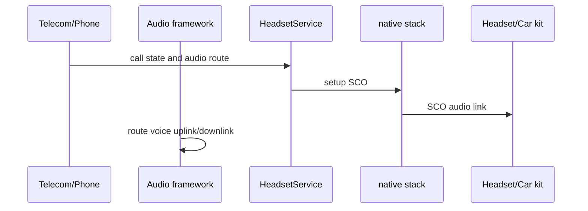

# BT音频流程-A2DP-AVRCP-HFP

## 一句话

蓝牙音频问题要把音乐音频 A2DP、媒体控制 AVRCP、通话音频 HFP/SCO 分开看；“耳机已连接”不代表音频路由、控制通道和通话链路都正常。

## 前置条件

- 明确问题发生在音乐、媒体按键、通话、语音助手还是车机蓝牙。
- 记录当前已连接 Profile：A2DP、AVRCP、HFP 是否分别 connected。
- 如果是无声/断续/卡顿，需要同步抓 audio、bluetooth、HCI 和 bugreport。

## A2DP音乐正常路径

## AVRCP媒体控制路径

## HFP通话音频路径

## AP侧观察点

| Profile | 关键字 |
|---|---|
| A2DP | `A2dpService`、`BluetoothAudioHal`、`A2DP_SOFTWARE_ENCODING_DATAPATH`、codec、active device |
| AVRCP | `Avrcp`、media key、metadata、playback state |
| HFP | `HeadsetService`、`HFP`、`SCO`、call audio state、active device |
| Audio | `AudioService`、`AudioPolicy`、route、device connect/disconnect |

## Native/HCI侧观察点

- A2DP 看媒体通道是否建立、codec 是否协商成功、音频数据是否持续。
- AVRCP 看控制命令是否到达以及是否有响应。
- HFP 看 HFP service level connection、SCO 建链、SCO disconnect reason。
- HCI 只能证明蓝牙链路和数据包，是否选中蓝牙作为系统音频输出还要看 Audio framework。

## 常见异常分叉

| 现象 | 可能方向 | 需要证据 |
|---|---|---|
| 耳机显示已连接但音乐外放 | A2DP 未连接、active device 错误、audio route 未切换 | A2DP state、AudioPolicy、active device |
| 音乐无声但进度在走 | A2DP 数据路径、codec、HAL、对端静音 | `BluetoothAudioHal`、HCI A2DP data、audio dump |
| 耳机按键无效 | AVRCP 未连接、媒体会话未处理、按键事件丢失 | AVRCP log、MediaSession、input/key event |
| 通话不走耳机 | HFP 未连接、SCO 未建立、Telecom/audio route 错误 | HFP/SCO log、AudioService、call state |
| 车机音乐正常但电话异常 | A2DP 成功但 HFP 失败 | 分别确认 A2DP/HFP state 和 HCI reason |
| 音频卡顿/断续 | 链路质量、codec、调度、音频 buffer、对端兼容 | HCI、audio underrun、RSSI/距离对比 |

## 关联文档

- [[BT连接与Profile流程]]
- [[BT第一坏点速查]]
