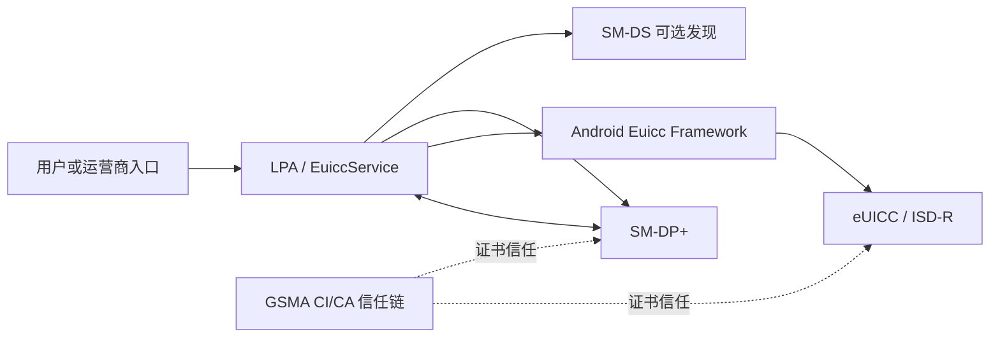
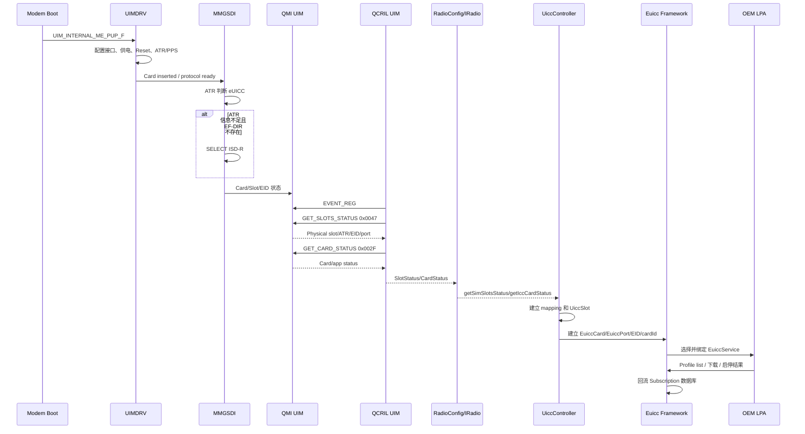

# Qualcomm eSIM启动流程与全栈排查

## 一句话结论

Qualcomm eSIM 开机可用不是“存在 Profile”这一项决定的，而是下面四层状态连续成立：

```text
Modem 能上电并识别 eUICC
→ QMI UIM 发布 physical slot/card/port/EID
→ QCRIL/Radio HAL 把状态交给 Android
→ Android 建立 UiccSlot/EuiccCard/EuiccPort，并选中可用的 EuiccService/LPA
```

没有 Profile 时，正常基线应该是“eUICC、EID 和 Port 已建立，Profile 列表为空”，而不是 `mUiccSlots=null`、`cardId=-2` 或完全没有 Slot Status。

## 适用源码和版本边界

本文基于以下源码树梳理：

```text
/home/wx/Project/QCOM/qcom4490/S1E4ProPlus
```

该源码中同时存在两套 Android 主干：

| 源码树 | 版本证据 | 本文用途 |
|---|---|---|
| `target/` | `target/build/make/core/version_defaults.mk` 中 SDK 32 | Product、Vendor、QCRIL、Radio HAL |
| `qssi/` | `qssi/build/make/core/version_defaults.mk` 中 Android 14、SDK 34 | Android Framework、Telephony、LPA 打包 |

产品和 Modem 基线：

| 项目 | 源码证据 |
|---|---|
| Product | `target/device/castles/qdt676/qdt676.mk` |
| `PRODUCT_NAME` | `qdt676` |
| `PRODUCT_MODEL` | `S1E4 Pro Plus` |
| AMSS contents | `amss/QCM4490.LA.2.0/contents.xml` |
| Modem chipset | `Clarence` |
| MPSS | `MPSS.DE.3.1.1.c2-00283-CLARENCE_GEN_PACK` |

> [!warning] 源码候选不等于手机实际运行版本
> 本文以 `qssi/frameworks` 作为 Framework 主线、`target/vendor/qcom/proprietary/qcril-nr` 作为 Vendor 主线。手机最终使用哪套 system/vendor、哪个 LPA、哪版 Radio HAL，必须通过运行时 fingerprint、SDK、VINTF、已安装包和 `dumpsys euicc` 再确认。

运行时版本核对：

```bash
adb shell getprop ro.product.model
adb shell getprop ro.build.version.sdk
adb shell getprop ro.build.fingerprint
adb shell getprop ro.vendor.build.fingerprint
adb shell lshal | grep -iE "radio.config|radio.lpa|radio"
adb shell service list | grep -iE "euicc|radio"
```

## 先统一名词和编号

| 名词 | 含义 | 排查时容易混淆的点 |
|---|---|---|
| RSP | Remote SIM Provisioning，远程 SIM 配置体系 | 是完整协议和信任体系，不只是“扫码下载” |
| eUICC | 支持 RSP 的安全 UICC 元件；本项目配置为不可拆卸 eUICC | “焊接”是本项目形态，不是 eUICC 的唯一技术定义 |
| EID | eUICC 硬件标识 | EID 未建立时，Android eSIM API 往往仍不可用 |
| ISD-R | eUICC 管理域 | 常用 AID 为 `A0000005591010FFFFFFFF8900000100` |
| Profile | 下载到 eUICC 的运营商应用、凭据、文件和策略 | 通常包含 IMSI/鉴权材料；不能假定一定存有可展示的手机号 |
| LPA | Local Profile Assistant | 负责 RSP 编排、网络交互及 Profile 查询、下载、启停、删除等 |
| SM-DP+ | Subscription Manager Data Preparation+ | 准备并安全交付加密 Profile；不是普通 APK 下载服务器 |
| SM-DS/DS | Subscription Manager Discovery Service | 用于发现待处理事件/服务器；并非每次 activation code 下载都必须经过 |
| CI/CA | GSMA 证书签发与信任体系 | eUICC、SM-DP+ 等通过证书链建立双向信任 |
| Physical Slot | 物理 UICC/eUICC 接口 | Android 下标通常从 0 开始 |
| Logical Slot | 分配给 Phone/Modem subscription 的逻辑槽 | 必须结合 physical slot mapping 判断 |
| Port | eUICC 上可承载一个启用 Profile 的逻辑端口 | MEP 场景下一个 eUICC 可有多个 Port |
| MEP | Multiple Enabled Profiles | Modem 支持字段不代表 Android 全链路已经支持 |
| cardId | Android 对 UICC/eUICC 的稳定标识 | `-2` 是 `UNINITIALIZED_CARD_ID` |

> [!warning] Slot 编号不要直接对照
> Android physical slot index 从 0 开始；QXDM/UIM 日志常写 Slot 1、Slot 2。看到 Android `slotIndex=0` 时，不能直接认定它对应 QXDM 的 `UIM_0`，必须结合 logical-to-physical mapping、硬件原理图和实际 Slot Status。

### RSP 外部实体关系



边界：

- activation code 通常携带 SM-DP+ 地址、matching ID 等信息；地址已经明确时不一定需要经过 SM-DS。
- SM-DS 更接近“待处理事件发现”，不能简单理解成所有激活码的固定 DNS。
- LPA 负责流程编排，但 APDU、Profile 安装和服务器认证的安全决定最终落在 eUICC/ISD-R。
- Android 系统 TLS 信任、系统时间和 eUICC 内部证书信任是两条相关但不完全相同的证书链。

## eSIM“可用”的分层定义

排障前先明确问题问的是哪一层：

| 层级 | 可用条件 | 推荐证据 |
|---|---|---|
| 产品声明 | 系统声明 `FEATURE_TELEPHONY_EUICC` | `pm list features` |
| eUICC 硬件 | Slot 上电、ATR/ISD-R 识别成功 | QXDM UIM/MMGSDI |
| Modem 服务 | Card/Slot Status 和 EID 可返回 | QMI UIM `0x002F/0x0047/0x0065` |
| Android UICC | `UiccSlot/EuiccCard/EuiccPort` 已建立 | `dumpsys telephony.registry`、`dumpsys euicc`、logcat |
| LPA 服务 | `EuiccConnector` 选中并绑定有效 `EuiccService` | `mSelectedComponent` |
| Profile 管理 | Profile list 能正常返回 | `GetEuiccProfileInfoListResult` |
| 业务订阅 | 已启用 Profile 写入 Subscription 数据库 | `dumpsys isub`、SubscriptionManager log |

因此：

```text
FEATURE_TELEPHONY_EUICC=true
≠ eUICC 已被 Modem 识别
≠ EID 已建立
≠ LPA 可用
≠ 已有可注册网络的 Profile
```

## 构建与产品配置

### Android feature 和 Slot 配置

当前产品只明确打包：

```make
target/device/castles/qdt676/qdt676.mk
PRODUCT_COPY_FILES += \
    frameworks/native/data/etc/android.hardware.telephony.euicc.xml:$(TARGET_COPY_OUT_ODM)/etc/permissions/sku_qdt676_sku1/android.hardware.telephony.euicc.xml
```

该文件的目标位置位于 `sku_qdt676_sku1` 对应的 ODM permission 目录，因此还要确认手机启动时选择的 hardware SKU 确实会加载这份 permission；“源码写了 copy”不等于当前 SKU 已声明 feature。

在 `qdt676.mk` 中未发现：

```text
android.hardware.telephony.euicc.mep.xml
```

QSSI Framework 中还存在直接定制：

```xml
qssi/frameworks/base/core/res/res/values/arrays.xml

<integer-array name="non_removable_euicc_slots">
    <item>0</item>
</integer-array>
```

默认物理槽数量：

```xml
qssi/frameworks/base/core/res/res/values/config.xml

<integer name="config_num_physical_slots">1</integer>
```

检查点：

- 最终 product image 是否真的包含 `android.hardware.telephony.euicc.xml`。
- 当前启动 hardware SKU 是否命中 `sku_qdt676_sku1`。
- `pm list features` 是否能看到 `android.hardware.telephony.euicc`。
- 如果项目要求 MEP，是否包含 `android.hardware.telephony.euicc.mep`。
- `non_removable_euicc_slots` 的 Android 下标是否与实际焊接 eUICC 一致。
- `config_num_physical_slots` 是否与 Modem 报告的 physical slot 数一致。
- product overlay 是否覆盖了上述数组和整数。

运行时命令：

```bash
adb shell getprop ro.boot.product.hardware.sku
adb shell pm list features | grep -i euicc
adb shell cmd overlay list | grep -iE "telephony|framework"
```

### LPA 预置、特权权限和 Service 声明

桌面资料中的 Google LPA/`EuiccGoogleOverlay.apk` 方案属于特定产品实现。当前 QCM4490 源码没有发现本产品打包 Google LPA/overlay，实际候选是 LinksField LPA 和 Qualcomm `uimlpaservice`，不能直接照搬 Google 包名、目录和 overlay target。

当前 LinksField 打包证据：

```text
qssi/vendor/mobiiot/apps/LinksFieldLPA/Android.mk
LOCAL_CERTIFICATE := platform
LOCAL_PRIVILEGED_MODULE := true

qssi/vendor/mobiiot/system_device.mk
PRODUCT_PACKAGES += LinksFieldLPA
```

特权权限文件：

```text
qssi/vendor/mobiiot/permissions/privapp-permissions-mobiiot.xml
```

为 `com.linksfield.android.euicc` 配置了：

```text
android.permission.BIND_EUICC_SERVICE
android.permission.WRITE_EMBEDDED_SUBSCRIPTIONS
android.permission.READ_PRIVILEGED_PHONE_STATE
```

权限语义要分开：

| 项目 | 必须满足的条件 |
|---|---|
| LPA 包权限 | PackageManager 实际授予 `WRITE_EMBEDDED_SUBSCRIPTIONS` |
| EuiccService 保护 | Service 的 `android:permission` 必须是 `BIND_EUICC_SERVICE` |
| 组件发现 | 声明 `android.service.euicc.EuiccService` intent filter 和非 0 priority |
| 安装属性 | 分区、签名、privileged/signature 权限策略匹配 |
| SELinux | Framework 能绑定 Service，LPA 能访问网络及所需 Radio/APDU 接口 |

仅在 manifest 中写了 `uses-permission` 不等于运行时已经授予。检查：

```bash
adb shell dumpsys package com.linksfield.android.euicc | \
grep -iE "codePath|pkgFlags|WRITE_EMBEDDED_SUBSCRIPTIONS|READ_PRIVILEGED_PHONE_STATE|granted=true"

adb shell dumpsys package com.qualcomm.qti.lpa | \
grep -iE "codePath|pkgFlags|WRITE_EMBEDDED_SUBSCRIPTIONS|granted=true"
```

> [!warning] BIND 权限不要混淆
> `BIND_EUICC_SERVICE` 主要用于限制谁可以绑定该 Service；`EuiccConnector` 还会单独检查 LPA 包是否拥有 `WRITE_EMBEDDED_SUBSCRIPTIONS`。两者缺一都可能导致 `mSelectedComponent=null`。

### 终端能力和 SM-DP+ 交互

关键资源：

```text
qssi/frameworks/base/core/res/res/values/config.xml
config_telephonyEuiccDeviceCapabilities
```

当前 QSSI 默认数组是空的，且本次源码搜索未找到 qdt676/device/vendor overlay 对它进行填充：

```xml
<string-array translatable="false"
        name="config_telephonyEuiccDeviceCapabilities">
</string-array>
```

`EuiccPort.authenticateServer()` 会读取该数组，将设备能力编码进发送给 eUICC 的 `AuthenticateServer` 参数。数组为空时仍会构造请求，但 device capabilities 节点没有具体能力项；这不一定阻断所有 SM-DP+，但可能影响服务器兼容性、RAT/版本能力协商和问题定位。

当前 `EuiccPort.addDeviceCapability()` 支持的精确键名：

| 键名 | 含义 |
|---|---|
| `gsm` | GSM supported release |
| `utran` | UTRAN supported release |
| `cdma1x` | CDMA2000 1x supported release |
| `hrpd` | HRPD supported release |
| `ehrpd` | eHRPD supported release |
| `eutran` | E-UTRAN supported release |
| `nfc` | Contactless supported release |
| `crl` | RSP CRL supported version |
| `nrepc` | NR over EPC supported release |
| `nr5gc` | NR over 5GC supported release |
| `eutran5gc` | E-UTRAN over 5GC supported release |

> [!danger] 能力键拼写严格
> 源码识别的是 `crl`（小写字母 L），不是 `cr1`；是 `cdma1x`，不是 `cdmalx`；是 `nrepc`，不是 `nrEpc`。拼错会记录 `Invalid device capability name`，并跳过该能力。

配置原则：

- 通过 product RRO/overlay 填充，不建议直接改 AOSP 默认值。
- 只声明整机和当前协议栈真实支持的能力，不要机械复制所有示例项。
- 版本值必须与平台、Radio 和认证口径一致。
- 修改后同时验证最终 `framework-res.apk`、overlay 生效状态和 `AuthenticateServer` 行为。

运行时/镜像检查：

```bash
adb shell cmd overlay list | grep -iE "framework|telephony|euicc"
adb shell cmd overlay lookup android \
    android:array/config_telephonyEuiccDeviceCapabilities

adb pull /system/framework/framework-res.apk
aapt2 dump resources framework-res.apk | \
grep -A 30 config_telephonyEuiccDeviceCapabilities
```

### Modem Subscription Manager 编译开关

关键构建逻辑：

```text
modem/modem_proc/uim/build/uim.scons
```

`USES_SUB_MANAGER` 会打开：

```c
FEATURE_UIM_DS_SUBSCRIPTION_MANAGER
```

当前 `uim.scons` 中，`USES_CUST_2` 会关闭 `USES_SUB_MANAGER` 和 `USES_SUPPORT_IUICC`；否则默认打开。必须检查最终 Modem build flags，不能只看源文件中存在实现。

检查点：

- 最终编译是否定义 `FEATURE_UIM_DS_SUBSCRIPTION_MANAGER`。
- 是否意外带入 `USES_CUST_2`。
- `uimsub_manager.c` 是否进入最终链接。
- Modem 是否注册并缓存 physical slot information。
- 编译成功不等于运行时 physical slot cache 已建立。

### pSIM/eSIM 组合和硬件 MUX 边界

“SIM1 为 pSIM、SIM2 为 eSIM”只是常见产品组合，不是 RSP 标准要求。硬件通常分两类：

| 设计 | 特征 | 排查重点 |
|---|---|---|
| 独立接口 | pSIM 和 eUICC 各占一个 UIM interface | `number_of_active_interfaces`、Slot mapping、各接口上电 |
| 共享接口/MUX | pSIM 与 eUICC 共用一个 Modem UIM interface，通过 GPIO/模拟开关切换 | MUX 选择、电气稳定、上下电顺序、插拔事件和状态重建 |

当前项目日志出现 `UIM_2`，但仅凭该名字不能证明 UIM2 是独立 eUICC 还是共享 MUX。必须结合：

- 原理图中 eUICC、卡座和 Modem UIM 引脚连接。
- `/nv/item_files/modem/uim/uimdrv/uim_hw_config`。
- TLMM/pinctrl、PMIC、电源和 board/SKU 配置。
- 开机时 MUX 默认电平以及 bootloader/kernel/Modem 谁拥有控制权。

如果硬件确实共享接口，通用安全顺序是：

```text
停止新 APDU/等待当前事务结束
→ 当前卡下电
→ 切换 MUX/GPIO
→ 等待硬件稳定或完成事件
→ 目标卡上电
→ 等待 ATR/识别
→ 重新查询 Slot/Card Status
→ Framework 销毁旧对象并建立新对象
```

检查点：

- 切换前是否已经 power down，避免带电切换或 APDU 处理中改路。
- 切换后是否真的产生新的 ATR 和 Slot/Card Status。
- 旧 `UiccCard/UiccPort` 是否销毁，新的对象和 mapping 是否重建。
- 开机恢复状态是否与实际 MUX 电平一致。
- 多 BOM/SKU 是否通过只读硬件标识决定能力，而不是只靠 UI 开关。

> [!warning] MTK 命令不能直接移植
> `/proc/mtk_gpio`、`AT+ESIMPOWER`、`MTK_ESIM_VERSION` 和 MT6835 固定 GPIO 号都是 MTK 私有实现，不能直接用于 Qualcomm。Qualcomm 应从原理图、TLMM/pinctrl、UIMDRV/NV 和产品控制服务重新确认所有权。

> [!warning] 不要把固定 sleep 和 0666 当成量产方案
> 固定等待 1 秒只能用于验证时序假设，最终应优先使用 power/ATR/Slot Status 完成事件或硬件确认的稳定时间。sysfs 节点也不应通用设置为 `0666`；应采用专用 SELinux type、最小 owner/group/mode 和受权限控制的服务接口。

## 开机全栈时序



从第一坏点角度可压缩为：

```text
UIM 接口启用
→ 上电/Reset
→ ATR/PPS
→ eUICC 识别
→ EID/Physical Slot Status
→ QMI UIM
→ QCRIL mapping
→ Radio HAL
→ UiccSlot/EuiccCard/EuiccPort
→ EuiccConnector/LPA
→ Profile
→ Subscription
```

## 阶段一：Modem UIMDRV 上电和接口枚举

### 关键代码

| 路径 | 作用 |
|---|---|
| `modem/modem_proc/uim/uimdrv/src/uim.c` | UIM task 和启动入口 |
| `modem/modem_proc/uim/uimdrv/src/uimdrv.c` | UIM driver 主流程 |
| `modem/modem_proc/uim/uimdrv/src/enumeration/uimdrv_enumeration.c` | UIM 接口枚举 |
| `modem/modem_proc/uim/uimdrv/src/uimgen.c` | UIM 通用命令/状态机 |
| `modem/modem_proc/uim/uimdrv/src/hal/uimgen_hal_iso.c` | ISO 电气和协议 HAL |
| `modem/modem_proc/uim/uimdrv/src/uimsub_manager.c` | physical/logical slot 管理 |
| `modem/modem_proc/uim/api/uim_v.h` | UIM 命令和状态枚举 |

开机命令：

```c
UIM_INTERNAL_ME_PUP_F = 0x0100
```

初始状态：

```c
UIM_UNINITIALIZED_S = 0x03
```

### 本阶段必须回答

1. eUICC 对应 UIM interface 是否被配置为 active。
2. 是否执行供电、时钟、Reset。
3. 是否收到完整 ATR。
4. PPS/协议协商是否完成。
5. 状态是否离开 `UIM_UNINITIALIZED_S`。
6. UIMDRV 是否把 physical slot 信息交给 Subscription Manager。

### 重点 NV/配置

```text
NV 70210
/nv/item_files/modem/uim/uimdrv/uim_hw_config
```

重点字段和含义：

| 字段                            | 检查目的                  |
| ----------------------------- | --------------------- |
| `disableUim`                  | eUICC 所在接口是否被禁用       |
| `number_of_active_interfaces` | 活跃 UIM 接口数量是否覆盖 eUICC |
| 接口/Slot mapping               | UIM2 是否映射到真实 eUICC    |
| 电压、GPIO、clock/reset           | 是否与硬件连接和 PMIC 配置一致    |

### QXDM 观察点

- `UIM_1/UIM_2 command` 是否出现 `0x100`。
- 上电后是否有 Reset、ATR、PPS。
- 是否反复 power cycle 或停在 uninitialized。
- 是否出现接口 disabled、no ATR、timeout、voltage error。
- physical slot 数是否为 0。

第一坏点判定：

| 证据 | 优先方向 |
|---|---|
| 完全没有目标 UIM interface 启动 | Modem build/NV/接口配置 |
| 有上电，无 ATR | eUICC 硬件、电气、GPIO/时钟/Reset、UIMDRV |
| ATR 成功但没有进入 MMGSDI | Driver 到 MMGSDI 事件链 |
| 一直 `UIM_UNINITIALIZED_S` | 上电状态机未完成，暂不进入 RIL |

## 阶段二：MMGSDI 识别 eUICC

### 关键代码

| 路径 | 作用 |
|---|---|
| `modem/modem_proc/uim/mmgsdi/src/mmgsdi_nv_refresh.c` | Card 初始化、EF-DIR 和 eUICC 识别分支 |
| `modem/modem_proc/uim/mmgsdi/src/mmgsdi_euicc.c` | SELECT ISD-R、eUICC 判断 |

正常情况下，ATR 可以携带 eUICC 能力信息。但源码明确处理了 ATR 不可靠的卡：

```text
ATR 未标识 eUICC
+ EF-DIR 不存在
→ SELECT ISD-R
→ SELECT 成功则把 slot_data_ptr->is_euicc 置为 TRUE
```

ISD-R AID：

```text
A0000005591010FFFFFFFF8900000100
```

检查点：

- ATR 是否包含 eUICC 能力。
- `mmgsdi_euicc_is_isdr_found()` 是否被调用。
- SELECT ISD-R 的 APDU 和状态字是否成功。
- `slot_data_ptr->is_euicc` 最终是否为 true。
- Android ATR 判断与 Modem 的 ISD-R 补救判断是否一致。

> [!warning] Modem 与 Android 可能识别不一致
> Modem 能通过 SELECT ISD-R 修正 ATR 不可靠的情况；Android `AnswerToReset` 主要依据 ATR。若 Modem 报 eUICC，但 Framework 没创建 `EuiccCard`，必须同时核对 QMI 输出的 ATR 和 Android `AnswerToReset.isEuiccSupported()`。

## 阶段三：没有 Profile 时 Modem 应如何表现

关键代码：

```text
modem/modem_proc/uim/uimqmi/src/qmi_uim.c
```

源码对以下场景有专门处理：

```c
is_euicc_card == true && num_aids_avail == 0
```

即 eUICC 已存在，但没有任何 active Profile/application 时，QMI UIM 仍会触发 Card Status 更新，让客户端知道卡仍然存在。

因此无 Profile 的正常结果是：

```text
eUICC physical slot = present
is_euicc = true
EID = valid
Card Status = present
active application/Profile = 0
Profile list = []
```

以下状态不能用“因为没有 Profile”解释：

```text
没有 ATR
没有 eUICC 识别
GET_SLOTS_STATUS 返回 internal error
Android mUiccSlots=null
default cardId=-2
EuiccConnector 没有可绑定组件
```

## 阶段四：UIM Subscription Manager 和 QMI UIM

### 关键代码

| 路径 | 作用 |
|---|---|
| `modem/modem_proc/uim/uimdrv/src/uimsub_manager.c` | Slot/Subscription Manager |
| `modem/modem_proc/uim/uimqmi/src/qmi_uim_sub_mgr.c` | QMI physical slot status 请求处理 |
| `modem/modem_proc/uim/uimqmi/src/qmi_uim.c` | QMI UIM 请求分发、Card Status、EID |
| `modem/modem_proc/qmimsgs/uim/api/user_identity_module_v01.h` | QMI UIM IDL |

### 关键 QMI 消息

| 消息 | ID | 用途 |
|---|---:|---|
| `EVENT_REG` | `0x002E` | 注册 UIM indications |
| `GET_CARD_STATUS` | `0x002F` | 查询 Card/application 状态 |
| `STATUS_CHANGE_IND` | `0x0032` | Card Status 变化 |
| `GET_ATR` | `0x0041` | 查询 ATR |
| `GET_SLOTS_STATUS` | `0x0047` | 查询 physical slot、mapping、ATR、EID |
| `SLOT_STATUS_CHANGE_IND` | `0x0048` | Slot Status 变化 |
| `GET_EID` | `0x0065` | 查询 EID |

`qmi_uimi_get_slots_status()` 的关键失败条件：

| 条件 | 返回 |
|---|---|
| physical slot cache 数量为 0 | `QMI_ERR_INTERNAL` |
| physical slot pointer 为 null | `QMI_ERR_INTERNAL` |
| 未编译 `FEATURE_UIM_DS_SUBSCRIPTION_MANAGER` | `QMI_ERR_NOT_SUPPORTED` |

正常响应可携带：

- physical slot status。
- logical-to-physical slot mapping。
- ATR。
- ICCID。
- EID。
- extended card state。
- eUICC/MEP 能力。
- negotiated MEP mode。
- Port state、logical slot 和 port information。

QMI IDL 中已存在：

```text
is_euicc
is_mep
negotiated_mep_mode
port_state
logical_slot
port_information[]
```

### 本阶段检查点

1. QMI UIM service 是否正常 up。
2. QCRIL 是否成功发送 `EVENT_REG`。
3. `GET_SLOTS_STATUS 0x0047` 是否有 request/response。
4. response result/error 是什么。
5. physical slot 数量、slot state、logical slot mapping 是否合理。
6. ATR/EID TLV 是否存在、长度是否有效。
7. 无 Profile 时 `GET_CARD_STATUS` 是否仍报告 card present。
8. MEP 项目是否携带 per-port 信息。

## 阶段五：QCRIL UIM 初始化和硬门槛

### 关键代码

| 路径 | 作用 |
|---|---|
| `target/vendor/qcom/proprietary/qcril-nr/modules/uim/src/UimModule.cpp` | UIM module 生命周期和消息处理 |
| `target/vendor/qcom/proprietary/qcril-nr/modules/uim/src/qcril_uim.cpp` | QCRIL UIM 初始化 |
| `target/vendor/qcom/proprietary/qcril-nr/modules/uim/src/qcril_uim_slot_mapping.cpp` | Slot Status 转换和 mapping |
| `target/vendor/qcom/proprietary/qcril-nr/modules/qmi/src/UimModemQcci.cpp` | QMI UIM client 和数据转换 |
| `target/vendor/qcom/proprietary/qcril-nr/include/modules/uim/qcril_uim_srvc.h` | QCRIL UIM service 类型 |
| `target/vendor/qcom/proprietary/qcril-nr/qcril-common/interfaces/inc/interfaces/uim/qcril_uim_types.h` | 上层 Slot/Card 数据类型 |

初始化主线：

```text
QMI UIM Service Up
→ qcril_uim_init_state()
→ EVENT_REG
→ GET_SLOTS_STATUS
→ 缓存 logical-to-physical mapping
→ GET_CARD_STATUS
→ UIM module ready
```

### 零 active logical slot 硬门槛

`qcril_uim_slot_mapping.cpp` 中存在明确判断：

```text
number_of_logically_active_slots == 0
→ "Invalid number of logically active slots"
```

对同步响应：

```text
GET_SLOTS_STATUS 原本成功
→ QCRIL 改成 RIL_UIM_E_MODEM_ERR
```

对 Slot Status indication：

```text
active logical slot 数为 0
→ indication 直接 return，不向上广播
```

这意味着一个特殊风险：

```text
Modem 能看到无 Profile eUICC
但没有 active port/logical slot
→ QCRIL 把整个 Slot Status 当异常丢弃
→ Android 看不到 eUICC physical slot
```

排查时必须区分：

- Modem `0x0047` 本身就错误。
- Modem `0x0047` 正确，但 active logical slot 数为 0。
- QCRIL 转换后才变成 `MODEM_ERR`。

关键日志：

```text
qcril_uim_get_slots_status_resp
qmi_err_code
Invalid number of logically active slots
qcril_uim_process_slot_status_change_ind
```

### MEP 信息截断风险

Modem QMI IDL 已支持 MEP/per-port 字段，但当前 QCRIL 上层旧式 Slot 类型主要保留：

```text
cardState
slotState
logicalSlot
ICCID
ATR
EID
```

没有完整转发：

```text
is_mep
negotiated_mep_mode
uim_port_status[]
```

因此不能用“QMI IDL 有 MEP 字段”证明 Android MEP 已打通。

## 阶段六：RadioConfig、IRadio 和 HAL 边界

### 关键代码

```text
target/vendor/qcom/proprietary/qcril-nr/modules/radio_config
```

当前源码中 RadioConfig 实现覆盖 HIDL 1.0 至 1.3。主要接口：

| 接口 | 作用 |
|---|---|
| `IRadioConfig.getSimSlotsStatus()` | Framework 查询 physical slot 状态 |
| `getSimSlotsStatusResponse*` | 返回 Slot Status |
| `simSlotsStatusChanged*` | Slot Status indication |
| `IRadio.getIccCardStatus()` | 查询逻辑 Phone 对应 Card/application 状态 |
| `getIccCardStatusResponse` | 返回 Card Status |

关键日志：

```text
IRadioConfig: getSimSlotsStatus
getSimSlotsStatusResponse
getSimSlotsStatusResponse_1_2
simSlotsStatusChanged
simSlotsStatusChanged_1_2
getIccCardStatusResponse
```

### 本阶段检查点

1. Framework 实际连接 AIDL 还是 HIDL RadioConfig。
2. `getSimSlotsStatus` 是否真的发到 Vendor。
3. response 是否成功，Slot Status 数组是否为空。
4. ATR、EID、logical slot 是否在 HAL 转换中保留。
5. indication 是否被 QCRIL 零 active slot 判断拦截。
6. HAL service 是否 crash/restart。

> [!warning] HIDL 与 MEP
> Android 14 Framework 可以兼容旧 HIDL RadioConfig，但旧式 HIDL SlotStatus 无法完整表达新的 per-port/MEP 语义。MEP 项目必须逐层证明 QMI → QCRIL → HAL → Framework 的 Port 信息没有被降级成单 Port。

## 阶段七：Android UiccController 建立 eUICC 对象

### 启动入口

```text
qssi/frameworks/opt/telephony/src/java/com/android/internal/telephony/PhoneFactory.java
```

关键初始化顺序：

```text
RadioConfig.make()
→ UiccController.make()
→ SubscriptionManagerService
→ EuiccController.init()
→ EuiccCardController.init()
```

### Radio Available 后的查询

`UiccController` 收到 `EVENT_RADIO_AVAILABLE` 或 `EVENT_RADIO_ON` 后：

```text
每个 phoneId:
    getIccCardStatus()

仅 phoneId 0:
    getSimSlotsStatus()
```

关键代码：

| 路径/函数 | 作用 |
|---|---|
| `UiccController.onGetIccCardStatusDone()` | 处理 CardStatus |
| `UiccController.onGetSlotStatusDone()` | 处理 SlotStatus 和 mapping |
| `RILUtils.convertHalCardStatus()` | HAL CardStatus 转换 |
| `RILUtils.convertHalSlotStatus()` | HAL SlotStatus 转换 |
| `UiccSlot.update()` | 创建/更新 UiccCard |
| `UiccSlot` | physical slot 状态 |
| `EuiccCard` | eUICC card 对象 |
| `EuiccPort` | eUICC Port 和 APDU 能力 |

Android 只有拿到有效 CardStatus/SlotStatus 后，才可能建立：

```text
phoneId → physicalSlotIndex mapping
UiccSlot
EuiccCard
EuiccPort
EID
cardId
```

如果 `getSimSlotsStatus` 返回 `REQUEST_NOT_SUPPORTED`，`UiccController` 会把：

```text
mIsSlotStatusSupported = false
```

后续不再按 Slot Status 路径处理，因此必须确认是一次临时错误还是 HAL 确实不支持。

### Android ATR 识别

关键代码：

```text
qssi/frameworks/opt/telephony/src/java/com/android/internal/telephony/uicc/AnswerToReset.java
```

ATR 中 T=15 后第一个 TB：

| 位 | Android 含义 |
|---|---|
| b8 + b2 | 支持 eUICC |
| b8 + b1 | 支持 MEP |

关键日志和状态：

```text
UiccController
onGetSlotStatusDone
onGetIccCardStatusDone
UiccSlot
EuiccCard
EuiccPort
AnswerToReset
mDefaultEuiccCardId
```

## 阶段八：EID、cardId 和 EuiccManager 可用性

`EuiccManager.isEnabled()` 的核心条件是：

```java
getIEuiccController() != null
&& refreshCardIdIfUninitialized()
```

`UiccController` 的默认 eUICC cardId 初始为：

```text
UNINITIALIZED_CARD_ID = -2
```

因此下面任一条件都可能让 `EuiccManager.isEnabled()` 返回 false：

- `IEuiccController` 服务未初始化。
- 没有创建 `EuiccCard/EuiccPort`。
- EID/card string 尚未映射为 cardId。
- `mDefaultEuiccCardId` 仍为 `-2`。
- Slot Status 被 QCRIL/HAL 丢弃。

源码中还有 KPN EID 重试定制：

```text
EVENT_KPN_EID_RETRY
ril.telephony.eid
telephony_eid
```

这只能在 `UiccCard/UiccPort` 基础对象已经建立后补 EID，不能修复 `mUiccSlots=null` 或 Modem 没有发布 Slot Status。

## 阶段九：EuiccController、EuiccConnector 和 LPA 选择

### Framework 主线

```text
EuiccManager
→ IEuiccController
→ EuiccController
→ EuiccConnector
→ OEM EuiccService
```

关键代码：

| 路径 | 作用 |
|---|---|
| `qssi/frameworks/base/telephony/java/android/telephony/euicc/EuiccManager.java` | App-facing eSIM API |
| `qssi/frameworks/opt/telephony/src/java/com/android/internal/telephony/euicc/EuiccController.java` | 权限、流程编排、结果回流 |
| `qssi/frameworks/opt/telephony/src/java/com/android/internal/telephony/euicc/EuiccConnector.java` | 查找和绑定 EuiccService |
| `qssi/frameworks/opt/telephony/src/java/com/android/internal/telephony/euicc/EuiccCardController.java` | EuiccCard/Port APDU API |

`EuiccConnector.findBestComponent()` 只接受：

- 具有 `WRITE_EMBEDDED_SUBSCRIPTIONS` 权限的 privileged app。
- Service 要求 `BIND_EUICC_SERVICE`。
- Intent filter priority 非 0。
- 在候选中选择更高 priority。

### 当前源码存在两套 EuiccService

#### LinksField LPA：AOSP EuiccCard APDU 路径

打包入口：

```text
qssi/vendor/mobiiot/system_device.mk
qssi/vendor/mobiiot/apps/LinksFieldLPA/LinksFieldLPA.apk
```

APK manifest/DEX 检查结果：

```text
package = com.linksfield.android.euicc
service = EuiccServiceImpl
permission = android.permission.BIND_EUICC_SERVICE
intent = android.service.euicc.EuiccService
priority = 100
调用 android.telephony.euicc.EuiccCardManager
```

下行路径：

```text
EuiccManager
→ EuiccController
→ EuiccConnector
→ LinksField EuiccService
→ EuiccCardManager
→ EuiccCardController
→ EuiccPort
→ ApduSender
→ IRadio open logical channel/APDU
→ ISD-R
```

关键代码：

```text
qssi/frameworks/opt/telephony/src/java/com/android/internal/telephony/uicc/euicc/EuiccPort.java
qssi/frameworks/opt/telephony/src/java/com/android/internal/telephony/uicc/euicc/apdu/ApduSender.java
```

`EuiccPort` 中 ISD-R AID：

```text
A0000005591010FFFFFFFF8900000100
```

#### Qualcomm 私有 LPA：QMI LPA 路径

预编译 APK：

```text
qssi/vendor/qcom/proprietary/prebuilt_HY11/target/product/qssi/product/app/uimlpaservice/uimlpaservice.apk
```

APK manifest/DEX 检查结果：

```text
package = com.qualcomm.qti.lpa
service = QtiEuiccServiceImpl
permission = android.permission.BIND_EUICC_SERVICE
intent = android.service.euicc.EuiccService
priority = 100
QtiEuiccServiceImpl → UimLpaProxy
→ vendor.qti.hardware.radio.lpa@1.0/1.1/1.2
```

QCRIL 代码：

```text
target/vendor/qcom/proprietary/qcril-nr/modules/lpa
target/vendor/qcom/proprietary/qcril-nr/modules/uim/src/qcril_uim_lpa.cpp
```

支持的主要操作：

```text
ADD_PROFILE
ENABLE_PROFILE
DISABLE_PROFILE
DELETE_PROFILE
GET_PROFILE
GET_EID
UPDATE_NICKNAME
EUICC_MEMORY_RESET
GET_SET_SERVER_ADDRESS
USER_CONSENT
```

网络下载路径：

```text
Modem QMI UIM HTTP transaction indication
→ QCRIL LpaModule
→ Qualcomm LPA APK 执行 HTTPS
→ UimLpaHttpTxnCompletedRequest
→ QMI UIM HTTP
→ Modem/eUICC
```

关键代码：

```text
target/vendor/qcom/proprietary/qcril-nr/modules/lpa/src/LpaModule.cpp
target/vendor/qcom/proprietary/qcril-nr/modules/lpa/src/LpaUimHttpRequestMsg.cpp
modem/modem_proc/uim/uimqmi/src/qmi_uim_http.c
```

### 两套 LPA 同优先级风险

两套 `EuiccService` 的 priority 都是 100。`findBestComponent()` 只有在新候选 priority 严格大于当前值时才替换：

```java
if (resolveInfo.filter.getPriority() > bestPriority)
```

因此实际选中谁可能受 PackageManager resolve 顺序影响。不能凭 APK 存在或源码路径认定当前使用哪套 LPA。

运行时必须确认：

```bash
adb shell dumpsys euicc
adb shell dumpsys package com.linksfield.android.euicc
adb shell dumpsys package com.qualcomm.qti.lpa
adb shell pm list packages | grep -iE "linksfield|qualcomm.qti.lpa|uimlpa|euicc"
```

在 `dumpsys euicc` 中重点看：

```text
mSelectedComponent
mEuiccService
```

产品修正建议：

- 同一 SKU 最好只保留一套有效 `EuiccService`。
- 若必须共存，应给目标实现明确更高 priority，并验证 OTA/恢复出厂后解析顺序。
- CTS/业务测试前固定记录 `mSelectedComponent`。

## RSP 下载外部链路：Activation Code、SM-DS、SM-DP+ 和证书

### 标准化下载主线

```text
用户扫码/输入 activation code
→ LPA 解析 SM-DP+ 地址、matching ID、可选 confirmation code
→ 必要时通过 SM-DS 发现待处理事件
→ LPA 与 SM-DP+ 建立 HTTPS
→ eUICC 与 SM-DP+ 完成双向认证
→ PrepareDownload
→ 获取 Bound Profile Package
→ LoadBoundProfilePackage 安装到 eUICC
→ Profile 状态更新
→ Subscription 数据库刷新
```

LinksField 路径中，LPA 通过 `EuiccCardManager/EuiccPort` 把服务器认证材料和 Profile 包转成 ISD-R APDU；Qualcomm 私有路径中，Modem/QMI LPA 发起 UIM HTTP transaction，LPA APK 执行 HTTPS 后把结果返回 Modem。两条路径网络执行者不同，但都要同时满足服务器网络链路和 eUICC 安全认证。

### 证书和网络检查点

| 阶段 | 要检查的证据 |
|---|---|
| activation code | 格式、SM-DP+ 地址、matching ID、confirmation code；日志必须脱敏 |
| DNS/路由 | LPA 进程是否能解析并访问目标服务器 |
| 系统 TLS | 系统时间、CA store、TLS handshake、代理/防火墙 |
| eUICC 认证 | `authenticateServer` 返回、eUICC CI 公钥 ID、server certificate/signature |
| 下载准备 | `prepareDownload` 和 confirmation code hash |
| Profile 包 | Bound Profile Package 是否完整，内存是否足够 |
| 安装 | `loadBoundProfilePackage`/QMI installation progress 和最终 result |
| 回流 | Profile list、enabled state、SubscriptionInfo |

常见边界：

- HTTPS 成功不代表 eUICC 接受服务器证书。
- eUICC 认证成功不代表 Profile 包下载完成。
- Profile 包下载完成不代表安装成功。
- 安装成功不代表 Profile 已启用。
- Profile 已启用不代表网络注册、APN 和 IMS 已完成。

### eSIM Transfer 菜单边界

迁移菜单属于 LPA/UI、运营商和 RSP 能力的组合，不是 eUICC 启动成功的判据。菜单缺失时应单独确认：

- 两端 LPA 版本是否实现 Transfer。
- 运营商 Profile 是否允许迁移。
- Profile 当前状态是否满足迁移流程。
- 设备锁屏、近场/直连链路、网络和区域策略。
- 产品是否启用对应 overlay、feature flag 和 UI component。

厂商测试模式拨号码、区域绕过和特定 Google LPA 行为都属于产品私有条件，不能写成 Qualcomm 通用流程。

## 阶段十：Profile 查询、下载、启停和删除

### Profile 查询

正常链路：

```text
EuiccManager
→ EuiccController
→ EuiccConnector.getEuiccProfileInfoList
→ OEM LPA
→ eUICC
→ GetEuiccProfileInfoListResult
```

无 Profile 的正常响应：

```text
RESULT_OK
profiles = []
```

异常响应：

| 现象 | 优先层 |
|---|---|
| `EuiccManager.isEnabled=false` | Slot/EID/cardId/EuiccController |
| `mSelectedComponent=null` | LPA 打包、权限、priority、组件解析 |
| Service bind 失败 | LPA 进程、SELinux、manifest |
| Profile result 为 null/error | LPA 到 eUICC 的 APDU/QMI 路径 |
| Profile list 成功为空 | 正常无 Profile，不是 Slot 故障 |

### 下载 Profile

通用入口：

```text
EuiccManager.downloadSubscription()
→ EuiccController
→ EuiccConnector
→ OEM EuiccService
```

之后根据实际 LPA 分成：

```text
LinksField:
EuiccCardManager → EuiccPort → APDU → ISD-R

Qualcomm:
QtiEuiccServiceImpl → UimLpaProxy → radio.lpa HIDL
→ QCRIL LPA → QMI UIM/LPA → eUICC
```

下载阶段检查：

1. activation code 是否解析成功。
2. SM-DP+ 地址、DNS、TLS、系统时间是否正常。
3. 是否请求用户 consent/confirmation code。
4. HTTP transaction indication 是否到达 LPA。
5. LPA 是否完成 HTTPS 并把 payload 返回 Modem。
6. 安装进度是否到 `INSTALLATION_COMPLETE`。
7. eUICC 内存是否足够。
8. 下载完成后是否刷新 Profile 和 Subscription 数据库。

Qualcomm LPA 关键状态：

```text
DOWNLOAD_PROGRESS
INSTALLATION_PROGRESS
INSTALLATION_COMPLETE
GET_USER_CONSENT
GET_USER_CONFIRMATION_CODE
```

典型失败分类：

```text
GENERIC
SIM
NETWORK
MEMORY
```

### 启用、禁用、删除和改名

| 操作 | Framework | Qualcomm QCRIL |
|---|---|---|
| 启用/切换 | `switchToSubscription` | `QCRIL_UIM_LPA_ENABLE_PROFILE` |
| 禁用 | OEM EuiccService | `QCRIL_UIM_LPA_DISABLE_PROFILE` |
| 删除 | `deleteSubscription` | `QCRIL_UIM_LPA_DELETE_PROFILE` |
| 改名 | `updateSubscriptionNickname` | `QCRIL_UIM_LPA_UPDATE_NICKNAME` |
| 擦除 | `eraseSubscriptions` | `EUICC_MEMORY_RESET` |

启停后还要验证：

- active Profile/application 是否变化。
- Card Status 是否重新上报。
- logical slot/port mapping 是否变化。
- SubscriptionInfo 是否更新。
- 默认数据、语音、短信 subscription 是否符合策略。
- 无 Profile 或禁用最后一个 Profile 后，physical eUICC Slot 是否仍保留。

### Profile 已下载但不能注册网络

不要把“下载成功”和“移动网络可用”合并成一个结论。继续按下面链路找第一坏点：

```text
Profile installed
→ Profile enabled
→ eUICC application/card status 更新
→ logical slot/port mapping 有效
→ SubscriptionInfo 创建并选为目标订阅
→ Radio/NAS 使用正确 IMSI 和运营商配置
→ PLMN 选择、鉴权、注册
→ APN/IMS 等业务配置生效
```

| 现象 | 优先方向 |
|---|---|
| Profile installed 但 enable 失败 | LPA/eUICC Profile 状态、policy、port |
| enable 成功但 CardStatus 没变化 | Modem UIM/QMI indication |
| CardStatus 正常但没有 subId | SubscriptionManagerService |
| subId 存在但 Radio 仍使用旧订阅 | logical mapping、radio restart/refresh 时序 |
| 新 IMSI 已生效但注册被拒 | MCFG/运营商策略、SIM 鉴权、NAS reject |
| 已注册但数据不通 | CarrierConfig、APN、数据承载 |
| 数据正常但 IMS 不注册 | IMS 配置、ISIM、运营商授权 |

是否需要重启 Radio/Modem 应由 mapping、CardStatus 和 NAS 证据决定，不应把“下载后固定重启 Modem”当成通用修复。

## 阶段十一：Subscription 数据库回流

Profile 操作完成后：

```text
EuiccController.refreshSubscriptionsAndSendResult()
→ SubscriptionManagerService.updateEmbeddedSubscriptions()
→ blockingGetEuiccProfileInfoList()
→ 更新 SubscriptionProvider
→ notifySubscriptionInfoChanged()
```

关键代码：

```text
qssi/frameworks/opt/telephony/src/java/com/android/internal/telephony/euicc/EuiccController.java
qssi/frameworks/opt/telephony/src/java/com/android/internal/telephony/subscription/SubscriptionManagerService.java
```

检查点：

- `updateEmbeddedSubscriptions: start to get euicc profiles`。
- cardId 是否正确传入。
- Profile ICCID、nickname、carrier name、access rules 是否完整。
- 已删除 Profile 是否被标记为非 embedded/非 active。
- `notifySubscriptionInfoChanged` 是否触发。
- UI、`SubscriptionManager`、默认订阅是否同步。

运行时命令：

```bash
adb shell dumpsys isub
adb shell content query --uri content://telephony/siminfo
adb shell dumpsys telephony.registry
```

> [!warning] 数据库查询包含用户和运营商信息
> 对外提供日志前应脱敏 ICCID、EID、手机号、activation code、SM-DP+ token 和证书相关内容。

## MEP 和 Port 全链路检查

MEP 可用必须同时满足：

```text
产品 feature
→ Modem eUICC/MEP 识别
→ QMI per-port 状态
→ QCRIL 不截断
→ Radio HAL 可表达多个 Port
→ UiccSlot/EuiccPort 建立多个 Port
→ EuiccManager/LPA 使用正确 portIndex
```

逐层检查：

| 层 | 必查项 |
|---|---|
| Product | `android.hardware.telephony.euicc.mep` 是否打包 |
| ATR | Android 是否识别 MEP bit |
| QMI | `is_mep`、`negotiated_mep_mode`、`port_information[]` |
| QCRIL | 是否完整保留 per-port 字段 |
| HAL | 实际 AIDL/HIDL 版本是否支持 Port |
| Framework | `UiccSlot.getPortList()`、`EuiccPort` 数量和 index |
| LPA | switch/download 是否传正确 `portIndex` |
| Subscription | 多个 enabled Profile 是否各自映射到正确 phone/subId |

当前源码风险：

- qdt676 未发现打包 `android.hardware.telephony.euicc.mep.xml`。
- QMI IDL 有 MEP/per-port 字段。
- 当前 QCRIL/RadioConfig 仍以旧 HIDL SlotStatus 为主。
- QCRIL 上层 Slot 类型未完整转发 QMI per-port 信息。

因此当前不能宣称 MEP 已全链路可用；需要实际 Modem response、HAL transaction 和 Framework Port 对象共同证明。

## 无 Profile 的正常和异常基线

| 检查项 | 正常无 Profile | 异常 |
|---|---|---|
| UIM 上电 | 完成 | 停在 uninitialized/no ATR |
| eUICC 识别 | true | 未识别或识别不一致 |
| Physical Slot | present | 缺失/数量 0 |
| EID | 可读 | null/全 0/未上报 |
| QMI `0x0047` | success | internal/not supported |
| QMI `0x002F` | card present，apps 可为 0 | card absent/error |
| QCRIL active slot | 有有效 mapping/port | 0，被硬门槛拦截 |
| Android `UiccSlot` | 已创建 | `mUiccSlots=null` 或 slot 缺失 |
| `EuiccCard/EuiccPort` | 已创建 | 未创建 |
| cardId | 已初始化 | `-2` |
| `EuiccManager.isEnabled` | true | false |
| LPA | 已绑定 | `mSelectedComponent=null` |
| Profile list | `RESULT_OK, profiles=[]` | null/error |

## 第一坏点决策表

| 当前能看到的最后正常证据 | 下一条缺失/错误证据 | 第一排查方向 |
|---|---|---|
| UIM interface 启动 | 无 power/reset | Modem UIMDRV/NV/硬件 |
| power/reset | 无 ATR | eUICC 电气、clock/reset、UIMDRV |
| ATR | 未识别 eUICC | MMGSDI ATR/ISD-R |
| eUICC=true | 无 physical slot cache | UIM Subscription Manager |
| QMI service up | `0x0047 internal/not supported` | Modem build flag/cache |
| `0x0047` 成功 | QCRIL 报 zero active slots | QCRIL mapping/Port |
| QCRIL 有 SlotStatus | HAL 无 response/indication | RadioConfig service |
| HAL SlotStatus 正确 | Framework 无 UiccSlot | RILUtils/UiccController |
| UiccSlot 存在 | 无 EuiccCard/Port | ATR/eUICC 标识、UiccSlot.update |
| EuiccPort/EID 存在 | cardId 仍为 -2 | UiccController cardId 映射 |
| `isEnabled=true` | LPA 未绑定 | EuiccConnector/manifest/SELinux |
| LPA 已绑定 | Profile query error | LPA APDU/QMI/eUICC |
| Profile query 成功 | profiles=[] | 正常无 Profile |
| LPA 发起下载 | DNS/TLS/HTTP 失败 | 网络、系统时间、CA、SM-DP+ |
| HTTPS 正常 | `authenticateServer` 失败 | eUICC/服务器证书链、matching ID、device capabilities |
| 服务器认证成功 | Bound Profile Package 安装失败 | eUICC 内存、Profile 包、policy、APDU/QMI |
| Profile 下载完成 | enable/安装状态异常 | LPA/eUICC Profile policy/port |
| Profile 下载成功 | Subscription 未更新 | SubscriptionManagerService |
| Profile enabled 且 subId 正常 | 无法注册网络 | MCFG、NAS、鉴权、RF/网络 |

### Modem 还是 RIL：判断口径

```text
没有 ATR/eUICC识别/EID/QMI 0x0047
→ 先查 Modem

QMI 0x0047/0x002F 正确，但 QCRIL 上报 MODEM_ERR 或丢 indication
→ 查 QCRIL

Radio HAL 已给出正确 SlotStatus/CardStatus，但 Android 没建对象
→ 查 Framework

EuiccCard/Port/EID 都正常，只是 Profile 操作失败
→ 查 LPA/Profile/网络
```

## 分层日志关键字

### QXDM/Modem

建议打开 UIMDRV、MMGSDI、QMI UIM、UIM Subscription Manager、LPA/UIM HTTP 相关 mask。

```text
UIM_1
UIM_2
UIM_INTERNAL_ME_PUP_F
UIM_UNINITIALIZED_S
ATR
PPS
MMGSDI
eUICC
ISD-R
SELECT
EID
Link Established
physical slot
logical slot
port
MEP
QMI_UIM
GET_CARD_STATUS
GET_SLOTS_STATUS
SLOT_STATUS_CHANGE
GET_EID
UIM_HTTP
```

重点解码消息：

```text
QMI UIM 0x002E EVENT_REG
QMI UIM 0x002F GET_CARD_STATUS
QMI UIM 0x0032 STATUS_CHANGE_IND
QMI UIM 0x0041 GET_ATR
QMI UIM 0x0047 GET_SLOTS_STATUS
QMI UIM 0x0048 SLOT_STATUS_CHANGE_IND
QMI UIM 0x0065 GET_EID
```

抓开机日志时应从 Modem boot 前开始，至少覆盖：

```text
UIM task start
→ eUICC 上电
→ QMI UIM service up
→ Android radio available
→ Framework 完成第一次 slot/card 查询
```

### QCRIL/Radio HAL

```text
UimModule
qcril_uim_init_state
qcril_uim_get_slots_status_resp
Invalid number of logically active slots
IRadioConfig: getSimSlotsStatus
getSimSlotsStatusResponse
simSlotsStatusChanged
getIccCardStatusResponse
LpaModule
QMI UIM HTTP Indication
UimLpaHttpTxnCompletedRequest
```

### Android Framework/LPA

```bash
adb logcat -b main -b system -b radio -v threadtime | \
grep -iE "UiccController|UiccSlot|EuiccCard|EuiccPort|AnswerToReset|RadioConfig|RILJ|EuiccManager|EuiccController|EuiccConnector|EuiccService|SubscriptionManagerService|UimLpa|QtiEuicc|LinksField|authenticateServer|prepareDownload|loadBoundProfilePackage|device capability|SM-DP|TLS"
```

配套状态：

```bash
adb shell dumpsys euicc
adb shell dumpsys isub
adb shell dumpsys telephony.registry
adb shell dumpsys package com.linksfield.android.euicc
adb shell dumpsys package com.qualcomm.qti.lpa
adb shell pm list features | grep -i euicc
```

### 完整性检查

一次有效的 eSIM 开机问题日志应同时包含：

1. QXDM/QUTS 从 Modem boot 前开始的 UIM/QMI log。
2. 同一次启动的 `logcat -b all`。
3. `dmesg` 或 kernel log，便于查硬件/子系统重启。
4. `getprop`、`dumpsys euicc`、`dumpsys isub`。
5. 已安装 LPA 包和版本。
6. 是否有 Profile、Profile 是否 enabled、是否要求 MEP。
7. 原理图中的 eUICC 对应 UIM interface。
8. 日志时间点和重现步骤。

## 当前设备案例的抽象结论

当前开机 QXDM 已观察到：

```text
UIM_2 command = 0x100
state.status = 0x3
command_in_progress = 0
```

对应源码含义：

```text
0x100 = UIM_INTERNAL_ME_PUP_F
0x3   = UIM_UNINITIALIZED_S
```

同时当前日志中尚未形成完整证据链：

```text
ATR/PPS
→ eUICC/SELECT ISD-R
→ GET EID
→ Link Established
→ Physical Slot Status
→ QMI UIM 0x0047/0x0048
```

所以当前第一优先级是：

1. 原理图/board/SKU 是否让 eUICC 路由到 UIM2；若有硬件 MUX，开机默认电平是否已经选中 eUICC。
2. Modem UIM2 是否启用并完成上电。
3. UIM2 是否收到 ATR、识别 eUICC。
4. Subscription Manager 是否发布 physical slot。
5. QMI `0x0047/0x002F` 的真实响应。
6. 若上述均正确，再查 QCRIL 的 zero active slot 硬门槛。

> [!note] 结论边界
> “当前日志没有看到 ATR/QMI Slot Status”可能是流程确实缺失，也可能是 QXDM mask 不完整。修代码前要先确认 UIM/MMGSDI/QMI UIM 相关 mask 已全部打开。

## 源码路径索引

### Modem

```text
modem/modem_proc/uim/uimdrv
modem/modem_proc/uim/mmgsdi
modem/modem_proc/uim/uimqmi
modem/modem_proc/qmimsgs/uim

modem/modem_proc/uim/uimdrv/src/uim.c
modem/modem_proc/uim/uimdrv/src/uimdrv.c
modem/modem_proc/uim/uimdrv/src/enumeration/uimdrv_enumeration.c
modem/modem_proc/uim/uimdrv/src/uimgen.c
modem/modem_proc/uim/uimdrv/src/hal/uimgen_hal_iso.c
modem/modem_proc/uim/uimdrv/src/uimsub_manager.c
modem/modem_proc/uim/mmgsdi/src/mmgsdi_nv_refresh.c
modem/modem_proc/uim/mmgsdi/src/mmgsdi_euicc.c
modem/modem_proc/uim/uimqmi/src/qmi_uim.c
modem/modem_proc/uim/uimqmi/src/qmi_uim_sub_mgr.c
modem/modem_proc/uim/uimqmi/src/qmi_uim_http.c
modem/modem_proc/qmimsgs/uim/api/user_identity_module_v01.h
modem/modem_proc/uim/build/uim.scons
```

### QCRIL和Radio HAL

```text
target/vendor/qcom/proprietary/qcril-nr/modules/uim/src/UimModule.cpp
target/vendor/qcom/proprietary/qcril-nr/modules/uim/src/qcril_uim.cpp
target/vendor/qcom/proprietary/qcril-nr/modules/uim/src/qcril_uim_slot_mapping.cpp
target/vendor/qcom/proprietary/qcril-nr/modules/qmi/src/UimModemQcci.cpp
target/vendor/qcom/proprietary/qcril-nr/modules/uim/src/qcril_uim_lpa.cpp
target/vendor/qcom/proprietary/qcril-nr/modules/radio_config
target/vendor/qcom/proprietary/qcril-nr/modules/lpa
```

### Android Framework

```text
qssi/frameworks/opt/telephony/src/java/com/android/internal/telephony/PhoneFactory.java
qssi/frameworks/opt/telephony/src/java/com/android/internal/telephony/uicc/UiccController.java
qssi/frameworks/opt/telephony/src/java/com/android/internal/telephony/uicc/UiccSlot.java
qssi/frameworks/opt/telephony/src/java/com/android/internal/telephony/uicc/AnswerToReset.java
qssi/frameworks/opt/telephony/src/java/com/android/internal/telephony/uicc/euicc/EuiccCard.java
qssi/frameworks/opt/telephony/src/java/com/android/internal/telephony/uicc/euicc/EuiccPort.java
qssi/frameworks/opt/telephony/src/java/com/android/internal/telephony/uicc/euicc/apdu/ApduSender.java
qssi/frameworks/base/telephony/java/android/telephony/euicc/EuiccManager.java
qssi/frameworks/opt/telephony/src/java/com/android/internal/telephony/euicc/EuiccController.java
qssi/frameworks/opt/telephony/src/java/com/android/internal/telephony/euicc/EuiccConnector.java
qssi/frameworks/opt/telephony/src/java/com/android/internal/telephony/euicc/EuiccCardController.java
qssi/frameworks/opt/telephony/src/java/com/android/internal/telephony/subscription/SubscriptionManagerService.java
```

### Product和LPA

```text
target/device/castles/qdt676/qdt676.mk
qssi/frameworks/base/core/res/res/values/arrays.xml
qssi/frameworks/base/core/res/res/values/config.xml
qssi/vendor/mobiiot/system_device.mk
qssi/vendor/mobiiot/apps/LinksFieldLPA
qssi/vendor/mobiiot/apps/LinksFieldLPA/Android.mk
qssi/vendor/mobiiot/permissions/privapp-permissions-mobiiot.xml
qssi/vendor/qcom/proprietary/prebuilt_HY11/target/product/qssi/product/app/uimlpaservice
```

## 现场排查最短闭环

按下面顺序只回答“上一层是否已经给下一层正确输入”：

1. QXDM：UIM2 是否完成上电和 ATR。
2. QXDM：是否识别 eUICC、是否有 EID。
3. QXDM：`0x0047` 是否返回有效 physical slot。
4. QCRIL：是否出现 zero active slot 拦截。
5. Radio HAL：`getSimSlotsStatusResponse` 内容是否正确。
6. Framework：是否建立 `UiccSlot/EuiccCard/EuiccPort`。
7. Framework：cardId 是否离开 `-2`，`isEnabled()` 是否为 true。
8. `dumpsys euicc`：实际绑定哪套 LPA。
9. LPA：Profile list 是空列表还是错误。
10. 下载/启停后：Subscription 数据库是否刷新。

结论模板：

```text
现象：
运行版本：
eUICC physical slot：
ATR/eUICC识别：
EID：
QMI 0x0047/0x002F：
QCRIL active slot/port：
Radio HAL：
UiccSlot/EuiccCard/EuiccPort：
cardId/EuiccManager.isEnabled：
选中的 LPA：
Profile list：
第一坏点：
已确认事实：
候选原因：
待补证据：
结论置信度：
```
