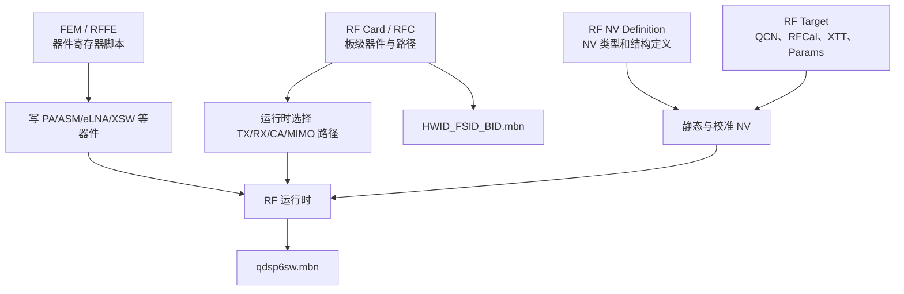

# Qualcomm Modem RF配置与编译链路

## 速查结论

- `RF Card` 是板级 RF 拓扑和路径数据库：描述这块板用了什么器件、器件挂在哪条 RFFE 总线、哪些端口支持哪些 Band，以及 TX/RX、CA、MIMO、SRS 等场景怎样选路。
- `device_rffe/fem` 是器件级控制数据：按具体 PA、ASM、eLNA、XSW、Coupler 等料号提供寄存器地址、端口值、mask 和 enable/disable/trigger 序列。
- `rfnv` 定义 Cellular RF NV 的数据结构和类型；`rftarget_denali` 保存板级静态 NV、参考 QCN、校准参数和产线 RFCal 配置。
- RF Card 会生成独立 RFC MBN；FEM 没有独立可刷镜像，其对象和库最终链接进 `qdsp6sw.mbn`。
- RFPD/RFC AG PASS 主要证明 RF Card XML、路径和组合规则通过静态检查，不证明 FEM 寄存器、实物焊接、供电、MIPI 通信、校准或 OTA 性能正确。
- 当前 customer tree 的部分 `build` 目录属于 cleanpack 输入。特别是 `fem/asm/build`，其中存在受 Git 管理的预编译 `.o/.lib`，不能当普通缓存删除。

## 适用源码

```text
/home/wx/Project/QCOM/qcom4490/S1E4ProPlus/modem
└── modem_proc
    └── rf
```

本文核对的构建变体为：

```text
clarence.geniot.prod
```

## RF配置分层



四层配置相互依赖：

| 层次 | 关键路径 | 负责内容 | 配错后的典型现象 |
|---|---|---|---|
| RF Card | `rf/card/config/common/etc/rf_card` | 板型、器件拓扑、RFFE 地址、端口、Band、信号路径、CA/并发限制 | 单 Band 不通、路径走错、CA/MIMO/SRS 组合失败 |
| FEM/RFFE | `rf/device_rffe/fem` | 具体器件寄存器、端口映射和控制序列 | 器件能枚举但开关状态、增益或时序错误 |
| RF NV | `rf/rfnv` | Cellular RF NV 类型、结构和接口定义 | NV 解释或读写结构不匹配 |
| RF Target | `rf/rftarget_denali` | 静态 NV、参考 QCN、校准和产测输入 | 功率、灵敏度、FBRx、线损、温补或产测异常 |

可以把它理解为：

> [!info] 一条路径的完整含义
> RF Card 决定“信号应该经过哪些器件和端口”；FEM 决定“这些器件具体写什么寄存器”；RF Target/NV 决定“这块实物的校准和补偿值是多少”。

## RF Card配置

### 目录职责

主目录：

```text
modem_proc/rf/card/config/common/etc/rf_card
```

当前目录中有多份 `rfc_*_ag.xml`，每一份通常描述一个或多个 RF Card 变体。XML 的主要内容包括：

| 配置     | 典型字段                                                       | 作用                             |
| ------ | ---------------------------------------------------------- | ------------------------------ |
| Card身份 | `hwid`、`fsid`、`board_id`、`target_list`                     | 运行时和构建时识别板型                    |
| 物理器件   | `device type`、`manufacturer_id`、`product_id`、`product_rev` | 指定收发机、PA、ASM、eLNA 等器件          |
| RFFE拓扑 | `comm_master`、`channel`、`default_usid`、`assigned_usid`     | 描述 MIPI RFFE 控制连接              |
| 逻辑模块   | `module id`、`type`                                         | 把一颗物理器件拆成 PA、ASM、Coupler 等逻辑功能 |
| 信号路径   | `sig_path`、`path_type`、`trx`、`port`、`antenna`              | 描述 TX/RX 从 RFIC 到天线的路径         |
| 频段能力   | `tech`、`band_name`、`gain_lineup`                           | 声明路径适用的 RAT/Band 和增益状态         |
| 并发能力   | `ca_combo`、ASP conflict、资源组                                | 限制 CA、EN-DC、MIMO、SRS 等组合       |
| 校准关系   | `cal_reference_sig_path`、`FULL_CAL/NO_CAL`                 | 指定路径校准和参考关系                    |

### 示例：HWID 1076

示例文件：

```text
rf/card/config/common/etc/rf_card/rfc_electron_na_eu_jp_apt_V4_ag.xml
```

该文件定义了两种 Card 变体：

| HWID | FSID | Board ID | Target                           | 生成 RFC MBN     |
| ---: | ---: | -------: | -------------------------------- | -------------- |
| 1076 |    0 |        0 | NETRANI、WAIPIO、FILLMORE、CLARENCE | `1076_0_0.mbn` |
| 1076 |    2 |        0 | CLARENCE                         | `1076_2_0.mbn` |

器件节点中可以直接看到：

```text
device type
-> RFFE protocol/channel
-> manufacturer_id/product_id/product_rev
-> default_usid/assigned_usid
-> module_list(PA/ASM/COUPLER/...)
```

例如一条 RX path 会继续配置：

```text
path_type=rx
-> antenna switching path
-> LTE/WCDMA/NR5G band
-> calibration mode
-> SDR transceiver port
-> eLNA port and gain lineup
-> antenna index
```

当前文件的结构统计可看到 71 个 `device` 元素、399 个 `path_type` 路由记录、30 条 `fbrx_path`，并包含大量 CA 组合与天线切换属性。数量只用于说明配置规模，不代表当前产品会同时启用全部路径。

## FEM与RFFE器件数据

### 目录分类

主目录：

```text
modem_proc/rf/device_rffe/fem
```

| 子目录 | 器件/功能 | 主要作用 |
|---|---|---|
| `pa` | Power Amplifier | 发射功率放大和 PA 状态 |
| `papm` | PA Power Manager | APT/ET/Boost 等 PA 供电控制 |
| `asm`、`asm2` | Antenna Switch Module | Band、TX/RX 和天线端口切换 |
| `elna` | External LNA | 接收低噪声放大和增益状态 |
| `xsw` | Cross Switch | 多输入输出 RF 交叉切换 |
| `coupler` | Coupler | 发射取样、功率检测和 FBRx |
| `therm` | Thermistor/Temperature | 温度读取和温补 |
| `physical` | Physical device data | 物理器件级公共属性 |
| `api` | 公共接口 | FEM 数据类和工厂接口 |
| `build`、各类 `*/build` | SCons/cleanpack输入 | 生成、预编译对象、库和构建规则 |

同一个物理料号可能同时出现在 `pa`、`asm`、`elna`、`coupler` 等目录，因为软件按逻辑功能拆分，而不是按芯片外壳拆分。

### 数据文件示例

示例：

```text
rf/device_rffe/fem/asm/src/rfdevice_asm_fx5627vb_asm_data_ag.cpp
```

该文件为一颗 ASM 配置：

- 5 个逻辑端口；
- disable、enable、trigger 三类数据；
- 寄存器地址，如 `0x02`、`0x1C`；
- RFFE bus index；
- 默认寄存器值；
- 每个端口的数据和写 mask；
- 厂商 ID、产品 ID、产品 revision；
- `settings_data_get()`、`sequence_data_get()`、`device_info_get()` 接口。

公共抽象接口位于：

```text
rf/device_rffe/interface/api/common/rfdevice_fem_data.h
```

核心接口：

```cpp
device_info_get()
settings_data_get()
sequence_data_get()
```

### api与src必须同名吗

不需要目录名或文件名完全相同。真正必须一致的是：

1. 头文件声明和 C/C++ 定义的函数名、参数、返回类型、namespace 和 C/C++ linkage；
2. 实现文件必须被 SCons 编译成对象；
3. 对象必须进入最终参与链接的库；
4. 调用侧和定义侧使用相同 feature 宏条件。

例如：

```text
asm/api/rfdevice_asm_customer_factory_ag.h
    声明 rfdevice_asm_customer_data_create(...)

asm/src/rfdevice_asm_customer_factory_ag.cpp
    定义 rfdevice_asm_customer_data_create(...)
```

文件名一致便于维护，但不是链接器判断符号是否存在的条件。

### 是否由器件供应商提供

这部分通常混合了 Qualcomm 生成框架、器件供应商寄存器资料、Qualcomm/供应商适配数据，以及 OEM 最终 BOM 集成结果，不能简单归为某一方全部提供。

源码中的 factory 会按以下信息选择具体数据类：

```text
mfg_id + prd_id + prd_rev + hw_rev + module_name
```

因此不同供应商、不同 revision、甚至同一器件在不同模块角色下，都可能需要不同 FEM 配置。同时，RF Card 也必须同步改器件 ID、RFFE 地址、模块和信号路径；只增加一个 FEM `.cpp` 并不等于新物料已经接入。

## 编译链路

### 总入口

先加载工程环境：

```bash
cd /home/wx/Project/QCOM/qcom4490/S1E4ProPlus
source build/env_info.sh
```

编译：

```bash
bash modem/build_modem.sh build
```

清理入口：

```bash
bash modem/build_modem.sh clean
```

当前 wrapper 最终调用：

```bash
cd modem/modem_proc/build/ms
python3.8 ./build_variant.py \
  clarence.geniot.prod \
  bparams=-k
```

`bparams=-k` 会让 SCons 在部分目标失败后继续构建。排查第一个编译错误时，应临时去掉 `-k` 或直接以日志中的第一个真实 error 为准，不能只看最后几十行。

> [!warning] clean也要检查Git状态
> 该源码树包含 cleanpack 预编译对象。无论使用脚本 clean 还是手工清理，完成后都要检查相关目录的 `git status`。不要把所有名为 `build` 的目录都视为可删除输出。

### RF Card生成与编译

```text
modem_rfc.scons
-> env.AddRFCAG(CHIPSET)
-> rfc_ag.py
-> RFPD -f RFC_AG -t clarence -o <BUILDPATH>
-> 生成 target/clarence/rf_card/<card>/
-> 每个 Card 的 *_ag.scons 调用 rfpd_tool
-> 生成 C/C++、库和 Card MBN
-> env.AddRfCard(HWID, FSID, board_id, ...)
-> rfc_autogen_factory.cpp
```

生成的 factory：

```text
rf/card/driver/build/modem_root_libs/qdsp6/
  clarence.geniot.prod/rfc_autogen_factory.cpp
```

运行时按 `(rf_hw, fsid, board_id)` 选择 RFC。例如 HWID 1076：

```text
(1076, 0, 0) -> 1076_0_0.mbn
(1076, 2, 0) -> 1076_2_0.mbn
```

### FEM生成与编译

```text
modem_rfdevice_fem.scons
-> env.AddRFFEAG(CHIPSET)
-> rffe_generate.py
-> QGenFactory --fem .. --build <BUILDPATH> --tp_gen
-> 生成/更新各器件数据和 factory
-> 各 asm/pa/elna/xsw/... SCons 编译对象与库
-> 链接进入 qdsp6sw.mbn
```

FEM 没有独立的最终可刷 `fem.mbn`。所谓“单编 FEM”通常仍是重新运行 MPSS 变体构建，只让 SCons 根据依赖重编受影响的 FEM 对象：

```bash
bash modem/build_modem.sh build
```

不要为了触发重编直接删除整个 `fem/*/build`。优先修改或 `touch` 对应 source，让 SCons 根据依赖更新；必须处理对象时，先确认该文件是否受 Git 管理。

### RF NV与RF Target

`rfnv/etc/NvDefinition.xml` 明确说明它只包含 Cellular RF NV item definitions，并定义 TX linearizer、频偏、PA state、SAR backoff、spur 等数据结构。它主要回答“这个 RF NV 数据怎样解释”，不等于保存了某台机器最终校准值。

HWID 1076 的板级 RF Target 示例：

```text
rf/rftarget_denali/mtp/qcn/hwid_1076_bid0_pid255/
rf/rftarget_denali/mtp/qcn/hwid_1076_bid0_pid255_swid_1/
rf/rftarget_denali/mtp/qcn/hwid_1076_bid0_swid_2_pid255/
rf/rftarget_denali/mtp/xtt/etc/hwid_1076_bid0_pid255/
```

其中包括：

- `static_nv_masterfile.xml`：板级静态 RF NV 树；
- `*.xqcn`：参考 QCN；
- `Params.xml`、`Char_*.xml`：RFCal/产测和 characterization 输入；
- `*.xtt/*.cxtt`：产线校准流程配置。

HWID 1076 的静态 NV master 文件还记录了其来源 RF Card 为 `rfc_electron_na_eu_jp_apt_V4_ag.xml`，说明 RF Target 与 RF Card 必须成套维护。

## 当前编译产物

2026-07-27 的 `clarence.geniot.prod` 完整编译日志显示：

```text
scons: done building targets.
Build clarence.geniot.prod returned code 0.
```

主要输出位于：

```text
modem/modem_proc/build/ms/bin/clarence.geniot.prod
```

| 产物         | 当前数量/位置                                       | 含义                                  |
| ---------- | --------------------------------------------- | ----------------------------------- |
| 主 MPSS     | `qdsp6sw.mbn`                                 | Modem 主镜像，包含 FEM 等大量 RF 代码          |
| 调试数据库      | `qdsp6m.qdb`                                  | 符号/调试相关数据库                          |
| Split bins | `splitbins/qdsp6sw.b00...b30` + `qdsp6sw.mdt` | 主镜像拆分文件，共 32 个                      |
| RFC MBN    | `so/*.mbn`，当前 16 个                            | 按 HWID/FSID/Board ID 加载的 RF Card 配置 |
| MCFG HW    | `configs/mcfg_hw/**/mcfg_hw.mbn`，当前 6 个       | 硬件/卡槽模式配置                           |
| MCFG SW    | `configs/mcfg_sw/**/mcfg_sw.mbn`，当前 143 个     | 运营商软件配置                             |
| EFS        | `efs1.bin`、`efs2.bin`、`efs3.bin`              | EFS 镜像占位/分区输入                       |

`modem/BuildProducts.txt` 当前只列 1 个 `qdsp6sw.mbn`、6 个 MCFG HW 和 143 个 MCFG SW，共 150 行。RFC MBN、QDB 和 splitbins 需要直接检查输出目录，不能只依赖 `BuildProducts.txt`。

## RFPD与RFC AG自检边界

报告入口：

```text
rf/card/utils/rfpd/log/clarence.geniot.prod/rfpd_report_index.html
```

报告栏目包括：

- Single Carrier；
- Multi Carrier/CA；
- ASP Conflict；
- AsDiv；
- SDR Info；
- Ant Detune Table；
- RFFE Bus Check；
- SRS。

### PASS能证明什么

| PASS范围           | 可以证明                   | 不能证明               |
| ---------------- | ---------------------- | ------------------ |
| XML schema       | XML 结构符合 schema        | 路径值和实物一定正确         |
| Single Carrier   | 单载波路径可生成并满足静态规则        | 实物 TX/RX 功率和灵敏度    |
| CA/Multi Carrier | 配置中声明的组合没有被静态规则否决      | 动态并发时序和真实互扰        |
| RFFE Bus Check   | RF Card 中总线/地址关系通过相应检查 | 器件焊接、供电和 MIPI 波形正常 |
| RFC AG生成         | 生成器可产生代码/MBN           | FEM 寄存器脚本和校准正确     |

因此：

> [!important] QRCT中RFPD和RFC AG都PASS
> 可以认为目标 RF Card 配置通过了对应静态检查和生成流程，但不能直接得出“整套 RF 配置没有问题”。还要验证 FEM、RFFE ID/通信、QCN/校准、conducted、OTA 和真实网络场景。

### 为什么不能只看最终Modem编译结果

当前 `rfc_ag.py` 会等待 RFPD 并打印 return code，但代码没有在 return code 非零时明确抛异常。当前 `RFCAGLog.txt` 也出现过另一张 RF Card 的重复 RFFE key lint 错误，同时该 XML 后面仍打印 `PASSED schema validation`。

所以至少要同时看：

1. Modem 总构建 return code；
2. `RFCAGLog.txt` 中的 `failed lint checks`、`Duplicate key-sequence`、`ERROR`；
3. `rfpd_report_index.html` 和目标 Card 的子报告；
4. 目标 HWID 的 RFC MBN 是否实际生成。

## undefined reference完整排查

典型错误：

```text
undefined reference to
rfdevice_asm_customer_data_create(...)
```

调用链：

```text
rfdevice_asm_factory_ag.cpp
-> rfdevice_asm_customer_data_create(...)
-> rfdevice_asm_customer_factory_ag.cpp
-> 具体器件 data class
```

按以下顺序排查：

### 1. 声明与定义

```bash
rg -n "rfdevice_asm_customer_data_create" \
  modem_proc/rf/device_rffe/fem/asm/api \
  modem_proc/rf/device_rffe/fem/asm/src
```

确认参数、返回类型、namespace 和 feature 宏一致。

### 2. 对象是否生成

```bash
test -f modem_proc/rf/device_rffe/fem/asm/build/modem_root_libs/qdsp6/\
clarence.geniot.prod/src/rfdevice_asm_customer_factory_ag.o
```

### 3. 对象中是否定义符号

```bash
readelf -Ws <object.o> | c++filt | \
  rg "rfdevice_asm_customer_data_create"
```

当前恢复后的对象可看到该符号为 `GLOBAL FUNC`。

### 4. 对象是否进入库

```bash
ar t modem_proc/rf/device_rffe/fem/asm/build/modem_root_libs/qdsp6/\
clarence.geniot.prod/modem_rfdevice_asm_ag.lib | \
  rg "rfdevice_asm_customer_factory_ag.o"
```

### 5. 库是否参与最终链接

从 build log 搜索：

```bash
rg -n "modem_rfdevice_asm_ag.lib|rfdevice_asm_customer_factory_ag.o|undefined reference" \
  modem/build_logs/modem_build_*.log
```

### 本次已确认根因

本次不是头文件声明错误，也不是 C++ 名字修饰问题。根因是：

```text
rf/device_rffe/fem/asm/build
```

下面的必要对象/库被删除，导致实现没有进入链接。恢复缺失文件后问题解决。

当前 Git 证据：

```text
tracked files: 56
tracked .o:    42
tracked .lib:  8
```

> [!danger] 不要直接删除asm/build
> `asm/build` 同时承载 SCons 文件、cleanpack 预编译对象和库。删除前必须执行 `git ls-files modem/modem_proc/rf/device_rffe/fem/asm/build`。目录名叫 build 不代表它只是本地缓存。

## 供应商代码报错处理

不要直接注释 factory 分支或给空实现绕过链接。正确顺序是：

1. 确认 RF Card 中引用的 `mfg_id/prd_id/prd_rev/module_name` 与实物和 FEM factory 一致；
2. 确认供应商给出的寄存器脚本适用于当前 revision 和端口定义；
3. 确认头文件、实现、SCons source list、对象、库和最终链接完整；
4. 对比同类已工作的器件实现，检查基类接口、feature 宏和 factory 注册；
5. 用 RFFE 读 ID、寄存器 trace 和示波器/逻辑分析结果验证控制链；
6. 用 conducted/校准结果验证 RF 数据本身，不把“编译通过”当作寄存器正确。

可以提供给供应商的最小证据包：

| 证据 | 内容 |
|---|---|
| 物料身份 | MFG ID、Product ID、Product Rev、HW Rev、模块角色 |
| 软件路径 | RF Card XML、FEM header/source、SCons |
| 编译链 | 首个 compiler/linker error、完整 link command |
| 二进制证据 | 对象是否存在、符号表、库成员 |
| 运行时证据 | RFFE ID、读写失败地址、目标 Band/path |
| 硬件证据 | 供电、MIPI 波形、端口连接、原理图/BOM revision |

## MPSS打包链路

开发编译树：

```text
/home/wx/Project/QCOM/qcom4490/S1E4ProPlus/modem/modem_proc
```

AMSS meta 当前引用的打包树：

```text
/home/wx/Project/QCOM/qcom4490/S1E4ProPlus/amss/MPSS.DE.3.1.1/modem_proc
```

`amss/QCM4490.LA.2.0/common/config/contents_std.xml` 明确从后一棵树读取 `qdsp6sw.mbn`、RFC、MCFG 和 RF Target 文件。

同步脚本：

```text
modem/copy_mpss_images.sh
```

该脚本会先对目标目录执行 `rm -rf`，再复制 MPSS 文件，属于破坏性同步。执行前必须明确检查源路径和目标路径。

当前两棵树中的 `qdsp6sw.mbn` 大小相同但 SHA-256 不同，且当前仓库范围内没有找到 `NON-HLOS.bin`。因此：

```text
MPSS编译成功
!= AMSS打包树已同步
!= NON-HLOS.bin已生成
!= 最终刷机包可用
```

## 修改后的验证清单

- [ ] RF Card 的 HWID、FSID、Board ID 与产品硬件版本一致。
- [ ] RFFE channel、MFG ID、Product ID、USID 与原理图和器件资料一致。
- [ ] RF Card 中的 module/port 与 FEM 的逻辑端口一致。
- [ ] RFPD 目标 Card 报告通过，且 `RFCAGLog.txt` 无相关 lint/error。
- [ ] QGenFactory 成功，目标器件对象和库实际生成。
- [ ] 对象中有目标符号，库中包含目标对象。
- [ ] `qdsp6sw.mbn` 和目标 `HWID_FSID_BID.mbn` 时间戳已更新。
- [ ] 目标 RF Target/QCN/校准配置与 Card revision 对应。
- [ ] AMSS 消费树已按计划同步，hash 与源树一致。
- [ ] 最终 meta/NON-HLOS 打包成功。
- [ ] RFFE、校准、conducted、OTA 和现场网络验证完成。

## 关联文档

- [[10_Basics/RF基础概念]]
- [[60_Configuration/Qualcomm-MCFG运营商配置与生效链路]]
- [[30_Troubleshooting/无线信号与搜网失败排查]]
- [[70_Tools-Debug/Debug-Tips/信号强度查看SOP]]
