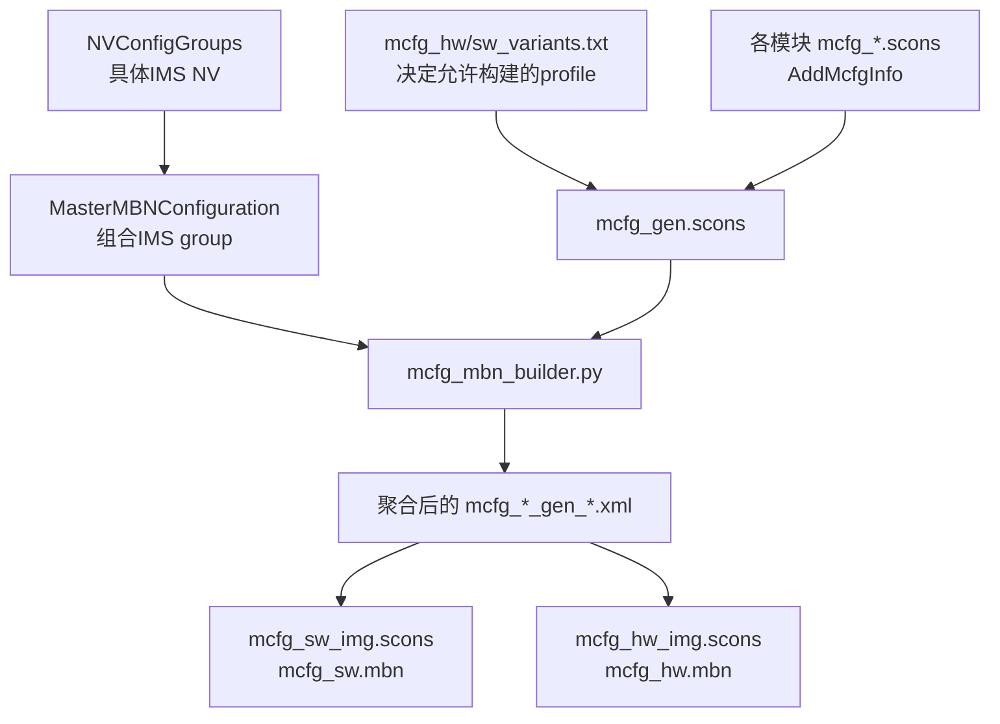
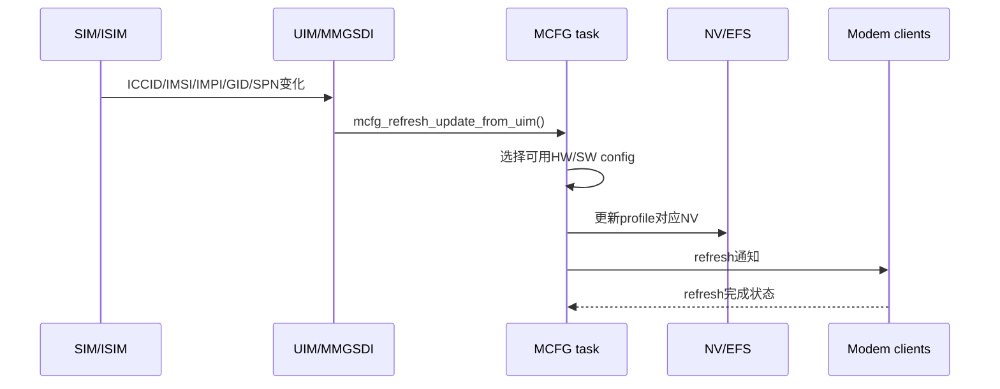

# Qualcomm MCFG运营商配置与生效链路

## 速查结论

- `MCFG HW` 主要描述芯片平台、单卡/双卡、CDMALess、SAOnly 等硬件与订阅模式；`MCFG SW` 主要描述运营商和业务 profile。
- `mcfg_sel_db.xml` 根据 ICCID/IIN、IMSI/PLMN、IMPI、SPN、GID 等 SIM 信息决定运营商匹配结果。
- `mcfg_*_variants.txt` 决定哪些 MCFG profile 进入当前 build，但实际使用哪一个文件必须看 `GetWhitelist()` 条件和编译日志，不能只凭文件名推断。
- `MasterMBNConfiguration` 负责组合 IMS 分组；`NVConfigGroups` 保存具体 IMS NV 值。完整 `mcfg_sw.mbn` 还会聚合 Data Modem、LTE、NR5G、MMCP、GNSS、UIM、WCDMA 等模块配置。
- 运行时由 UIM/MMGSDI 向 MCFG 提交 ICCID、IMSI、IMPI、GID1/GID2、SPN 等数据，MCFG 选择 profile、更新 NV 并触发 refresh。
- 当前 customer tree 的核心选择和处理实现经过 cleanpack，只保留 API、SCons source list 和预编译 `mcfg_sel.lib/mcfg_proc.lib`。可以证明调用链和接口语义，但不能把不可见的内部算法细节写成确定事实。

## 适用源码

```text
/home/wx/Project/QCOM/qcom4490/S1E4ProPlus/modem/modem_proc
```

本文核对的构建变体：

```text
clarence.geniot.prod
```

## MCFG HW与MCFG SW

| 类型 | 选择维度 | 示例 | 当前输出 |
|---|---|---|---|
| MCFG HW | 平台、形态、卡槽模式、CDMALess、SAOnly | Clarence DSDS、SS、DSDS_CDMALess | 6 个 `mcfg_hw.mbn` |
| MCFG SW | Region、Carrier、Commercial/Lab/Profile | AUNZ/Telstra/Commercial | 143 个 `mcfg_sw.mbn` |

Clarence 当前 MCFG HW：

```text
generic/common/Clarence/STANDALONE/LA/DSDS
generic/common/Clarence/STANDALONE/LA/DSDS_CDMALess
generic/common/Clarence/STANDALONE/LA/DSDS_SAOnly
generic/common/Clarence/STANDALONE/LA/SS
generic/common/Clarence/STANDALONE/LA/SS_CDMALess
generic/common/Clarence/STANDALONE/LA/SS_SAOnly
```

运营商问题通常先查 MCFG SW，但如果问题只在单卡/双卡、CDMA/SA 模式下出现，也要同时核对 MCFG HW。

## 关键路径

| 路径 | 作用 |
|---|---|
| `mcfg/mcfg_gen/scripts/mcfg_sel_db.xml` | SIM/UIM 信息到 carrier 的选择数据库 |
| `mcfg/bsp/mcfg_sw_img/build/mcfg_sw_variants.txt` | 标准 SW profile 白名单 |
| `mcfg/bsp/mcfg_sw_img/build/cust_mcfg_sw_variants.txt` | `USES_CUST_2` 外部 customer build 使用的白名单 |
| `mcfg/bsp/mcfg_hw_img/build/mcfg_hw_variants.txt` | MCFG HW 白名单 |
| `mcfg/build/mcfg_img_utils.py` | `GetWhitelist()` 等构建工具 |
| `mcfg/mcfg_gen/build/mcfg_gen.scons` | 扫描各模块 MCFG SCons 并汇总 group |
| `mcfg/build/mcfg/mcfg_mcfg_gen.scons` | MCFG 基础 group 到 carrier/profile 的映射 |
| `mcfg/build/mcfg_mbn_builder.py` | 聚合 master/group XML 并生成 MCFG 输入 |
| `dataims/Configuration/build/mcfg_dataims_gen.scons` | DataIMS master XML 到 carrier/profile 的映射 |
| `dataims/Configuration/MasterMBNConfiguration` | IMS master 组合入口 |
| `dataims/Configuration/NVConfigGroups` | 具体 IMS NV 值 |
| `mcfg_fwk/api` | MCFG 选择、激活、refresh 公共接口 |
| `uim/mmgsdi/src` | SIM 数据变化后调用 MCFG 的入口 |

## 构建时生成链路



完整 SW profile 不是单个 IMS XML 的简单转换。构建系统会扫描多个 AU 的 SCons，通过 `AddMcfgInfo()` 把同一 carrier/profile 的 group 聚合到一个生成 XML，再转换为 MBN。

以 Telstra 为例，当前生成 XML同时聚合：

1. MCFG 基础配置；
2. DataIMS；
3. Data Modem；
4. GNSS；
5. LTE；
6. MMCP；
7. NR5G；
8. UIM；
9. WCDMA。

所以修改运营商参数时，必须先判断该需求属于 IMS、Data、NAS/MMCP、LTE/NR、UIM 还是 AP 侧配置，不能把所有需求都改到 `NVConfigGroups`。

## 白名单选择规则

`mcfg/build/mcfg_img_utils.py:get_whitelist()` 的实际逻辑：

| 条件 | 使用文件 |
|---|---|
| 有 `USES_CUST_2` 且不是 internal build | `cust_mcfg_<hw/sw>_variants.txt` |
| 有 `USES_DSDA` 且 DSDA 文件存在 | `mcfg_<hw/sw>_variants_dsda.txt` |
| 是 internal build 且 internal 文件存在 | `mcfg_<hw/sw>_variants_internal.txt` |
| 其他情况 | `mcfg_<hw/sw>_variants.txt` |

### 当前Clarence构建使用哪个

2026-07-27 的实际 build log 明确打印：

```text
[mcfg_hw_img.scons] mcfg_mbn_tag_file =
.../mcfg_hw_variants.txt

[mcfg_sw_img.scons] mcfg_mbn_tag_file =
.../mcfg_sw_variants.txt
```

因此本次 `clarence.geniot.prod` 使用标准白名单，不是 `cust_mcfg_sw_variants.txt`。

标准白名单中存在：

```text
generic/AUNZ/Telstra : Commercial
```

这解释了为什么当前输出中存在 Telstra，即使 `cust_mcfg_sw_variants.txt` 没有 Telstra。

> [!important] 固定检查方法
> 不要问“某个 carrier 在 cust 文件里没有，为什么还生成”。先在 build log 搜 `mcfg_mbn_tag_file`，确认当前变体实际读取的白名单。

## SIM匹配数据库

选择数据库：

```text
mcfg/mcfg_gen/scripts/mcfg_sel_db.xml
```

当前文件有 116 条 `SelRecord`，优先级声明为：

```text
customid
-> impi
-> spn
-> gid1
-> gid2
-> 3gpp2_imsi
-> 3gpp_imsi
-> iin
```

含义：

| 条件 | 来源 | 常见用途 |
|---|---|---|
| customid | 外部/OEM自定义匹配 | 特殊 SKU 或客户规则 |
| IMPI | ISIM IMS Private Identity | IMS 专用卡识别 |
| SPN | SIM Service Provider Name | MVNO/品牌区分 |
| GID1/GID2 | SIM Group Identifier | 同 MCCMNC 下区分子品牌/MVNO |
| 3GPP2 IMSI | CDMA/3GPP2 卡信息 | CDMA 相关 profile |
| 3GPP IMSI/PLMN | IMSI 的 MCC/MNC | 主流运营商匹配 |
| IIN | ICCID issuer 前缀 | 对 MCCMNC 相同的卡进一步识别 |

优先级表示多个条件同时有结果时的匹配权重，不表示每条 `if` 都必须包含全部字段。

## 运行时生效链路



公开 API 可以证明：

| API | 源码注释说明 |
|---|---|
| `mcfg_refresh_uimdata_needed()` | 查询当前 slot 为选择和 refresh 需要哪些 UIM 数据 |
| `mcfg_refresh_update_from_uim()` | UIM/MMGSDI 提交 ICCID、IMSI 或 session update |
| `mcfg_refresh_autoselect_enabled()` | 查询 UIM 自动选择 MCFG SW 是否开启 |
| `mcfg_ext_get_selected_config()` | 获取已选择/已激活 config ID |
| `mcfg_ext_set_selected_config()` | 把设备上已有的 config 设为 selected |
| `mcfg_ext_activate_config()` | 更新 NV、触发 refresh，或分别只执行其中一步 |

UIM 数据结构包含：

```text
ICCID
IMSI
3GPP2 IMSI
IMPI
GID1
GID2
SPN
slot/subscription index
```

MMGSDI 的实际调用点位于：

```text
uim/mmgsdi/src/mmgsdi_nv_refresh.c
uim/mmgsdi/src/mmgsdi_session.c
uim/mmgsdi/src/mmgsdi_card_init.c
uim/mmgsdi/src/mmgsdi_cnf.c
```

### cleanpack可见性边界

当前以下目录没有保留源实现：

```text
mcfg_fwk/mcfg_sel/src
mcfg_fwk/mcfg_proc/src
```

SCons 仍列出 `mcfg_sel.c`、`mcfg_uim.c`、`mcfg_refresh.c`、`mcfg_proc.c` 等源文件，并链接预编译：

```text
mcfg_fwk/mcfg_sel/build/.../mcfg_sel.lib
mcfg_fwk/mcfg_proc/build/.../mcfg_proc.lib
```

因此可以确认：

- UIM 数据会进入 MCFG；
- 存在自动选择、selected config、activate 和 refresh；
- selection DB 有明确优先级。

但以下细节不能仅凭当前 customer tree 完全证明：

- 同优先级多条规则冲突时的所有内部 tie-break；
- 所有 fallback 的运行时边界条件；
- refresh 状态机的全部内部时序。

这些内容需要 Qualcomm 完整源码、接口文档或运行时 trace 补证据。

## Telstra 505-01示例

### 1. SIM选择

`mcfg_sel_db.xml` 中：

| 字段 | 值 |
|---|---|
| IIN | `896101` |
| PLMN | `505-01` |
| carrier_name | `Telstra` |
| mcfg_carrier_index | `15` |
| volte | `true` |
| vowifi | `true` |

这里的 `volte/vowifi` 是选择记录携带的能力属性，不应脱离最终 profile NV 和 AP 配置单独解释为整机功能必然可用。

### 2. Build白名单

当前实际使用的 `mcfg_sw_variants.txt` 包含：

```text
generic/AUNZ/Telstra : Commercial
```

### 3. 各模块映射

基础 MCFG：

```text
mcfg/build/mcfg/mcfg_mcfg_gen.scons
-> groups/mcfg/AUNZ/Telstra/mcfg_sw_gen_Commercial.xml
-> Telstra : Commercial
```

DataIMS：

```text
dataims/Configuration/build/mcfg_dataims_gen.scons
-> MasterMBNConfiguration/AUNZ/Telstra/ims_master.xml
-> Telstra : Commercial
```

### 4. IMS组合与具体NV

入口：

```text
dataims/Configuration/MasterMBNConfiguration/AUNZ/Telstra/ims_master.xml
```

它继续引用 `ims_public.xml` 和 `ims_private.xml`，再聚合以下 NV group：

```text
common
DPL
PM
RCS
RM
SIP
SMS_DAN_USSD
UT
VT_VoLTE_VoWiFi
```

当前 Telstra 目录下实际有 13 个 NV/group 文件。具体 NV 值位于：

```text
dataims/Configuration/NVConfigGroups/<group>/AUNZ/Telstra/
```

例如 `common/AUNZ/Telstra/ims_public.xml` 中可以看到：

- `ims_user_agent=Telstra`；
- `IMS_enable=1`；
- VoLTE、VT、Wi-Fi Calling、UT、SMS over IMS 等 service enablement 字段；
- IMS operation mode、Allowed RAT mask 等公共配置。

### 5. 聚合生成XML

当前生成文件：

```text
mcfg/mcfg_gen/clarence.geniot.prod/generic/AUNZ/Telstra/
  mcfg_sw_gen_Commercial.xml
```

已确认：

| 字段 | 值 |
|---|---|
| carrierIndex | `15` |
| version | `0x0A010F00` |
| Configuration_Name | `Telstra_Australia_Commercial` |
| IIN | `896101` |
| MCC/MNC | `505 01` |

### 6. 最终MBN

```text
build/ms/bin/clarence.geniot.prod/configs/mcfg_sw/
  generic/AUNZ/Telstra/Commercial/mcfg_sw.mbn
```

这条链路说明 Telstra profile 当前确实参与构建，而不只是“源码目录存在”。

## 修改运营商配置的决策表

| 需求 | 优先修改位置 | 何时还要改其他层 |
|---|---|---|
| 已有运营商修改 IMS NV | `NVConfigGroups/.../<Carrier>/*.xml` | Master 没引用该 group 时还要改 `MasterMBNConfiguration` |
| 新增 IMS group | `NVConfigGroups` + `MasterMBNConfiguration` | 还要确认 `mcfg_dataims_gen.scons` 映射 |
| 修改 MCC/MNC/IIN/GID/SPN 匹配 | `mcfg_sel_db.xml` | 需要检查冲突、优先级和运行时自动选择 |
| 新增 carrier/profile | 各模块 group XML + 各模块 `mcfg_*.scons` | 还要加入实际使用的 variants 白名单 |
| 修改 LTE/NR/NAS/Data 行为 | 对应 LTE/NR5G/MMCP/Data Modem group | 不要只改 DataIMS |
| 单卡/双卡/CDMALess/SAOnly 差异 | MCFG HW group/variants | 同时核对产品卡槽和 modem build variant |
| AP功能开关/UI/APN | CarrierConfig、APN、Framework/vendor 配置 | 不属于单纯 Modem MCFG |

### 已有Profile的最小修改流程

1. 在 `mcfg_sel_db.xml` 确认目标 SIM 会选中正确 carrier。
2. 从 build log 确认实际使用的 variants 文件。
3. 确认目标 `Region/Carrier/Profile` 已在白名单中。
4. 确认对应 AU 的 `mcfg_*.scons` 已把 group 映射到该 profile。
5. 修改真正承载参数的 group XML。
6. 重新编译 Modem。
7. 检查聚合生成 XML 中的最终值。
8. 检查目标 `mcfg_sw.mbn` 时间戳/hash。
9. 同步到 AMSS 打包树并重新打包。
10. 插目标 SIM，验证 selected config、NV refresh 和业务行为。

### 新增Profile时额外检查

- carrier index 是否与现有定义冲突；
- MCC/MNC、IIN、GID、SPN 规则是否会误匹配其他运营商；
- Commercial/Lab/特殊 profile 命名是否在各 AU 一致；
- IMS、Data、LTE、NR5G、MMCP、UIM、WCDMA 是否都需要专用 group；
- fallback 是否合理；
- AP 侧 CarrierConfig/APN 是否同步支持。

## 编译与生成验证

### 编译命令

```bash
cd /home/wx/Project/QCOM/qcom4490/S1E4ProPlus
source build/env_info.sh
bash modem/build_modem.sh build
```

### 先确认实际白名单

```bash
rg -n "mcfg_mbn_tag_file" \
  modem/build_logs/modem_build_*.log
```

### 检查聚合XML

```bash
rg -n "carrierIndex|Configuration_Name|IIN_List|MCC_MNC_List" \
  modem/modem_proc/mcfg/mcfg_gen/clarence.geniot.prod/\
  generic/AUNZ/Telstra/mcfg_sw_gen_Commercial.xml
```

### 检查最终MBN

```bash
stat modem/modem_proc/build/ms/bin/clarence.geniot.prod/configs/mcfg_sw/\
generic/AUNZ/Telstra/Commercial/mcfg_sw.mbn

sha256sum modem/modem_proc/build/ms/bin/clarence.geniot.prod/configs/mcfg_sw/\
generic/AUNZ/Telstra/Commercial/mcfg_sw.mbn
```

### 当前产物统计

```bash
find modem/modem_proc/build/ms/bin/clarence.geniot.prod/configs/mcfg_sw \
  -type f -name mcfg_sw.mbn | wc -l

find modem/modem_proc/build/ms/bin/clarence.geniot.prod/configs/mcfg_hw \
  -type f -name mcfg_hw.mbn | wc -l
```

当前结果：

```text
mcfg_sw.mbn: 143
mcfg_hw.mbn: 6
```

## 运行时验证

运行时至少验证四层：

| 层级 | 要证明什么 | 可用证据 |
|---|---|---|
| SIM输入 | Modem 收到了正确 ICCID/IMSI/GID/SPN/IMPI | UIM/MMGSDI log、目标 SIM 信息 |
| Profile选择 | selected config 是目标 carrier/profile | MCFG config list/selected config API、MCFG trace |
| 激活与刷新 | NV 已写入并完成 refresh | activation callback、refresh log、NV readback |
| 业务采用 | IMS/Data/NAS 最终使用目标值 | SIP、NAS、Data call、IMS registration 和协议 log |

“MBN 在文件系统里存在”只证明它被构建或打包，不证明运行时选中了它；“selected config 正确”也不证明所有业务模块都读取了预期 NV。

## 常见失败模式

| 现象 | 优先检查 | 第一坏点 |
|---|---|---|
| 源 XML 修改了但生成 XML 不变 | 实际 variants、SCons映射、profile名 | 源配置没有进入聚合 |
| 生成 XML 正确但 MBN 未更新 | builder依赖、构建日志、目标路径 | XML到MBN生成 |
| carrier源码存在但没有输出MBN | `mcfg_mbn_tag_file`、白名单 | profile未进入当前build |
| MBN存在但插卡选错 | MCC/MNC/IIN/GID/SPN、优先级、可用config | SIM选择 |
| selected config正确但NV不变 | activate类型、refresh、订阅/slot | 激活与刷新 |
| IMS正常但Data/NAS异常 | Data Modem、MMCP、LTE/NR group | 改错模块 |
| Modem侧正确但UI/功能开关错误 | CarrierConfig、APN、Framework/vendor | AP侧配置 |
| Modem编译成功但刷机后仍是旧值 | AMSS消费树、hash、NON-HLOS | 同步/打包 |

## 打包边界

当前 Modem 输出树：

```text
modem/modem_proc/build/ms/bin/clarence.geniot.prod
```

AMSS `contents_std.xml` 实际引用：

```text
amss/MPSS.DE.3.1.1/modem_proc
```

所以 MCFG 修改的完整交付链是：

```text
源XML/SCons
-> 聚合生成XML
-> mcfg_sw.mbn / mcfg_hw.mbn
-> 同步到amss/MPSS.DE.3.1.1/modem_proc
-> meta生成NON-HLOS.bin
-> 刷机
-> 插卡选择与激活
```

当前两棵 MPSS 树中的 `qdsp6sw.mbn` hash 不同，且没有找到最终 `NON-HLOS.bin`。因此当前证据只证明 Modem 构建完成，不证明最新 MCFG 已进入可刷包。

## 交付检查清单

- [ ] SIM 匹配规则命中目标 carrier，且无高优先级误匹配。
- [ ] build log 确认了实际 variants 文件。
- [ ] 目标 Region/Carrier/Profile 在该白名单中。
- [ ] 所有相关 AU 的 `mcfg_*.scons` 都映射到目标 profile。
- [ ] Master XML 正确引用具体 NV group。
- [ ] 聚合生成 XML 包含预期 group 和最终值。
- [ ] `mcfg_sw.mbn` 或 `mcfg_hw.mbn` 已重新生成。
- [ ] AMSS 消费树已同步，源/目标 hash 一致。
- [ ] `NON-HLOS.bin` 已重新打包并刷入。
- [ ] 运行时 selected config、activation、NV refresh 均成功。
- [ ] IMS/Data/NAS/AP 用户可见行为符合需求。

## 关联文档

- [[50_Platform-Code/Qualcomm/Qualcomm-Modem-RF配置与编译链路]]
- [[运营商需求表配置作业流]]
- [[IMS配置方法]]
- [[Core-Config/NV参数配置]]
- [[Core-Config/APN配置方法_重构]]
- [[Core-Config/CarrierConfig配置方法_重构]]
- [[配置与客户定制]]
