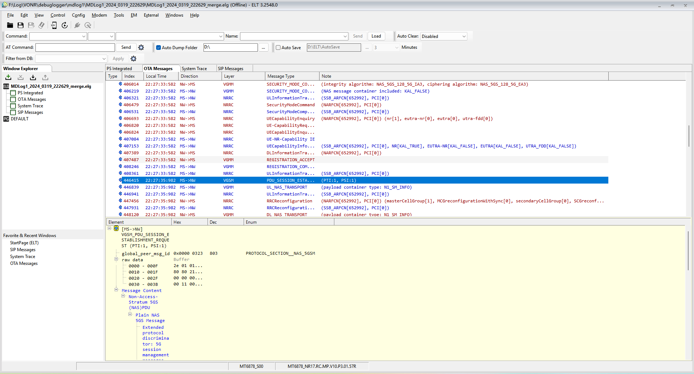
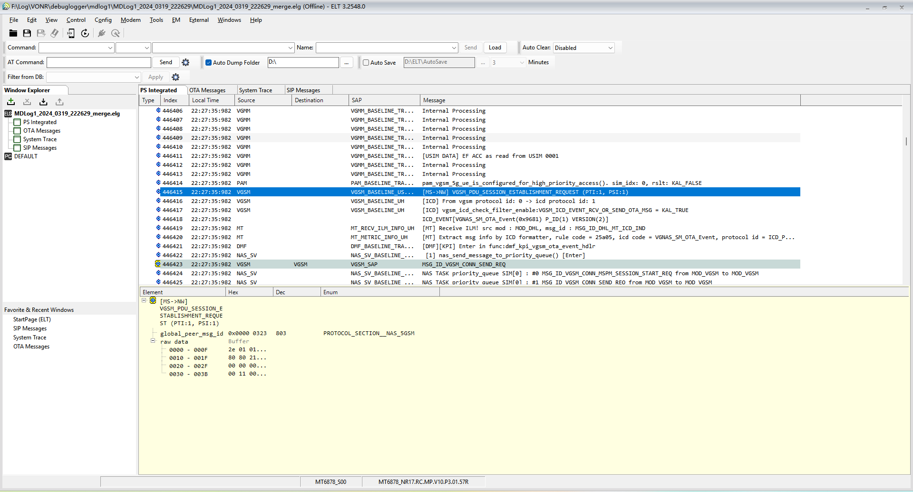
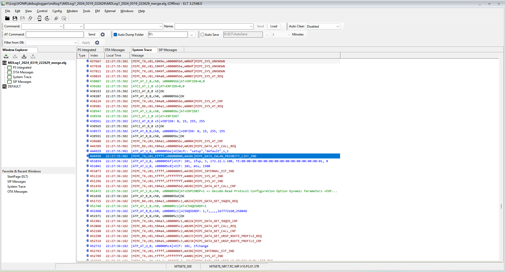
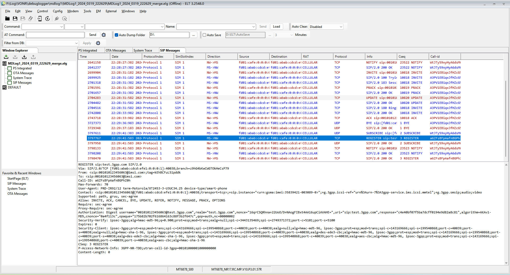

# MTK-ELT日志分析SOP

## 目标

这篇面向第一次使用 ELT 的同学。看完后至少要能做到：

- 知道 MTK 日志包里哪些文件要给 ELT。
- 能打开 `.muxz` / `.muxraw` / `.elg`。
- 知道在哪里搜索关键字、看 OTA 消息、导出关键证据。
- 遇到打不开、字段看不懂、日志缺模块时知道先检查什么。

## 工具位置

本机路径：

```text
D:\Tool\MTK\ELT_v3.2524.2\ELT.exe
D:\Tool\MTK\ELT_v3.2524.2\Documents\ELT_User_Manual.pdf
D:\Tool\MTK\ELT_v3.2524.2\Documents\FAQ.pdf
```

## 先认识界面



| 区域 | 位置 | 新手怎么用 |
|---|---|---|
| 菜单和工具栏 | 顶部 `File / View / Control / Config` | `File` 打开日志，`View` 打开分析窗口，`Control` 连接设备或设置 filter |
| `Window Explorer` | 左侧 | 看当前 `.elg` 里有哪些视图；常用的是 `PS Integrated`、`OTA Messages`、`System Trace`、`SIP Messages` |
| Tab 区 | 中上方 | 在 `PS Integrated`、`OTA Messages`、`System Trace`、`SIP Messages` 之间切换 |
| 消息列表 | 中间 | 按时间顺序看消息；优先确认 `Local Time`、`Direction`、`Layer`、`Message Type` |
| 详情窗格 | 下方浅黄色区域 | 选中消息后看解码字段；写结论时优先摘这里的协议字段和 cause |
| 状态栏 | 最底部 | 看平台、版本、是否离线、当前 log/数据库状态 |

先记住一个原则：ELT 不是直接看普通文本的工具，它要么打开 `.elg`，要么把 `.muxz` / `.muxraw` 转成 `.elg` 后再看。

## 输入文件怎么判断

MTK 网络问题常见日志目录是 `debuglogger`。先看有没有这些文件：

```text
debuglogger\
  mdlog1\
    MDLog1_*.muxz
    MDDB_PHONE_*.EDB
  mobilelog\
    APLog_*
  netlog\
    *.cap
```

| 文件 | 必要性 | 用途 |
|---|---|---|
| `mdlog1\*.muxz` | 必要 | modem 主日志，ELT 分析入口 |
| `mdlog1\*.muxraw` | 必要，若存在 | 另一种 mux raw 格式，ELT 可转换 |
| `MDDB_PHONE_*.EDB` | 强烈建议 | 解码数据库，不匹配会导致字段缺失或解释错误 |
| `mobilelog\APLog_*` | 建议 | 和 Android AP 侧 `RILJ`、`ServiceState` 对齐 |
| `netlog\*.cap` | 数据问题建议 | 注册后上网、DNS、TCP 问题需要抓包补证 |

没有 `.EDB` 时也可以试着打开，但结论必须写明：数据库缺失或不确定，字段解释可信度下降。

## 第一次打开日志

### 打开 `.elg`

1. 启动 `ELT.exe`。
2. 点击工具栏的打开图标，或菜单 `File -> Open Log`。
3. 选择 `.elg` 文件。
4. 打开后先看时间范围是否覆盖复现动作。

### 打开 `.muxz` / `.muxraw`

1. 启动 `ELT.exe`。
2. 点击 `Open log`，选择 `mdlog1` 下的 `.muxz` 或 `.muxraw`。
3. 如果弹出数据库选择，选同目录或同版本的 `MDDB_PHONE_*.EDB`。
4. 多个连续文件建议合并转换，避免流程断在文件边界。
5. 等转换完成后，ELT 会生成或打开 `.elg`。

打开后第一件事不是直接搜关键字，而是确认三件事：

```text
时间范围覆盖问题复现
数据库/EDB匹配
phoneId / SIM / RAT没有看错
```

## 常用窗口怎么打开

| 窗口 | 打开方式 | 看什么 |
|---|---|---|
| PS Integrated / Trace and Primitive Log | `View` 菜单中打开 | 顺序看 modem trace 全流程 |
| PS Modules | `View` 菜单中打开 | 按模块过滤，例如 `NWSEL`、`EMM`、`ESM`、`ERRC` |
| PS Trace Peer | `View` 菜单中打开 | 看 NAS / RRC / SIP 等 peer message |
| OTA Messages | `View -> OTA Messages` | 用 direction、layer、message 看空口协议 |
| Find Result | `View -> Windows of Find Result` | 保存和复用 `Find All` 搜索结果 |
| System Trace | `View` 菜单中打开 | modem assert、fatal、dump 相关线索 |

如果 OTA 详细字段解不出来，再检查 `Config -> Set Codec Path` 或数据库是否匹配。

### 四个 Tab 怎么选



`PS Integrated` 适合从 modem 内部流程看问题。列表里能看到模块、SAP、Message 和内部处理记录，适合回答“平台内部有没有触发到某个流程”“AT/IMS/NAS 模块有没有交互”。新手排查时先用它定时间线，再切到 OTA 或 SIP 看协议细节。


`OTA Messages` 适合看空口协议和 NAS/RRC 解码。关注 `Direction`、`Layer`、`Message Type`、`Note`；选中一行后在下方详情树里展开字段。注册/承载问题优先在这里找 `REGISTRATION`、`PDU_SESSION`、`Attach`、`TAU`、`Reject` 和 cause。



`System Trace` 适合看平台 trace、AT 命令、模块内部打印。它不是协议字段来源，但能解释为什么某个协议动作被触发或没有触发。assert / dump / fatal 也先从这里找时间点。



`SIP Messages` 只用于 IMS/SIP 问题或确认 IMS 是否插入了流程。LTE 注册、数据承载文档里不要把 SIP 现象当成注册根因；如果问题本身是 VoLTE / VoWiFi，再把这部分证据放到 IMS 专项文档。

## 新手分析流程

### LTE注册失败

按这个顺序找，不要一上来全局搜 `reject`：

```text
1. AP log确认触发时间，例如开机、飞行模式恢复、手动搜网。
2. ELT打开 mdlog1，确认 muxz 和 EDB 匹配。
3. 搜 NWSEL，确认目标 PLMN / RAT 是否正确。
4. 搜 ERRC / RRC，看是否完成小区选择和 RRC 建链。
5. 搜 EMM / Attach / TAU / Registration，看 NAS 结果。
6. 搜 ESM / default bearer，看默认承载是否建立。
7. 回 AP log 对齐 ServiceState / DataRegState。
```

常用关键字：

```text
NWSEL
EMM
ESM
ERRC
Attach
TAU
Registration
Reject
RRCConnectionRequest
RRCConnectionSetup
RRCConnectionRelease
default bearer
```

### 数据业务失败

先确认注册成功，再看承载和 APN：

```text
EMM registered
-> ESM PDN connectivity
-> Activate default EPS bearer
-> APN / PDN type / EBI
-> AP侧 SETUP_DATA_CALL / DataCallResponse
-> netlog 看 DNS / TCP
```

只看到 LTE 注册成功，不能说明数据可用。数据问题至少要补 `DataCallResponse` 或抓包证据。

### SIM / AT问题

先看 `SIM_DRV` 和 `AT`：

```text
SIM插入/上电
-> ATR
-> EF读取
-> IMSI / ICCID
-> AT URC
-> NAS注册
```

如果 SIM 信息没读到，后续搜网失败一般不是网络侧第一坏点。

### modem assert

1. 在 `System Trace` 搜 `Assert fail`、`Fatal error`。
2. 找 assert 前最后一个业务动作。
3. 确认是否有 memdump / ModemEE。
4. 提交时带上 `mdlog1`、`.EDB`、AP log、dump 目录。

## 如何导出证据

| 操作 | 用途 |
|---|---|
| `Copy Message` | 复制当前行摘要 |
| `Copy Full Message` | 复制当前消息和字段详情，写结论最常用 |
| `Copy Raw Data` | 保留原始 payload，协议字段争议时使用 |
| `Export Messages` | 把选中片段导出成新的 `.elg` |
| `Edit Comment` | 给关键行加注释，便于回看 |

建议每个结论都带这几类证据：

```text
时间戳：
phoneId / SIM：
PLMN / RAT：
最后成功消息：
第一失败消息：
cause / reject：
AP侧是否同步：
```

## 常见卡点

- `.EDB` 不匹配：消息名可能可见，但字段和 cause 不可信。
- 抓 log 时 filter 没开：目标侧没吐出来的 trace，后期无法恢复。
- 多个 `.muxz` 没合并：完整流程可能被切断。
- 只有 modem log：不能直接下 Android framework 根因。
- 只有 AP log：不能直接判断网络侧 reject 的完整上下文。

## 关联入口

- [MTK-DebugLogger抓LogSOP](../Log-Capture/MTK-DebugLogger抓LogSOP.md)
- [MTK网络通信问题抓Log与提交模板](../Log-Capture/MTK-网络通信问题抓Log与提交模板.md)
- [Log分析方法](Log分析方法.md)
- [LTE注册-平台Log速查](LTE注册-平台Log速查.md)

## 来源记录

- 本机说明书：`D:\Tool\MTK\ELT_v3.2524.2\Documents\ELT_User_Manual.pdf`
- 本机 FAQ：`D:\Tool\MTK\ELT_v3.2524.2\Documents\FAQ.pdf`
