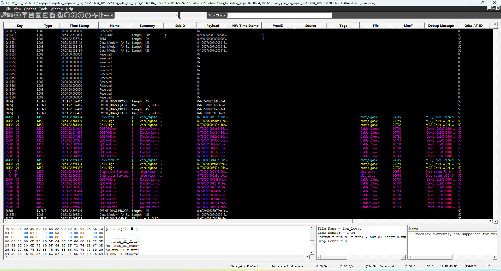
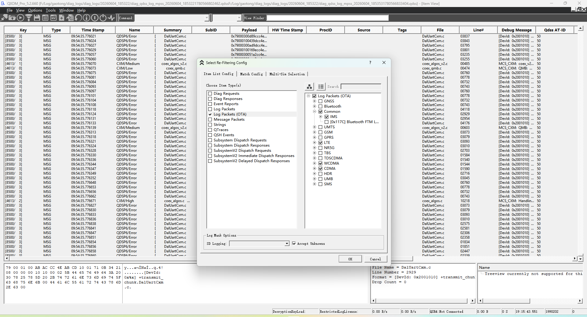
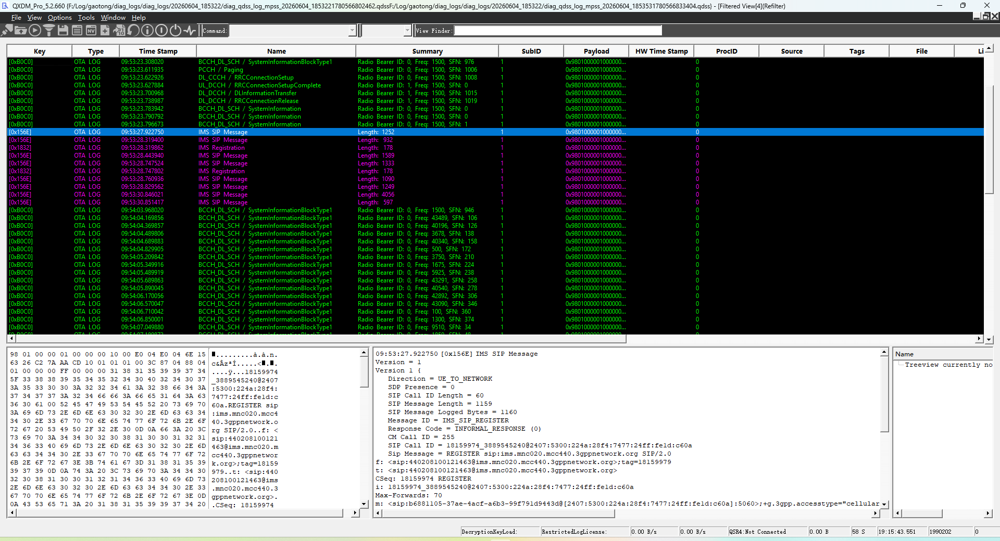

# Qualcomm-QXDM5日志分析SOP

## 目标

这篇面向第一次使用 QXDM5 的同学。看完后至少要能做到：

- 知道 QXDM5 能打开哪些 Qualcomm modem log。
- 会打开日志、看 Item View / Filtered View。
- 知道什么时候需要加载 `.qdb` / `.qsr4`。
- 能导出关键消息作为问题证据。

## 工具位置

本机路径：

```text
C:\Program Files\Qualcomm\QXDM5\QXDM.exe
C:\Program Files\Qualcomm\QXDM5\Documents\QXDMUserGuide.pdf
```

QXDM5 适合人工查看 DIAG item、event、log packet、message packet、NV 和 QShrink debug message。`.qmdl2` / `.qdss` 这类 QUTS bundle 如果要批量扫 cause，优先用 QUTS 或脚本；QXDM 更适合确认关键点和截图取证。

## 先认识界面



| 区域 | 位置 | 新手怎么用 |
|---|---|---|
| 菜单和工具栏 | 顶部 `File / View / Options / Tools` | `File` 打开日志，`View` 打开视图，`Options` 加载数据库和解析选项 |
| `View Finder` | 顶部输入框 | 快速搜索/打开视图，适合找 Item View、Filtered View |
| Item View 列表 | 中间黑色列表区 | 全量 item 时间线，先用它确认时间戳、类型、Name、Summary |
| 底部详情区 | 列表下方 | 左下是 raw data，右下是 parsed fields/text；选中消息后优先看右下解析 |
| 状态栏 | 最底部 | 看连接状态、QSR4 数据库状态、速率、时间等 |

看到标题里的 `Disconnected` 不代表不能离线分析，只说明当前没有连接真机。离线打开 `.hdf` / `.isf` / `.dlf` 仍然可以看已有日志。

## 输入文件怎么判断

| 文件 | 用途 | 注意 |
|---|---|---|
| `.hdf` | QXDM Item Store 日志 | 最常见的 QXDM 离线格式 |
| `.isf` | Item Store / 日志候选 | 可以尝试用 QXDM 打开 |
| `.dlf` | legacy DIAG log | 旧格式，可能需要兼容处理 |
| `.qdb` / `.qsr4` | QShrink4 数据库 | 用于解 debug message 文本 |
| `.qmdl2` / `.qdss` | QUTS bundle | 结构化扫描优先用 QUTS，不建议纯人工翻 |

日志包里如果有 `.qdb`，优先保留；没有数据库时，NAS/RRC 等标准协议消息可能仍能看，但 QShrink debug message 可能不可读。

## 第一次打开日志

### 打开 HDF / ISF / DLF

1. 启动 `QXDM.exe`。
2. 选择 `File -> Open`。
3. 选择 `.hdf` / `.isf` / `.dlf`。
4. 打开后用 `View -> Common -> Item View` 或 `F11` 查看全量 item。
5. 用 `Filtered View` 建一个只看目标消息的窗口。

大文件打开慢时，先关闭不需要的 Filtered View，再重新打开日志。

### 回放 HDF

如果要按时间回放已有 `.hdf`：

```text
File -> Replay Items
```

回放适合观察视图刷新，但排查问题时通常直接搜索和过滤更快。

## 加载 QShrink4 数据库

如果看到 debug message 是 hash、乱码或不可读文本，先检查 QShrink 数据库：

1. 选择 `Options -> Load QShrink4 database`。
2. 选择匹配版本的 `.qdb` 或 `.qsr4`。
3. 看底部状态栏，确认 QSR4 状态是否成功。
4. 回到消息窗口重新看 debug message 是否可读。

数据库不匹配时，不要强行解释 debug message 文本。结论里要写明 `qdb/qsr4 未匹配` 或 `QSR4 状态未知`。

## 常用视图

| 视图 | 打开方式 | 看什么 |
|---|---|---|
| Item View | `View -> Common -> Item View` 或 `F11` | 全量 item，适合先定时间线 |
| Filtered View | `F12` 或 View Bar | 只看目标 packet / event / message |
| Bookmark List View | `View -> Common -> Bookmark List View` | 管理关键标记点 |
| NV Browser | `View` 菜单中打开 | 辅助看 NV 相关项 |
| Extended Displays | `View` 菜单中打开 | LTE/NR/状态类图表和表格 |

Item View 的典型结构是：

```text
上方：item列表
左下：raw data
右下：parsed fields / parsed text
```

写问题结论时，优先引用右下角解析字段；有争议时再补 raw data。

### Re-filtering Config 怎么用



大日志不要一直在 Item View 里翻。建议新建或重过滤 Filtered View：

1. 打开 Filtered View 后选择 `Refilter`。
2. 在左侧 `Item List Config` 选择要看的 item 类型，例如 `Log Packets (OTA)`、`Message Packets`、`Events`。
3. 在右侧树里勾选目标协议族，例如 `Common -> IMS`、`LTE`、`NR5G`。
4. 保留 `Accept Unknowns`，避免数据库不完整时把关键 item 过滤掉。
5. 点 `OK` 后生成新的 Filtered View。

筛选原则：先宽后窄。第一次过滤可以只选 OTA/LTE/NR/IMS，确认时间窗后再按关键字定位 NAS、RRC、SIP 或 QMI。

### Filtered View 怎么读



Filtered View 更适合日常分析。上方列表看 `Type`、`Time Stamp`、`Name`、`Summary`；下方左侧保留原始 hex/ASCII，右侧是解析后的字段。截图里选中的是 `IMS SIP Message`，右下已经解析出 Direction、SIP Call ID、SIP Message 和 Response Code。

写结论时按这个顺序摘证据：

```text
Time Stamp
Name / Summary
Direction / SubID / ProcID
parsed fields中的cause、message type、PLMN、APN、Call ID等关键字段
raw data只作为争议或复核材料
```

## 搜索和过滤怎么做

常用方式：

1. `Ctrl + F` 搜消息列表。
2. 勾选 `Include Full Parsed Text`，再搜 PLMN、APN、cause、reject 等字段。
3. 命中后用 `Match Items` 或 `Refilter Items` 建新的 Filtered View。
4. 对关键消息加 Bookmark，方便回到原始时间线。

常用关键字：

```text
LTE NAS
EMM
Attach
TAU
Registration Reject
LTE RRC
RRCConnectionRequest
RRCConnectionRelease
ESM
QMI_NAS
QMI_WDS
QMI_DSD
MMGSDI
UIM
NV
MCFG
fatal
assert
SSR
```

## 新手分析流程

### LTE / NR注册失败

```text
1. 确认 subscription / SIM / phoneId。
2. 看 RRC 是否建链成功。
3. 看 NAS Attach / TAU / Registration。
4. 找 Reject / Accept / Complete。
5. 看 ESM bearer 或 5GSM PDU Session。
6. 回 AP log 对齐 ServiceState / DataRegState。
```

注意：NAS `Service Request` 和 `QMI service request` 不是同一层证据。前者是协议层，后者是 AP/RIL 与 modem 服务接口层，结论不能混写。

### 数据业务失败

```text
注册态正常
-> ESM / 5GSM 承载或 PDU Session
-> QMI_WDS / QMI_DSD 数据连接状态
-> APN / PDN type / IP / DNS
-> AP log 和抓包确认 DNS / TCP / HTTP
```

QXDM 看到 QMI 数据连接成功，不等于公网可用；数据面还要看 AP log 或 pcap。

### NV / MCFG验证

QXDM 只能作为运行态辅助证据，不代替源码配置：

```text
源码或 MBN 配置
-> 编译/刷机/激活
-> QXDM / NV Browser / DIAG 消息确认运行态
-> AP dumpsys 或业务 log 确认最终行为
```

## 如何导出证据

| 操作 | 用途 |
|---|---|
| `Export Text` | 导出选中 item 文本 |
| `Export All Text` | 导出当前视图全部文本 |
| `Copy Items` | 把选中 item 复制到新的 `.hdf` |
| Bookmark | 标记关键 item，便于复盘 |
| Screenshot | 对不可导出的视图做辅助截图 |

建议结论固定保留：

```text
时间戳：
subscription / SIM：
RAT / PLMN：
关键消息名称：
reject / cause：
QSR4数据库状态：
AP侧是否同步：
```

## 常见卡点

- `.qdb` / `.qsr4` 不匹配：debug message 不可信。
- `.hdf` 很大：减少 Filtered View，分关键字搜索。
- QXDM 有 modem 事实，不代表 AP 处理成功；AP log 仍要对齐。
- QUTS bundle 用 QXDM 人工翻效率低，需要批量扫 cause 时优先 QUTS。
- 多卡问题必须先确认 subscription，避免看错卡。

## 关联入口

- [Log分析方法](Log分析方法.md)
- [LTE注册-平台Log速查](LTE注册-平台Log速查.md)
- [常用命令](../Commands/常用命令.md)

## 来源记录

- 本机说明书：`C:\Program Files\Qualcomm\QXDM5\Documents\QXDMUserGuide.pdf`
