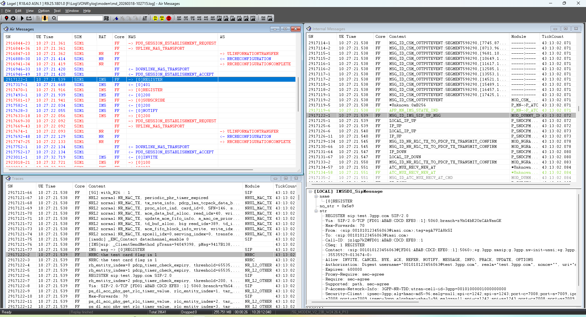

# UNISOC-Logel日志分析SOP

## 目标

这篇面向第一次使用 Logel 的同学。看完后至少要能做到：

- 知道展锐 Ylog / modem log 该用哪个入口打开。
- 会看 Internal Messages、Air Messages、Traces。
- 会用 Find、Scene Search 搜关键流程。
- 知道 parser 不匹配、log 丢失、full dump 缺失时该怎么判断。

## 工具位置

本机路径：

```text
D:\Tool\SPRD\Logel_R9.25.1801\Bin\Logel.exe
D:\Tool\SPRD\Logel_R9.25.1801\Doc\Logel User Guide.pdf
D:\Tool\SPRD\Logel_R9.25.1801\Doc\Logel FAQ.pdf
```

官方资料入口：<https://unisupport.unisoc.com/file/index.do?fileid=32409>

本地附件：[Logel User Guide.pdf](../../attachments/outline/files/f5686886-47ec-43e7-8aee-18b3769af4ce_Logel User Guide.pdf)

## 先认识界面



| 区域 | 位置 | 新手怎么用 |
|---|---|---|
| 菜单和工具栏 | 顶部 `File / Edit / View / Option` 和图标区 | 打开日志、回放、连接、查找、窗口管理都从这里开始 |
| `Air Messages` | 左上窗口 | 先按时间看空口/协议消息流，例如 RRC、NAS、SIP；红色通常表示 UE 发向网络，蓝色通常表示网络发向 UE |
| `Internal Messages` | 右上窗口 | 看 modem 内部消息、状态机、模块间消息；适合确认某个协议消息前后平台内部做了什么 |
| `Traces` | 左下窗口 | 看模块 trace、函数日志、失败分支；截图里选中 SIP 行后，可以在这里看到相邻 trace |
| 详情窗格 | 右下窗口 | 选中消息后看解析内容；截图里展开了 `IMSSDI_SipMessage`，能看到 REGISTER 的 SIP 头字段 |
| 状态栏 | 最底部 | 看 parser、总包数、丢包数、log 大小、duration、modem version；截图里 `Dropped:0`，说明这段样例没有明显丢包 |

第一次使用时先不要急着解释字段，先确认三件事：

```text
日志是否覆盖问题时间窗
parser是否匹配
当前看的窗口是 Internal / Air / Trace 中哪一种
```

截图里的正确读法是：先从左上 `Air Messages` 找到目标协议消息，再到右上/左下看同一时间点附近的内部消息和 trace，最后用右下详情窗格摘字段。不要只截一行消息就下结论，至少要保留前后几秒的上下文。

## 输入文件怎么判断

展锐常见输入来自 Ylog：

```text
ylog\
  modem\
    md_yyyymmdd-hhmmss_armlog\
  ap\
    001-xxxx_poweron\
```

| 输入 | 用途 | 注意 |
|---|---|---|
| `modem\md_*_armlog` | 最常见 modem 离线分析输入 | 注册、数据、SIM、assert 问题优先保留完整时间窗 |
| `.logel` / `.log` / `.lst` | Logel 可直接回放的文件 | 打开后先看时间范围和 parser 状态 |
| `modem_db.gz` / parser | trace 解码数据库 | 版本不匹配时字段解释不可信 |
| full dump / `history\armlog` | modem blocked / assert 证据 | 要提交整个目录，不要只截几行日志 |

## 设置parser

Logel 能显示消息不代表字段一定可信。遇到字段空、枚举异常、提示 mismatch，先设置 parser。

菜单路径：

```text
Option -> Parser Setting
```

判断口径：

- 默认会从 `Bin\Parser`、用户配置的 `Search Path`、Parser Server 等位置找 parser。
- Ylog 里带出的 `modem_db.gz` 可以手动指定为 `Database File`。
- 如果提示 parser mismatch / parser not found，先换匹配 parser，再分析字段。

## 第一次打开日志

1. 启动 `Logel.exe`。
2. 点击工具栏的 `Open log file to replay`。
3. 选择目标 `.logel` / `.log` / `.lst` 或对应 modem log 文件。
4. 等待回放解析完成。
5. 看状态栏是否有 parser、dropped packets、duration、modem version 等信息。

示例入口：


回放前建议先确认 AP 侧关键服务已启动，便于后续对齐：

```text
ImsApp: ImsApp Boot Successfully. version:12
ImsApp: ImsService Boot Successfully!
UniTelephonyApp: Boot Successfully!
```

## 三个核心窗口怎么用

| 窗口 | 看什么 | 适合场景 |
|---|---|---|
| Internal Messages | 内部消息、状态机、字段详情 | Attach / TAU / ESM / SIM / cause |
| Air Messages | 空口协议消息流 | RRC、NAS、SIP 等协议流程 |
| Traces | 模块 trace、函数日志、失败分支 | OOC、assert、状态机异常 |

新手建议：

```text
先用 Air Messages 看流程有没有走到目标协议消息
再用 Internal Messages 看字段和 cause
最后用 Traces 找平台内部失败分支
```

## 搜索关键字

1. 点击工具栏左上角 `Find`。
2. 输入消息名或关键字。
3. 选择搜索窗口和列。
4. 可给不同关键字设置颜色，区分流程阶段。
5. 点击 `Find` 查看结果。


常用关键字：

```text
ATTACH
TAU
EMM
ESM
PDN
default bearer
PLMN
RRCConnectionRequest
RRCConnectionSetup
RRCConnectionRelease
OOC
ASSERT
fatal
```

## LTE注册常用消息

无存储信息的 PLMN 和小区选择：

| 消息名称 | 描述 |
|---|---|
| `MSG_ID_CMD_RLM_SELECT_CELL` | NAS / ASM 请求 LRRC 开始 PLMN 和小区选择 |
| `MSG_ID_LTE_CPHY_BAND_SWEEP_REQ` | LRRC 请求 PHY 检测并同步支持频段上的小区 |
| `MSG_ID_LTE_CPHY_SUCC_SYNC_CELLS_IND` | PHY 上报 LRRC 小区检测和同步结果 |
| `MSG_ID_LTE_CPHY_IDLE_CONFIG_REQ` | LRRC 请求 PHY 驻留在当前小区 |
| `MSG_ID_LTEAS_NAS_UPDATE_INFO_IND` | LRRC 上报 NAS 当前驻留小区的接入信息 |
| `MSG_ID_LAS_CELL_SELECT_CNF` | LRRC 上报 NAS PLMN 和小区选择结果 |

PLMN 搜索：

| 消息名称 | 描述 |
|---|---|
| `MSG_ID_CMD_RLM_SEARCH_REQUEST` | NAS / ASM 请求开始 PLMN 搜索 |
| `MSG_ID_LTEAS_PLMN_LIST_IN_IND` | LRRC 指示 NAS 检测到的小区 PLMN 信息 |
| `MSG_ID_LTEAS_PLMN_LIST_SEARCH_CNF` | LRRC 指示 NAS PLMN 搜索流程结束 |

## Scene Search

菜单路径：

```text
Edit -> Scene Search
```

Scene Search 适合把常用流程固化成模板，例如注册、搜网、RRC、数据承载。`type` 可选择 `MSG`、`AIR`、`TRACE`。


建议新手先建三组：

| 场景 | 关键字 |
|---|---|
| LTE注册 | `SELECT_CELL`、`BAND_SWEEP`、`ATTACH`、`TAU`、`EMM` |
| 数据承载 | `ESM`、`PDN`、`default bearer`、`APN` |
| assert | `ASSERT`、`fatal`、`dump`、`systemdump` |

## 新手分析流程

### LTE注册失败

```text
1. AP log确认触发时间，例如开机、飞行模式恢复、手动搜网。
2. Logel打开 modem log，确认 parser 匹配。
3. 搜 PLMN / SELECT_CELL，看目标 PLMN / RAT 是否正确。
4. 搜 BAND_SWEEP / SIB / CELL_SELECT_CNF，看是否完成搜频、读系统消息、驻留。
5. 搜 RRCConnectionRequest / Setup / Complete，看 RRC 是否建链。
6. 搜 ATTACH / TAU / EMM，看 NAS 是接受还是拒绝。
7. 搜 ESM / default bearer，看默认承载是否建立。
8. 回 AP log 对齐 ServiceState / DataRegState。
```

结论至少写清：

```text
时间戳：
phoneId / SIM：
PLMN / RAT：
最后成功消息：
第一失败消息：
reject / cause：
是否缺 AP log：
```

### 数据业务失败

```text
注册成功
-> ESM PDN connectivity
-> default bearer
-> APN / PDN type / EBI
-> AP侧 SETUP_DATA_CALL / DataCallResponse
-> DNS / TCP / NetworkMonitor
```

只看到 `IN_SERVICE` 不代表数据可用；数据问题必须继续看默认承载和 AP/抓包证据。

### SIM问题

```text
卡插入/上电
-> ATR
-> IMSI / ICCID / EF读取
-> PLMN / EHPLMN / FPLMN
-> 注册请求
```

如果 SIM 基础信息没读到，后续注册失败通常不能先归因网络。

## 图表功能

菜单路径：`View`，例如：

```text
View -> LTE -> LTE Serving Cell Chart of SIM1 / Primary
```

| 指标 | 含义 | 判断 |
|---|---|---|
| SINR | 信号与干扰加噪声比 | 数值越大，链路质量越好 |
| RSRQ | 参考信号接收质量 | 约 `-3` 到 `-19.5`，值越大越好 |
| RSRP | 参考信号接收功率 | 约 `-44` 到 `-140 dBm`，值越大越好 |


## full dump抓取

modem blocked / assert 问题通常需要 full dump。

1. 确认 `Sysdump Enable` 已打开。
   - 路径：`Ylog -> 调试 -> Sysdump Enable`
   - `ud` 软件通常默认打开，`user` 软件需要手动打开。
2. 在 system info dumping 场景完成后，同时按住音量上键和音量下键，再双击电源键。
3. 黑屏进入 dump 界面后，打开 modem Logel 工具。
4. 手机插入 USB。
5. 点击 `Capture log` 开始捕获 dump。
6. 等待 `finish` 提示。
7. 到 Logel 工具 `bin\history` 目录下找到 full dump，将整个 `armlog` 文件夹打包提交。


## 常见卡点

- parser 不匹配：消息名可能可见，但字段和 cause 不可信。
- log 丢失率过高：先看 `Log Lost Statistics`，丢失率大于 5% 时结论要降权。
- 只抓 PC modem log：仍需同时导出 Ylog AP log。
- `Modem Reset` 默认开启：assert 后可能重启导致现场证据丢失，必要时按版本路径关闭。
- 只有 modem log：不能直接判断 Android framework 根因。

`Modem Reset` 常见路径：

```text
Android 8.1 到 11: YLog -> Settings -> LogSetting -> ModemLogSetting
Android 12 到 14: YLog -> 更多选项 -> 调试
```

## 关联入口

- [UNISOC-Ylog抓LogSOP](../Log-Capture/UNISOC-Ylog抓LogSOP.md)
- [Log分析方法](Log分析方法.md)
- [LTE注册-平台Log速查](LTE注册-平台Log速查.md)
- [信号强度查看SOP](../Debug-Tips/信号强度查看SOP.md)

## 来源记录

- [Logel工具使用](http://192.168.3.94:8888/doc/logel-9PX7Jl2Ddm) (`9PX7Jl2Ddm`)
- 本地附件：[Logel User Guide.pdf](../../attachments/outline/files/f5686886-47ec-43e7-8aee-18b3769af4ce_Logel User Guide.pdf)
- 本机说明书：`D:\Tool\SPRD\Logel_R9.25.1801\Doc\Logel User Guide.pdf`
- 本机 FAQ：`D:\Tool\SPRD\Logel_R9.25.1801\Doc\Logel FAQ.pdf`
