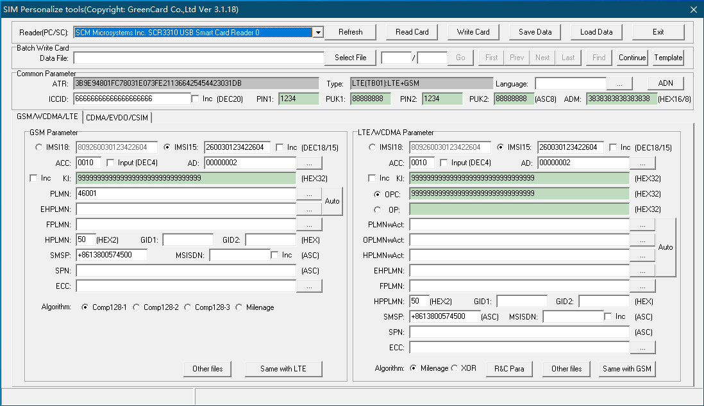
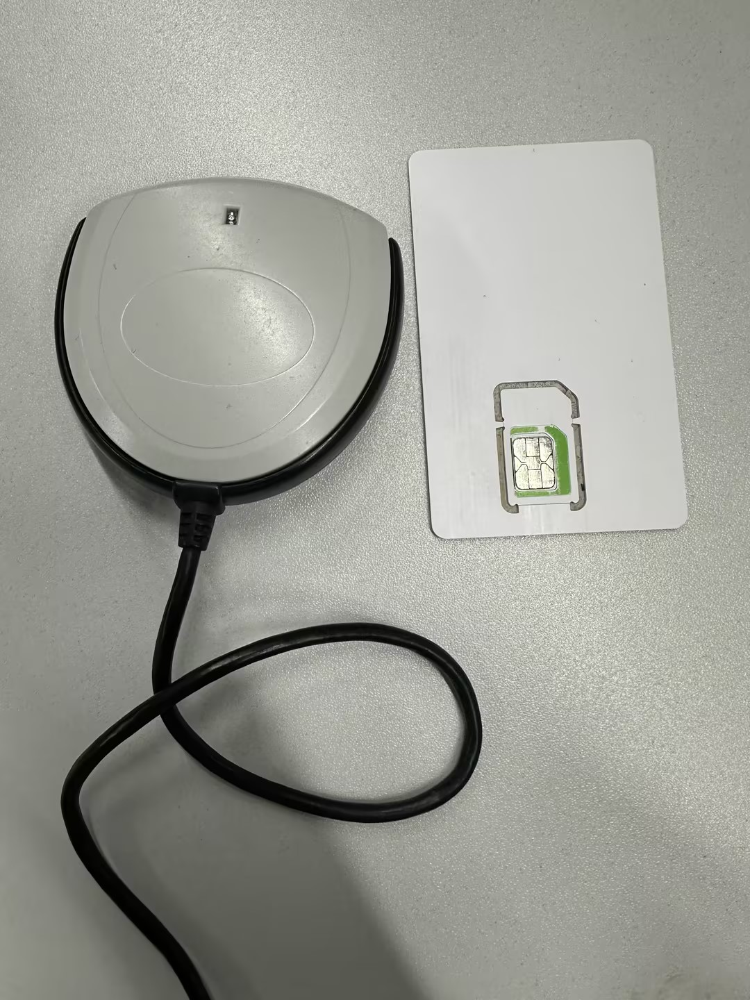
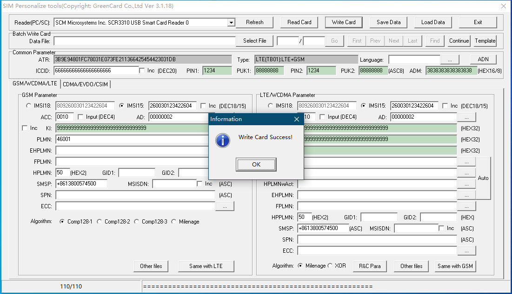
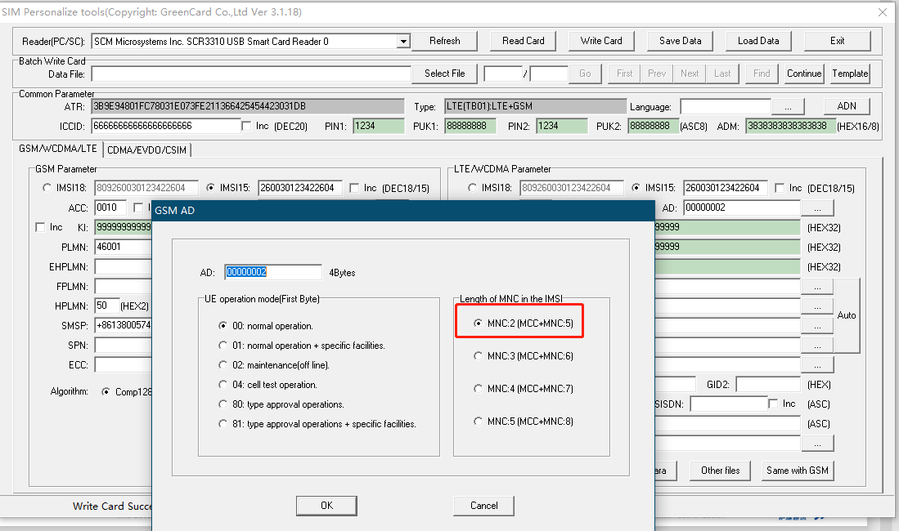

# GRSIMWrite白卡工具使用SOP

## 速查结论

GRSIMWrite 是白卡写卡工具，用于构造测试 SIM 场景，常见修改项包括 MCCMNC、IMSI、SPN、ICCID、ECC、PLMN、KI / OPC / OP 等。它适合运营商定制、锁网、非锁网、运营商名称、ECC、VoWiFi 弹窗等需求验证。

## 使用入口

| 项目 | 内容 |
| --- | --- |
| 工具 | GRSIMWrite / SIM Personalize tools |
| 截图版本 | `GreenCard Co.,Ltd Ver 3.1.18` |
| 适用对象 | 白卡 / 测试 SIM |
| 典型用途 | 写入 MCCMNC、IMSI、ICCID、SPN、ECC、PLMN、鉴权参数 |
| 前置设备 | PC、USB 智能卡读卡器、白卡 |
| 风险 | 写错 IMSI、KI、OPC、OP、ADM、PLMN、ECC 后，可能导致注册失败、鉴权失败、锁网判断错误或紧急呼叫验证失真 |

PPT 原始工具路径：

```text
\\192.168.3.127\127\13_Test\02_Tools\01-common\01-MCCMNC写卡软件
```

## 工具界面

主界面包含读卡器选择、读卡、写卡、保存、加载，以及 GSM / LTE / WCDMA / CDMA 参数区。



常见操作按钮：

| 按钮            | 用途             |
| ------------- | -------------- |
| `Refresh`     | 刷新读卡器          |
| `Read Card`   | 读取当前白卡数据       |
| `Write Card`  | 将当前配置写入白卡      |
| `Save Data`   | 保存当前配置，便于备份或复用 |
| `Load Data`   | 加载已有配置         |
| `Select File` | 批量写卡时选择数据文件    |

## 写卡流程

1. 将读卡器连接 PC。
2. 插入白卡。



3. 打开 `GRSIMWrite.exe`。
4. 在 `Reader(PC/SC)` 下拉框选择读卡器。
5. 点击 `Read Card`，先读取并确认原始卡数据。
6. 建议点击 `Save Data` 备份原始数据。
7. 按测试需求填写 MCCMNC、IMSI、SPN、ICCID、ECC 等字段。
8. 点击 `Write Card`。
9. 看到 `Write Card Success!` 后，拔卡插入手机验证。



## 关键字段

| 字段 | 含义 | 使用口径 |
| --- | --- | --- |
| `MCCMNC` / `PLMN` | 移动国家码 + 移动网络码 | 用于构造运营商、国家、锁网和漫游场景 |
| `IMSI` | 国际移动用户识别码 | 由 MCC、MNC、MSIN 组成；MNC 位数必须和 AD 配套 |
| `ICCID` | SIM 卡卡号 | 一般用于卡识别，不等同于 IMSI |
| `SPN` | Service Provider Name | 手机状态栏或运营商名称显示相关 |
| `ECC` | Emergency Call Code | 紧急号码相关测试字段 |
| `KI` | 鉴权密钥 | 敏感字段，写错会导致鉴权失败 |
| `OPC` / `OP` | Milenage 鉴权相关参数 | 敏感字段，必须和测试卡配置匹配 |
| `ADM` | 管理权限码 | 写卡或修改敏感 EF 时可能需要 |
| `ACC` | Access Control Class | 可影响接入控制测试 |
| `HPLMN` / `EHPLMN` / `FPLMN` | 归属、等效归属、禁用 PLMN 列表 | 用于选网、漫游、锁网和注册行为验证 |
| `SMSP` | SMS 参数 | 短信中心号码相关 |
| `MSISDN` | 用户号码 | 部分业务或 UI 显示可能读取 |
| `GID1` / `GID2` | Group Identifier | 部分运营商定制和 MVNO 判断会用 |

## AD 与 MNC 位数

工具里的 `AD` 配置会影响 IMSI 中 MNC 长度解释。写 MCCMNC 时必须确认 MNC 是 2 位还是 3 位，否则同一个 IMSI 可能被解析成错误 PLMN。



常用选择：

| 选项 | 含义 |
| --- | --- |
| `MNC:2 (MCC+MNC:5)` | 2 位 MNC，例如 `46001` |
| `MNC:3 (MCC+MNC:6)` | 3 位 MNC，例如部分海外运营商 |
| `MNC:4 / MNC:5` | 特殊场景，按测试需求确认 |

## 参考编码

PPT 中给了两个历史参考入口：

- MCC / MNC 查询：<https://blog.csdn.net/wds1181977/article/details/71352464>
- 语言列表查询：<https://blog.csdn.net/fugang1230/article/details/74452018>

使用口径：

- 这些链接只作为历史资料入口。
- 正式需求应优先以运营商需求文档、3GPP / GSMA 资料、项目配置表或平台现网配置为准。
- 写卡前把目标 MCCMNC、语言、SPN、ECC、锁网策略记录到测试用例里。

## 测试场景

### 基本功能测试

| 场景 | 写卡目标 | 验证点 |
| --- | --- | --- |
| 运营商识别 | 写入目标 MCCMNC / IMSI / SPN | 手机是否识别为目标运营商；状态栏和设置页显示是否符合预期 |
| 注册验证 | 写入目标 PLMN、HPLMN / EHPLMN / FPLMN | 是否能注册、是否按预期选网或拒网 |
| ECC 验证 | 写入目标 ECC | 无卡、有卡、无服务、漫游等场景下紧急号码是否符合预期 |
| SIM Lock 验证 | 构造锁网或非锁网 MCCMNC | 是否弹出解锁界面、错误码和剩余次数是否正确 |
| 运营商定制验证 | 写入指定 MCCMNC / SPN / GID | CarrierConfig、APN、运营商名、VoWiFi 弹窗等是否按目标运营商生效 |

PPT 示例里提到的基础场景包括：

- 插入联通卡、白卡 `46001 / 46006 / 46009` 开机检查。
- 插入移动卡开机检查。
- 分别输入错误和正确的解锁码验证。
- 开机后是否锁网以客户需求为准。
- SIM Lock 默认解锁次数示例为 10 次。
- 错误临时解锁码不能成功解锁，正确永久解锁码可以成功解锁。


### 客户需求测试

PPT 示例中把白卡用于两类需求：

- 锁网需求：例如指定 `3GPP_NW MCC=655 MNC=01`，构造 Vodacom ZA SIM Lock 场景。
- 非锁网 / 运营商定制需求：例如指定 Orange Poland `260/03`，验证 VoWiFi 弹窗、语言和帮助文案。

使用白卡验证客户需求时，需要把下面信息写入测试记录：

- 客户需求编号或问题单。
- 目标 MCCMNC、SPN、GID、语言、ECC 等写卡字段。
- 写卡前备份文件。
- 写卡后 `Read Card` 回读截图或导出文件。
- 手机端验证结果和 AP / modem log。

## 风险边界

- 白卡只能模拟 SIM 侧字段，不能证明现网 HSS / AuC / 核心网行为。
- KI、OPC、OP、ADM 属于敏感鉴权/管理参数，不要把真实商用卡参数写入公开文档。
- IMSI 的 MCC / MNC 位数必须和 AD 配套，否则容易造成 PLMN 解析错误。
- ICCID 不等于 IMSI，不能用 ICCID 判断注册 PLMN。
- SPN 只解决 SIM 侧显示字段，最终运营商名还可能受 CarrierConfig、ERI、SPN rule、PLMN name、平台客制化影响。
- ECC 写卡后仍需结合平台 ECC 配置、SIM EF、无服务状态和 modem 行为一起判断。

## 证据清单

| 证据 | 用途 |
| --- | --- |
| 写卡前 `Save Data` 备份 | 可回退和对比 |
| 写卡后 `Read Card` 截图 / 导出 | 确认字段确实写入 |
| 目标需求表 | 确认 MCCMNC、SPN、ECC、语言、锁网策略来源 |
| `adb shell dumpsys carrier_config` | 验证 AP 侧是否匹配到目标 carrier |
| `adb shell getprop` / `dumpsys isub` | 验证 SIM、subId、MCCMNC、carrierId |
| AP log / modem log | 验证注册、鉴权、选网、锁网行为 |

## 附件

- [8-白卡工具介绍--丁钊.pptx](../../attachments/outline/files/3d46cb58-dc77-4f16-b821-f1c650e6b9cc_8-白卡工具介绍--丁钊.pptx)

## 来源记录

- [GRSIMWrite工具使用](http://192.168.3.94:8888/doc/grsimwrite-MsnYAwxgQT) (`MsnYAwxgQT`)
- PPT：`8-白卡工具介绍--丁钊.pptx`
